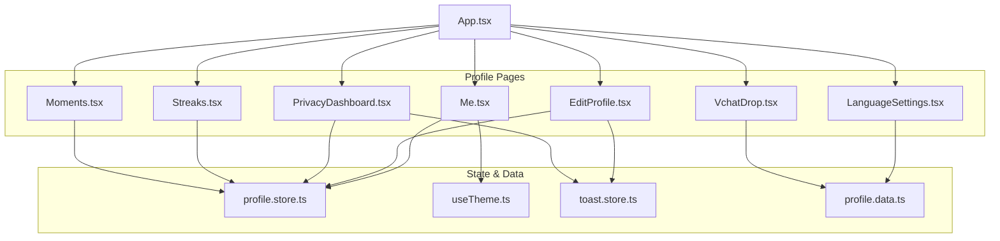
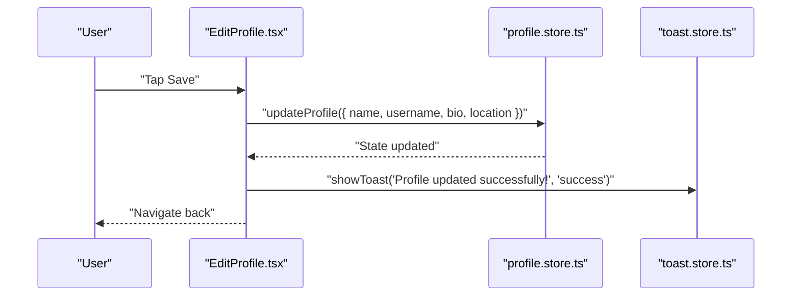
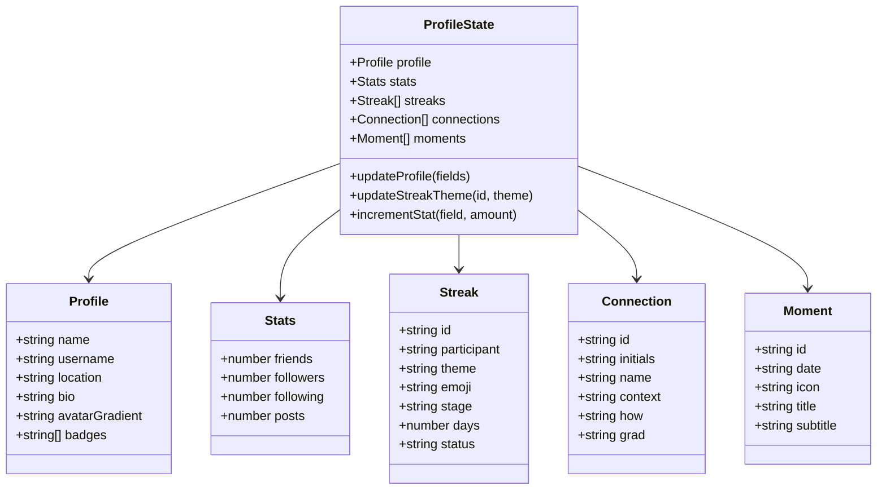
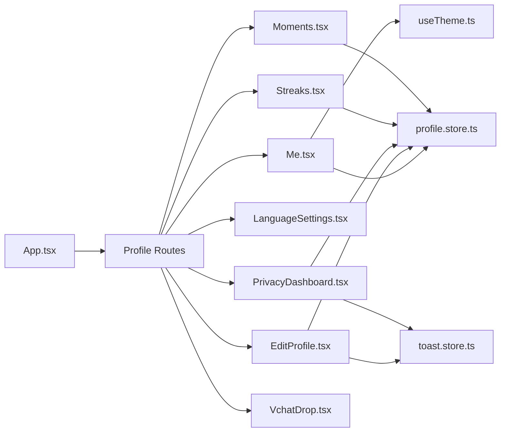
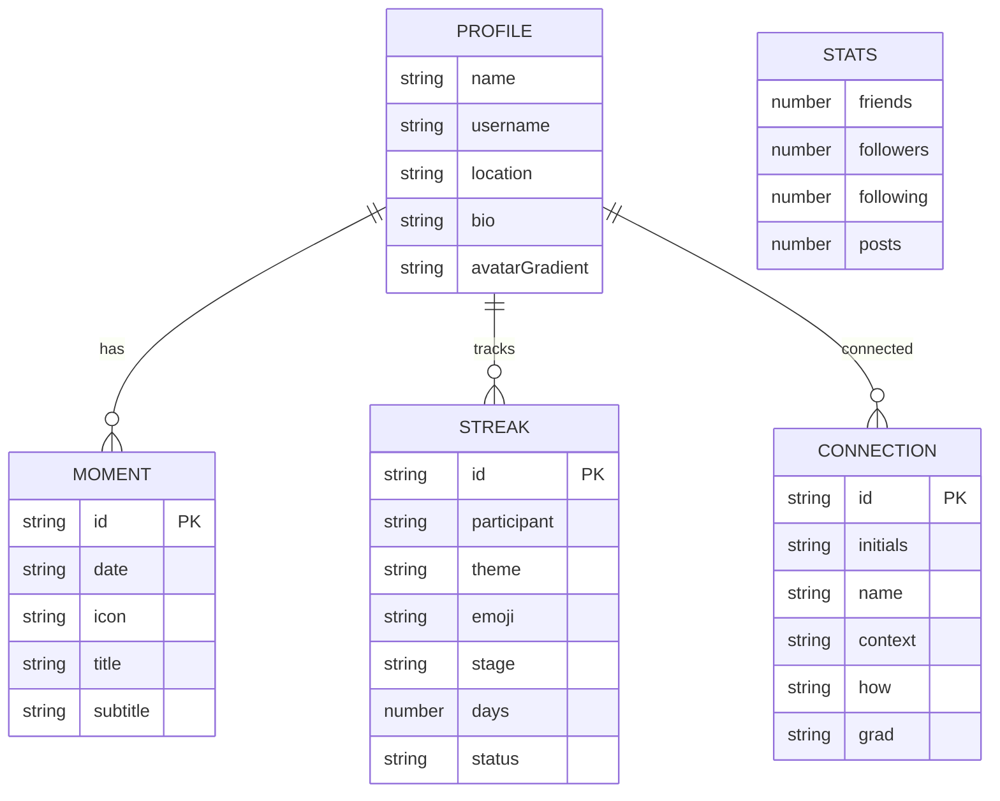

# Profile Management

<cite>
**Referenced Files in This Document**
- [Me.tsx](file://src/pages/Me.tsx)
- [EditProfile.tsx](file://src/pages/profile/EditProfile.tsx)
- [PrivacyDashboard.tsx](file://src/pages/profile/PrivacyDashboard.tsx)
- [LanguageSettings.tsx](file://src/pages/profile/LanguageSettings.tsx)
- [Streaks.tsx](file://src/pages/profile/Streaks.tsx)
- [Moments.tsx](file://src/pages/profile/Moments.tsx)
- [VchatDrop.tsx](file://src/pages/profile/VchatDrop.tsx)
- [profile.store.ts](file://src/store/profile.store.ts)
- [profile.data.ts](file://src/data/profile.data.ts)
- [useTheme.ts](file://src/hooks/useTheme.ts)
- [toast.store.ts](file://src/store/toast.store.ts)
- [App.tsx](file://src/App.tsx)
</cite>

## Table of Contents
1. [Introduction](#introduction)
2. [Project Structure](#project-structure)
3. [Core Components](#core-components)
4. [Architecture Overview](#architecture-overview)
5. [Detailed Component Analysis](#detailed-component-analysis)
6. [Dependency Analysis](#dependency-analysis)
7. [Performance Considerations](#performance-considerations)
8. [Troubleshooting Guide](#troubleshooting-guide)
9. [Conclusion](#conclusion)
10. [Appendices](#appendices)

## Introduction
This document explains VChat’s profile management system with a focus on:
- The main profile page (Me.tsx): user information display, verification badges, social stats, and quick actions.
- Edit profile functionality: form-driven updates, avatar presentation, and save behavior.
- Privacy dashboard: data visibility, consent controls, and account actions.
- Language settings: primary language, auto-translate toggles, offline translation packs, and fallback behavior.
- Profile data persistence, state management, and synchronization across devices.
- User experience considerations, accessibility, and security measures.
- Guidelines for extending features and integrating external identity providers.

## Project Structure
The profile management surface is organized under the profile pages and supported by a shared Zustand store, theme hook, and mock data.

**Diagram sources**
- [App.tsx:101-108](file://src/App.tsx#L101-L108)
- [Me.tsx:10-11](file://src/pages/Me.tsx#L10-L11)
- [EditProfile.tsx:5-11](file://src/pages/profile/EditProfile.tsx#L5-L11)
- [PrivacyDashboard.tsx:1-8](file://src/pages/profile/PrivacyDashboard.tsx#L1-L8)
- [LanguageSettings.tsx:5](file://src/pages/profile/LanguageSettings.tsx#L5)
- [Streaks.tsx:5](file://src/pages/profile/Streaks.tsx#L5)
- [Moments.tsx:5](file://src/pages/profile/Moments.tsx#L5)
- [VchatDrop.tsx:5](file://src/pages/profile/VchatDrop.tsx#L5)
- [profile.store.ts:95-138](file://src/store/profile.store.ts#L95-L138)
- [useTheme.ts:10-36](file://src/hooks/useTheme.ts#L10-L36)
- [toast.store.ts:17-38](file://src/store/toast.store.ts#L17-L38)
- [profile.data.ts:1-77](file://src/data/profile.data.ts#L1-L77)

**Section sources**
- [App.tsx:101-108](file://src/App.tsx#L101-L108)
- [Me.tsx:10-11](file://src/pages/Me.tsx#L10-L11)
- [profile.store.ts:95-138](file://src/store/profile.store.ts#L95-L138)

## Core Components
- Profile store: central state for profile, stats, streaks, connections, and moments; supports persistence and selective partialization.
- Theme hook: manages light/dark mode and persists theme preference.
- Toast store: global toast notifications for user feedback.
- Mock data: streaks, connections, memory vault entries, and language packs.

Key responsibilities:
- Me.tsx renders profile hero, badges, stats, streak highlights, recent connections, “Your Moments,” and settings rows.
- EditProfile.tsx provides a form to update name, username, bio, and location; triggers store updates and shows success feedback.
- PrivacyDashboard.tsx presents privacy score, data categories, stealth/read receipt toggles, and account actions.
- LanguageSettings.tsx displays primary language, auto-translate settings, offline packs, and fallback behavior.
- Streaks.tsx lists all streaks, progress visualization, and theme selection flow.
- Moments.tsx filters and renders private moments timeline with search and tabs.
- VchatDrop.tsx showcases nearby, remote, and NFC sharing features and recent connections.

**Section sources**
- [Me.tsx:18-228](file://src/pages/Me.tsx#L18-L228)
- [EditProfile.tsx:18-22](file://src/pages/profile/EditProfile.tsx#L18-L22)
- [PrivacyDashboard.tsx:28-111](file://src/pages/profile/PrivacyDashboard.tsx#L28-L111)
- [LanguageSettings.tsx:30-98](file://src/pages/profile/LanguageSettings.tsx#L30-L98)
- [Streaks.tsx:77-170](file://src/pages/profile/Streaks.tsx#L77-L170)
- [Moments.tsx:15-27](file://src/pages/profile/Moments.tsx#L15-L27)
- [VchatDrop.tsx:25-157](file://src/pages/profile/VchatDrop.tsx#L25-L157)
- [profile.store.ts:49-138](file://src/store/profile.store.ts#L49-L138)
- [profile.data.ts:1-77](file://src/data/profile.data.ts#L1-L77)
- [useTheme.ts:10-36](file://src/hooks/useTheme.ts#L10-L36)
- [toast.store.ts:17-38](file://src/store/toast.store.ts#L17-L38)

## Architecture Overview
The profile system follows a unidirectional data flow:
- UI components read from the profile store and theme store.
- User actions trigger store updates (updateProfile, updateStreakTheme, incrementStat).
- Persistence middleware serializes selected slices of state to storage.
- Routing integrates profile pages into the app shell.

**Diagram sources**
- [EditProfile.tsx:18-22](file://src/pages/profile/EditProfile.tsx#L18-L22)
- [profile.store.ts:104-108](file://src/store/profile.store.ts#L104-L108)
- [toast.store.ts:19-31](file://src/store/toast.store.ts#L19-L31)

## Detailed Component Analysis

### Main Profile Page (Me.tsx)
- Displays profile avatar with gradient, initials, and verification badge overlay.
- Shows name, username, and location.
- Renders verification badges with distinct colors/icons.
- Social stats grid for friends, followers, following, and posts with responsive labels.
- Highlights active streaks with emoji, participant, theme, and day count; indicates risk states.
- Lists recent connections with avatars and metadata.
- “Your Moments” summary card with weekly highlights.
- Settings rows for AI Twin, Language & Translation, Privacy Dashboard, Vchat Drop, Health Profile, Vchat Pay, Theme toggle, and About.

User experience considerations:
- Hover overlay on avatar area hints at edit capability.
- Clickable stat cards and “View All” links for deeper insights.
- Consistent spacing, typography hierarchy, and color usage aligned with theme.

**Section sources**
- [Me.tsx:18-228](file://src/pages/Me.tsx#L18-L228)

### Edit Profile (EditProfile.tsx)
- Initializes local form state from current profile values.
- Provides inputs for name, username, bio, and location.
- Presents avatar preview with change indicator.
- On save:
  - Calls store.updateProfile with changed fields.
  - Triggers a success toast via toast store.
  - Navigates back to previous screen.

Validation and UX:
- No client-side validation is implemented in the component; validation would be a good extension.
- Immediate visual feedback via toast improves perceived reliability.

**Section sources**
- [EditProfile.tsx:13-22](file://src/pages/profile/EditProfile.tsx#L13-L22)
- [EditProfile.tsx:67-110](file://src/pages/profile/EditProfile.tsx#L67-L110)
- [profile.store.ts:104-108](file://src/store/profile.store.ts#L104-L108)
- [toast.store.ts:19-31](file://src/store/toast.store.ts#L19-L31)

### Privacy Dashboard (PrivacyDashboard.tsx)
- Privacy score visualization with SVG gauge.
- Data categories list with counts; includes eye and trash actions per item.
- Stealth mode toggle to appear offline selectively.
- Read receipts controls with per-contact exceptions row.
- Account actions: download data and delete account placeholders.

UX and accessibility:
- Toggle components use accessible states and transitions.
- Clear categorization and action affordances.

**Section sources**
- [PrivacyDashboard.tsx:28-111](file://src/pages/profile/PrivacyDashboard.tsx#L28-L111)

### Language Settings (LanguageSettings.tsx)
- Displays current primary language and change action.
- Auto-translate settings: incoming messages, show original, voice notes.
- Voice output language selector.
- Offline translation packs list with download/downloaded states.
- Fallback toggle for offline translation confidence.

UX:
- Clean toggle interactions and visual feedback.
- Download affordances with size indicators.

**Section sources**
- [LanguageSettings.tsx:30-98](file://src/pages/profile/LanguageSettings.tsx#L30-L98)
- [profile.data.ts:65-76](file://src/data/profile.data.ts#L65-L76)

### Streaks (Streaks.tsx)
- Highlights total active streaks and longest streak.
- Feature cards for eco, brain, and generosity streaks.
- Full list of streaks with emoji, participant, theme, stage progression, days, and “Change Theme.”
- Bottom sheet theme picker with confirm action updates streak theme via store.

UX:
- Animated “AT RISK” badge for warning status.
- Progress visualization with stage ticks.

**Section sources**
- [Streaks.tsx:77-170](file://src/pages/profile/Streaks.tsx#L77-L170)
- [profile.store.ts:110-116](file://src/store/profile.store.ts#L110-L116)

### Moments (Moments.tsx)
- Private timeline view with tabs for time windows.
- AI search box with suggestions.
- Filtered rendering of moments based on search query.
- Timeline visualization with vertical line and event markers.

UX:
- Private lock icon emphasizes privacy.
- Empty state guidance when no moments match.

**Section sources**
- [Moments.tsx:15-27](file://src/pages/profile/Moments.tsx#L15-L27)
- [Moments.tsx:104-129](file://src/pages/profile/Moments.tsx#L104-L129)

### Vchat Drop (VchatDrop.tsx)
- Ephemeral Spaces card with activation state and participant list.
- Nearby Share, Remote Share, and NFC Tap cards with feature descriptions and actions.
- Recent connections via Drop.
- QR code section with share/save actions.

UX:
- Gradient cards with clear CTAs and feature summaries.
- QR visualization with center branding.

**Section sources**
- [VchatDrop.tsx:25-157](file://src/pages/profile/VchatDrop.tsx#L25-L157)
- [profile.data.ts:40-57](file://src/data/profile.data.ts#L40-L57)

### State and Persistence (profile.store.ts)
- Defines typed interfaces for Profile, Stats, Streak, Connection, and Moment.
- Seeds profile, stats, streaks, connections, and moments with realistic defaults.
- Exposes updateProfile, updateStreakTheme, and incrementStat actions.
- Uses Zustand persist middleware to serialize state slices to storage.

**Diagram sources**
- [profile.store.ts:49-138](file://src/store/profile.store.ts#L49-L138)

**Section sources**
- [profile.store.ts:49-138](file://src/store/profile.store.ts#L49-L138)

### Theme and Notifications
- Theme hook persists and toggles light/dark mode, applying/removing CSS classes on the root element.
- Toast store maintains a queue of toasts with automatic dismissal timers.

**Section sources**
- [useTheme.ts:10-36](file://src/hooks/useTheme.ts#L10-L36)
- [toast.store.ts:17-38](file://src/store/toast.store.ts#L17-L38)

## Dependency Analysis
- Routing: App.tsx registers profile routes and wraps pages with layout animations.
- UI to store: Me.tsx, EditProfile.tsx, PrivacyDashboard.tsx, LanguageSettings.tsx, Streaks.tsx, Moments.tsx, VchatDrop.tsx depend on profile.store.ts.
- UI to theme: Me.tsx uses theme hook for inline toggle.
- UI to notifications: EditProfile.tsx uses toast store for feedback.

**Diagram sources**
- [App.tsx:101-108](file://src/App.tsx#L101-L108)
- [Me.tsx:10-11](file://src/pages/Me.tsx#L10-L11)
- [EditProfile.tsx:5-11](file://src/pages/profile/EditProfile.tsx#L5-L11)
- [PrivacyDashboard.tsx:1-8](file://src/pages/profile/PrivacyDashboard.tsx#L1-L8)
- [LanguageSettings.tsx:5](file://src/pages/profile/LanguageSettings.tsx#L5)
- [Streaks.tsx:5](file://src/pages/profile/Streaks.tsx#L5)
- [Moments.tsx:5](file://src/pages/profile/Moments.tsx#L5)
- [VchatDrop.tsx:5](file://src/pages/profile/VchatDrop.tsx#L5)
- [profile.store.ts:95-138](file://src/store/profile.store.ts#L95-L138)
- [useTheme.ts:10-36](file://src/hooks/useTheme.ts#L10-L36)
- [toast.store.ts:17-38](file://src/store/toast.store.ts#L17-L38)

**Section sources**
- [App.tsx:101-108](file://src/App.tsx#L101-L108)
- [profile.store.ts:95-138](file://src/store/profile.store.ts#L95-L138)

## Performance Considerations
- Prefer minimal re-renders by passing memoized selectors to consumers of the profile store.
- Lazy-load heavy profile sub-features (e.g., AI Twin, Vchat Pay) to reduce initial bundle size.
- Virtualize long lists (e.g., Moments timeline) if datasets grow large.
- Debounce search inputs in Moments to avoid frequent filtering recalculations.
- Persist only necessary slices (already implemented) to keep storage sizes manageable.

## Troubleshooting Guide
Common issues and resolutions:
- Profile not updating after save:
  - Verify store.updateProfile is called with the intended fields.
  - Ensure the component re-renders by subscribing to the store.
- Theme toggle not persisting:
  - Confirm the theme store persist configuration and initialization.
- Toast not appearing:
  - Check toast store usage and container presence in the app shell.
- Streak theme change not reflected:
  - Confirm updateStreakTheme is invoked and the store slice is persisted.

**Section sources**
- [profile.store.ts:104-116](file://src/store/profile.store.ts#L104-L116)
- [useTheme.ts:10-36](file://src/hooks/useTheme.ts#L10-L36)
- [toast.store.ts:17-38](file://src/store/toast.store.ts#L17-L38)

## Conclusion
VChat’s profile management system combines a robust store-driven architecture with intuitive UI patterns. It provides a strong foundation for profile display, editing, privacy controls, language preferences, streaks, moments, and sharing features. Extending the system should focus on validation, accessibility, and integrating external identity providers while preserving existing persistence and theme/notification patterns.

## Appendices

### Implementation Guidelines for Extensions
- Validation:
  - Add controlled validation in EditProfile before calling updateProfile.
  - Surface errors via toast or inline validation messages.
- Avatar Upload:
  - Extend EditProfile to accept image uploads and compute avatarGradient or initials accordingly.
  - Store avatar metadata in the profile slice and persist.
- Authentication Integration:
  - Integrate external identity providers by seeding profile data on login and hydrating the store.
  - Ensure profile persistence remains intact across sessions.
- Accessibility:
  - Provide keyboard navigation and ARIA labels for toggles and buttons.
  - Ensure sufficient color contrast and focus indicators.
- Security:
  - Sanitize inputs and enforce field constraints server-side.
  - Encrypt sensitive data at rest and in transit; limit stored PII.

### Data Model Overview

**Diagram sources**
- [profile.store.ts:33-47](file://src/store/profile.store.ts#L33-L47)