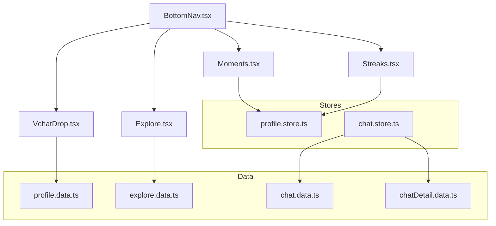
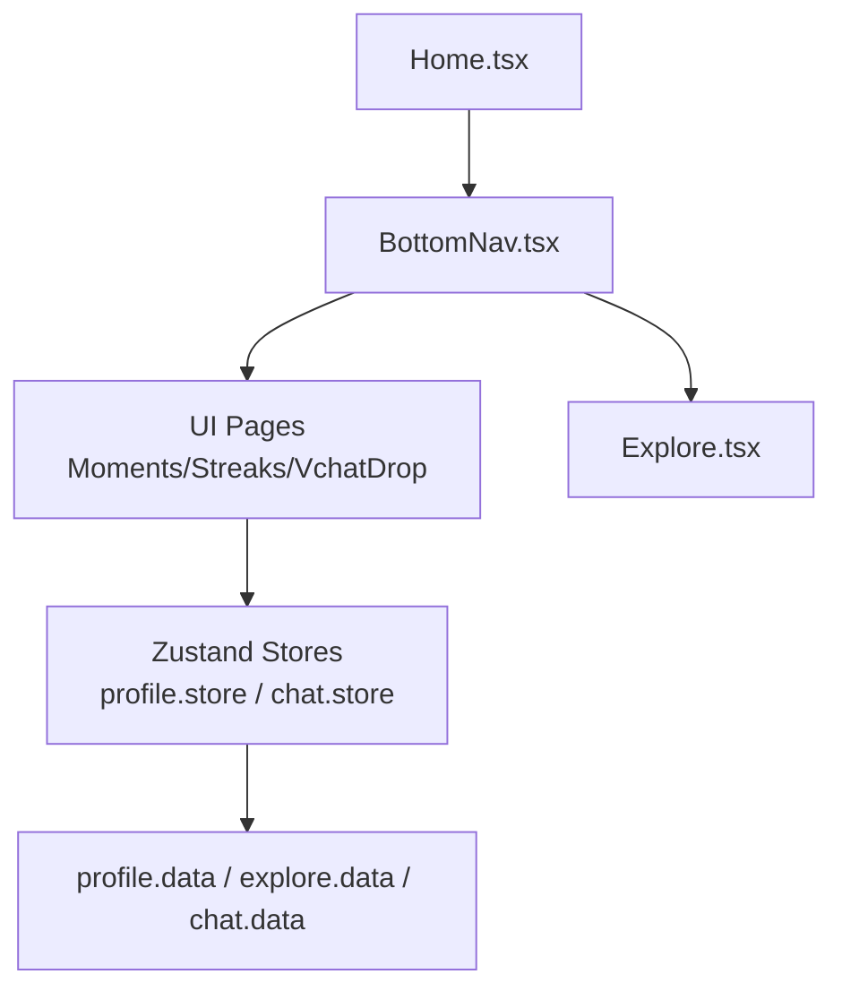
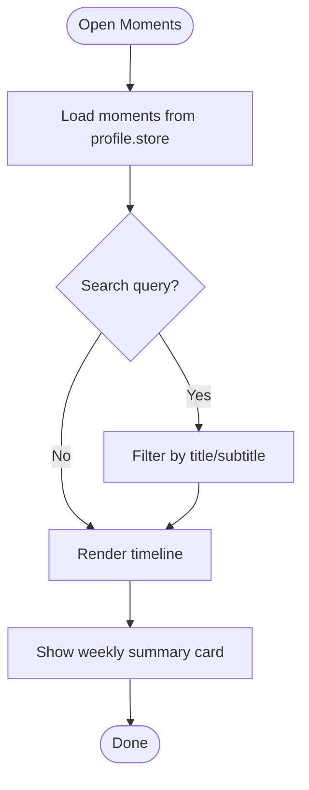
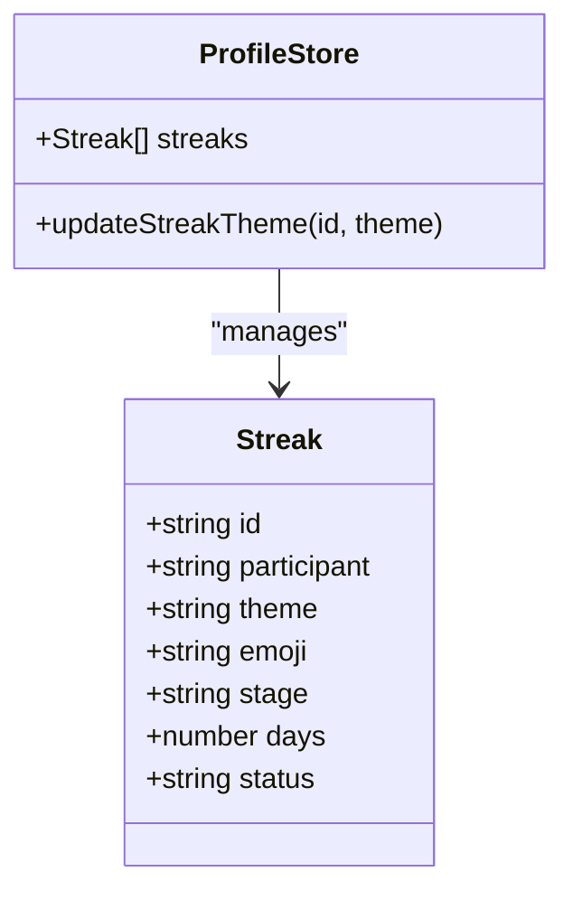
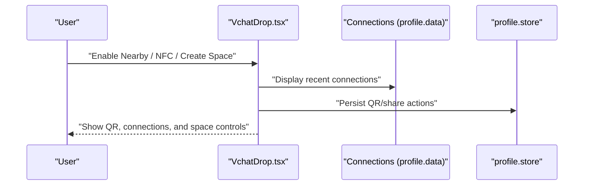
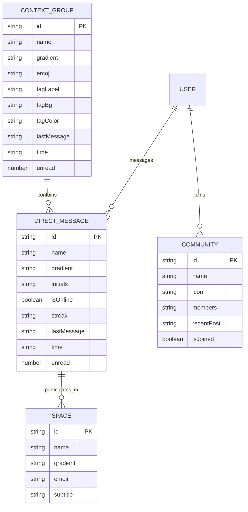
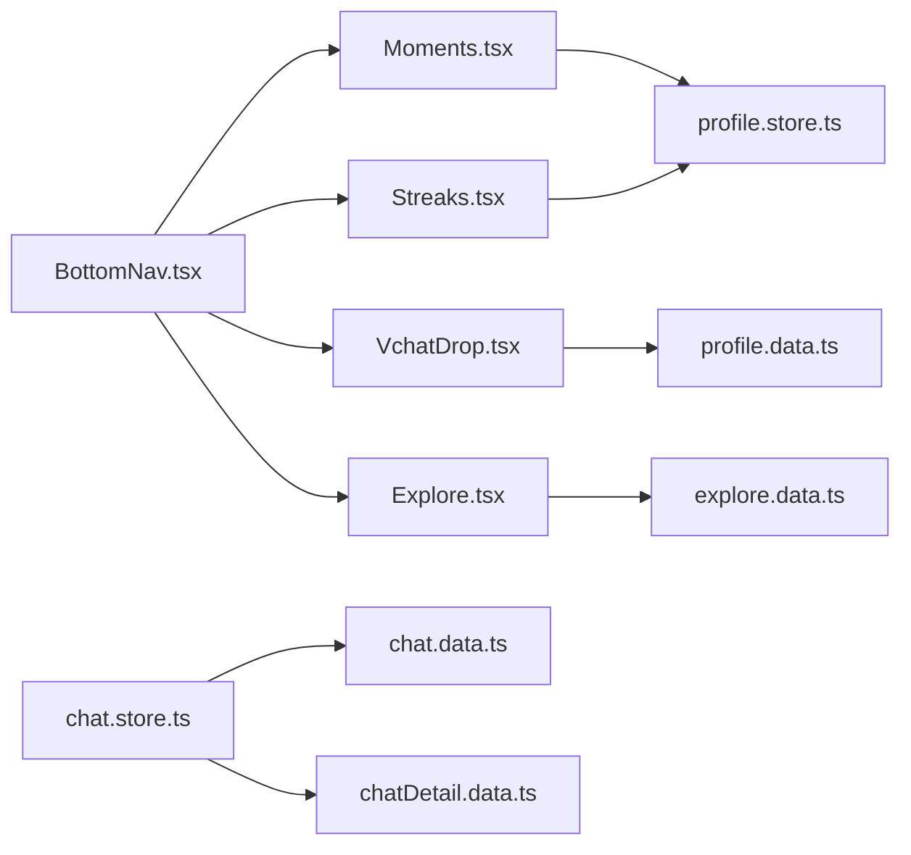

# Social Features

<cite>
**Referenced Files in This Document**
- [Moments.tsx](file://src/pages/profile/Moments.tsx)
- [Streaks.tsx](file://src/pages/profile/Streaks.tsx)
- [VchatDrop.tsx](file://src/pages/profile/VchatDrop.tsx)
- [profile.store.ts](file://src/store/profile.store.ts)
- [profile.data.ts](file://src/data/profile.data.ts)
- [chat.store.ts](file://src/store/chat.store.ts)
- [chat.data.ts](file://src/data/chat.data.ts)
- [chatDetail.data.ts](file://src/data/chatDetail.data.ts)
- [explore.data.ts](file://src/data/explore.data.ts)
- [BottomNav.tsx](file://src/components/BottomNav.tsx)
- [Home.tsx](file://src/pages/Home.tsx)
- [Explore.tsx](file://src/pages/Explore.tsx)
</cite>

## Table of Contents
1. [Introduction](#introduction)
2. [Project Structure](#project-structure)
3. [Core Components](#core-components)
4. [Architecture Overview](#architecture-overview)
5. [Detailed Component Analysis](#detailed-component-analysis)
6. [Dependency Analysis](#dependency-analysis)
7. [Performance Considerations](#performance-considerations)
8. [Troubleshooting Guide](#troubleshooting-guide)
9. [Conclusion](#conclusion)
10. [Appendices](#appendices)

## Introduction
This document explains VChat’s social interaction features: Moments collection, streak tracking, and VChat Drop content sharing. It covers how activities are aggregated into personal timelines, how weekly summaries and highlights are presented, how streaks are visualized and themed, and how nearby content sharing works via Bluetooth, NFC, and Wi-Fi direct. It also documents social graph maintenance, friend connections, communities, content moderation and safety controls, cross-platform compatibility, offline synchronization, and performance optimization strategies. Finally, it provides extension guidelines for adding new social capabilities and integrating with external networks.

## Project Structure
VChat organizes social features primarily under:
- Profile pages: Moments, Streaks, VChat Drop
- Stores: Profile store for moments, streaks, and connections; Chat store for messaging and DMs
- Data modules: Mock datasets for streaks, connections, posts, and communities
- Navigation: Bottom navigation adapts context-awarely to Hub mode and routes to social features

**Diagram sources**
- [BottomNav.tsx:1-62](file://src/components/BottomNav.tsx#L1-L62)
- [Moments.tsx:1-134](file://src/pages/profile/Moments.tsx#L1-L134)
- [Streaks.tsx:1-174](file://src/pages/profile/Streaks.tsx#L1-L174)
- [VchatDrop.tsx:1-163](file://src/pages/profile/VchatDrop.tsx#L1-L163)
- [profile.store.ts:1-139](file://src/store/profile.store.ts#L1-L139)
- [profile.data.ts:1-77](file://src/data/profile.data.ts#L1-L77)
- [explore.data.ts:1-193](file://src/data/explore.data.ts#L1-L193)
- [chat.store.ts:1-349](file://src/store/chat.store.ts#L1-L349)
- [chat.data.ts:1-134](file://src/data/chat.data.ts#L1-L134)
- [chatDetail.data.ts:1-71](file://src/data/chatDetail.data.ts#L1-L71)

**Section sources**
- [BottomNav.tsx:1-62](file://src/components/BottomNav.tsx#L1-L62)
- [Moments.tsx:1-134](file://src/pages/profile/Moments.tsx#L1-L134)
- [Streaks.tsx:1-174](file://src/pages/profile/Streaks.tsx#L1-L174)
- [VchatDrop.tsx:1-163](file://src/pages/profile/VchatDrop.tsx#L1-L163)
- [profile.store.ts:1-139](file://src/store/profile.store.ts#L1-L139)
- [profile.data.ts:1-77](file://src/data/profile.data.ts#L1-L77)
- [explore.data.ts:1-193](file://src/data/explore.data.ts#L1-L193)
- [chat.store.ts:1-349](file://src/store/chat.store.ts#L1-L349)
- [chat.data.ts:1-134](file://src/data/chat.data.ts#L1-L134)
- [chatDetail.data.ts:1-71](file://src/data/chatDetail.data.ts#L1-L71)

## Core Components
- Moments: Personal timeline aggregation, weekly summary card, private search, and chronological display.
- Streaks: Multi-theme life streaks, progress visualization, “at risk” indicators, and theme picker.
- VChat Drop: Nearby share (Bluetooth/Wi-Fi Direct), NFC tap, ephemeral spaces, QR sharing, and recent connections.
- Social Graph: Context groups, DMs with streak metadata, and Spaces; Explore communities and follow/unfollow actions.
- Moderation and Safety: “At risk” warnings on streaks, privacy lock on Moments, and safe defaults for sharing.

**Section sources**
- [Moments.tsx:1-134](file://src/pages/profile/Moments.tsx#L1-L134)
- [Streaks.tsx:1-174](file://src/pages/profile/Streaks.tsx#L1-L174)
- [VchatDrop.tsx:1-163](file://src/pages/profile/VchatDrop.tsx#L1-L163)
- [profile.store.ts:1-139](file://src/store/profile.store.ts#L1-L139)
- [profile.data.ts:1-77](file://src/data/profile.data.ts#L1-L77)
- [chat.store.ts:1-349](file://src/store/chat.store.ts#L1-L349)
- [chat.data.ts:1-134](file://src/data/chat.data.ts#L1-L134)
- [explore.data.ts:1-193](file://src/data/explore.data.ts#L1-L193)

## Architecture Overview
The social features rely on:
- UI pages for Moments, Streaks, and VChat Drop
- Zustand stores for state persistence and updates
- Mock data modules for seeding and rendering content
- Navigation adapting to Hub mode and routing to social features

**Diagram sources**
- [BottomNav.tsx:1-62](file://src/components/BottomNav.tsx#L1-L62)
- [Home.tsx:1-295](file://src/pages/Home.tsx#L1-L295)
- [profile.store.ts:1-139](file://src/store/profile.store.ts#L1-L139)
- [chat.store.ts:1-349](file://src/store/chat.store.ts#L1-L349)
- [profile.data.ts:1-77](file://src/data/profile.data.ts#L1-L77)
- [explore.data.ts:1-193](file://src/data/explore.data.ts#L1-L193)
- [chat.data.ts:1-134](file://src/data/chat.data.ts#L1-L134)

## Detailed Component Analysis

### Moments Collection System
- Activity aggregation: Timeline entries are seeded into the profile store and rendered in chronological order.
- Weekly summaries: A highlighted card displays curated metrics and highlights for a given week.
- Social highlights: Private-only view with a lock indicator; search filters moments by title/subtitle.
- Data model: Moment entries include date, icon, title, and subtitle.

**Diagram sources**
- [Moments.tsx:15-27](file://src/pages/profile/Moments.tsx#L15-L27)
- [profile.store.ts:86-93](file://src/store/profile.store.ts#L86-L93)

**Section sources**
- [Moments.tsx:1-134](file://src/pages/profile/Moments.tsx#L1-L134)
- [profile.store.ts:1-139](file://src/store/profile.store.ts#L1-L139)
- [profile.data.ts:1-77](file://src/data/profile.data.ts#L1-L77)

### Streak Tracking System
- Themes and stages: Each streak has a theme and progresses through stages with emoji and day count.
- Status indicators: “At risk” badges appear when streaks are nearing expiration.
- Visualization: Progress bar shows stage completion; “Next milestone” hints guide users.
- Editing: Theme picker allows changing a streak’s theme.

**Diagram sources**
- [profile.store.ts:6-14](file://src/store/profile.store.ts#L6-L14)
- [profile.store.ts:110-116](file://src/store/profile.store.ts#L110-L116)

**Section sources**
- [Streaks.tsx:1-174](file://src/pages/profile/Streaks.tsx#L1-L174)
- [profile.store.ts:1-139](file://src/store/profile.store.ts#L1-L139)
- [profile.data.ts:1-77](file://src/data/profile.data.ts#L1-L77)

### VChat Drop Content Sharing
- Nearby share: Bluetooth and Wi-Fi Direct sharing without internet; range and capability stated.
- NFC tap: Instant connection prompt for NFC-enabled devices.
- Ephemeral spaces: Geo-fenced mesh network creation and dissolution; room lifecycle managed via UI toggles.
- QR sharing: Personal QR generation and sharing options.
- Recent connections: List of recent connections made via Drop with gradient avatars.

**Diagram sources**
- [VchatDrop.tsx:1-163](file://src/pages/profile/VchatDrop.tsx#L1-L163)
- [profile.data.ts:40-57](file://src/data/profile.data.ts#L40-L57)
- [profile.store.ts:1-139](file://src/store/profile.store.ts#L1-L139)

**Section sources**
- [VchatDrop.tsx:1-163](file://src/pages/profile/VchatDrop.tsx#L1-L163)
- [profile.data.ts:1-77](file://src/data/profile.data.ts#L1-L77)
- [profile.store.ts:1-139](file://src/store/profile.store.ts#L1-L139)

### Social Graph and Community Building
- Context groups: Family, Work, Education, Society with gradient tags and unread counts.
- Direct messages: Individuals with online status, streak metadata, and initials.
- Spaces: Voice-active rooms with participant counts.
- Explore communities: Joinable groups with member counts and trending posts; follow/unfollow and join toggles.

**Diagram sources**
- [chat.data.ts:1-134](file://src/data/chat.data.ts#L1-L134)
- [explore.data.ts:158-192](file://src/data/explore.data.ts#L158-L192)

**Section sources**
- [chat.data.ts:1-134](file://src/data/chat.data.ts#L1-L134)
- [chat.store.ts:1-349](file://src/store/chat.store.ts#L1-L349)
- [explore.data.ts:1-193](file://src/data/explore.data.ts#L1-L193)
- [Explore.tsx:1-416](file://src/pages/Explore.tsx#L1-L416)

### Content Moderation and Safety Controls
- “At risk” warnings: Visual pulse badges on streak cards indicate danger of losing streak.
- Privacy-first design: Moments page is private by default with a lock indicator.
- Safe defaults: NFC enable prompts, ephemeral space dissolution, and QR sharing confirmations.

**Section sources**
- [Streaks.tsx:81-83](file://src/pages/profile/Streaks.tsx#L81-L83)
- [Moments.tsx:40-42](file://src/pages/profile/Moments.tsx#L40-L42)
- [VchatDrop.tsx:38-54](file://src/pages/profile/VchatDrop.tsx#L38-L54)

## Dependency Analysis
- UI pages depend on Zustand stores for reactive state and persistence.
- Stores depend on mock data modules for initial seeding.
- Navigation adapts context-awarely to Hub mode and routes to social features.

**Diagram sources**
- [BottomNav.tsx:1-62](file://src/components/BottomNav.tsx#L1-L62)
- [Moments.tsx:1-134](file://src/pages/profile/Moments.tsx#L1-L134)
- [Streaks.tsx:1-174](file://src/pages/profile/Streaks.tsx#L1-L174)
- [VchatDrop.tsx:1-163](file://src/pages/profile/VchatDrop.tsx#L1-L163)
- [profile.store.ts:1-139](file://src/store/profile.store.ts#L1-L139)
- [profile.data.ts:1-77](file://src/data/profile.data.ts#L1-L77)
- [explore.data.ts:1-193](file://src/data/explore.data.ts#L1-L193)
- [chat.store.ts:1-349](file://src/store/chat.store.ts#L1-L349)
- [chat.data.ts:1-134](file://src/data/chat.data.ts#L1-L134)
- [chatDetail.data.ts:1-71](file://src/data/chatDetail.data.ts#L1-L71)

**Section sources**
- [BottomNav.tsx:1-62](file://src/components/BottomNav.tsx#L1-L62)
- [profile.store.ts:1-139](file://src/store/profile.store.ts#L1-L139)
- [chat.store.ts:1-349](file://src/store/chat.store.ts#L1-L349)

## Performance Considerations
- Rendering optimization: Memoization in Moments filters avoids unnecessary re-renders.
- State persistence: Zustand with persistence middleware reduces redundant computations and improves UX continuity.
- Sorting and filtering: Chat store sorts chats by time and applies filters efficiently.
- UI animations: Framer Motion transitions are scoped to minimize layout thrashing.

**Section sources**
- [Moments.tsx:15-27](file://src/pages/profile/Moments.tsx#L15-L27)
- [chat.store.ts:218-266](file://src/store/chat.store.ts#L218-L266)

## Troubleshooting Guide
- Streaks not updating: Verify store action for theme change and persistence.
- No moments displayed: Check seeded moment array and ensure search query does not filter out all entries.
- VChat Drop not enabling: Confirm mock data presence for recent connections and QR rendering.
- Chat ordering anomalies: Review time parsing and sorting logic in chat store.

**Section sources**
- [profile.store.ts:110-116](file://src/store/profile.store.ts#L110-L116)
- [profile.store.ts:86-93](file://src/store/profile.store.ts#L86-L93)
- [profile.data.ts:40-57](file://src/data/profile.data.ts#L40-L57)
- [chat.store.ts:332-348](file://src/store/chat.store.ts#L332-L348)

## Conclusion
VChat’s social features combine personal reflection (Moments), motivation and identity (Streaks), and frictionless discovery (VChat Drop) with a robust social graph spanning groups, DMs, and communities. The modular UI, persistent stores, and mock data enable rapid iteration and scalability. Safety and moderation are embedded through explicit warnings and privacy defaults. The architecture supports cross-platform deployment via web technologies and offers clear extension points for advanced social integrations.

## Appendices

### Cross-Platform Compatibility and Offline Synchronization
- Web-first: React + Zustand + Vite stack runs across browsers and mobile web.
- Persistence: Zustand persistence middleware ensures offline continuity.
- Progressive Web App: Service worker assets present for caching and background updates.

**Section sources**
- [profile.store.ts:127-137](file://src/store/profile.store.ts#L127-L137)
- [chat.store.ts:320-329](file://src/store/chat.store.ts#L320-L329)

### Extending Social Capabilities
- Add new streak themes: Extend theme list and update store theme selection logic.
- Integrate external networks: Add new store slices for external profiles and feeds; wire UI pages to fetch and render remote data.
- Community features: Expand Explore store with external community APIs and join/follow toggles.

**Section sources**
- [Streaks.tsx:7-14](file://src/pages/profile/Streaks.tsx#L7-L14)
- [profile.store.ts:110-116](file://src/store/profile.store.ts#L110-L116)
- [Explore.tsx:14-27](file://src/pages/Explore.tsx#L14-L27)