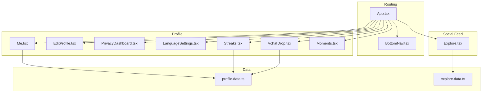
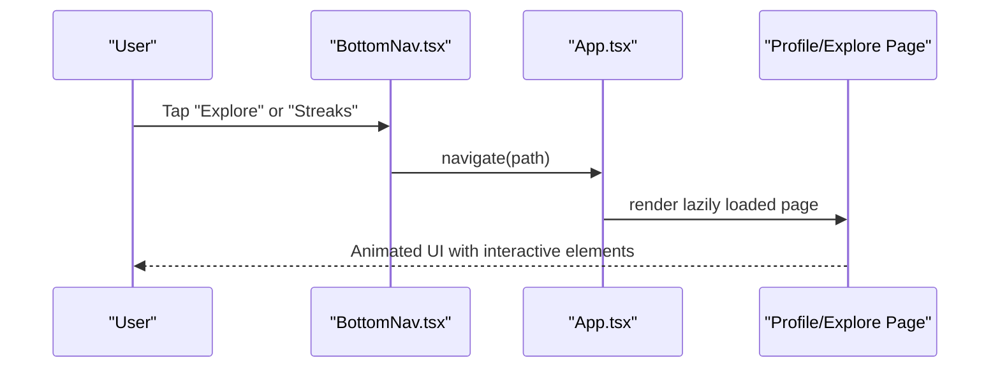
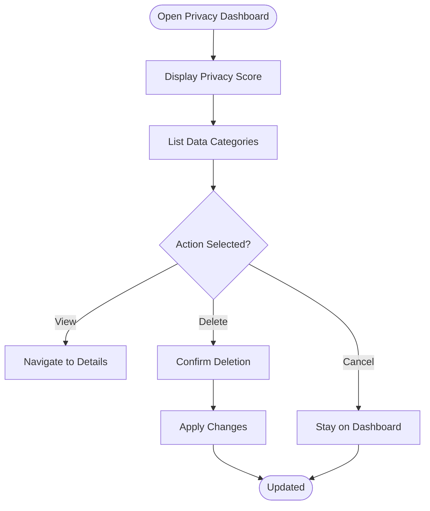
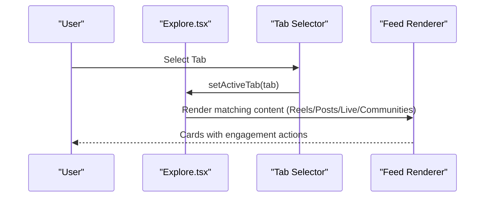
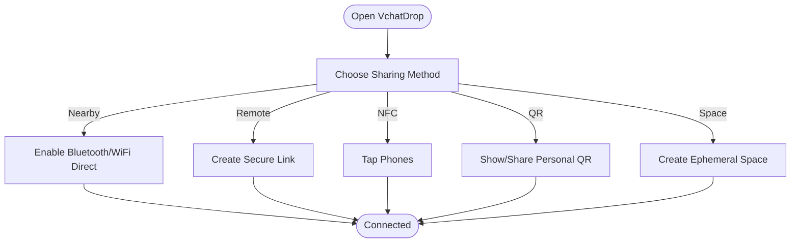
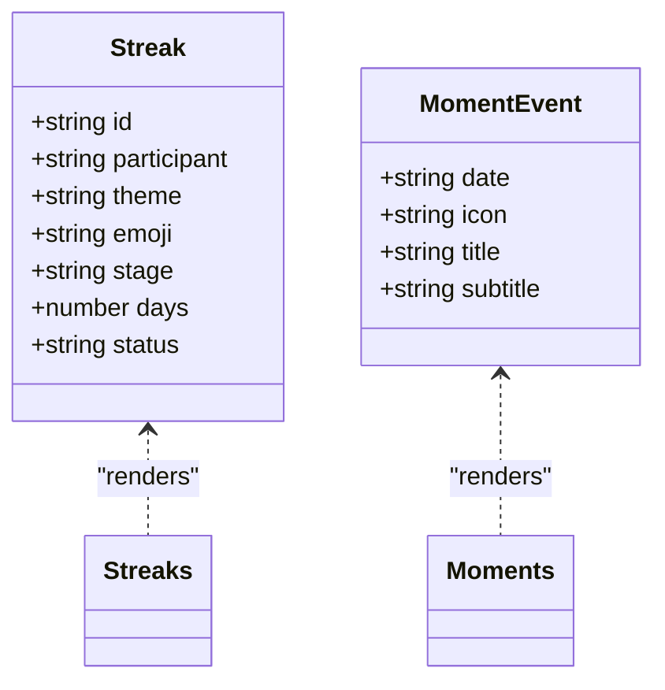
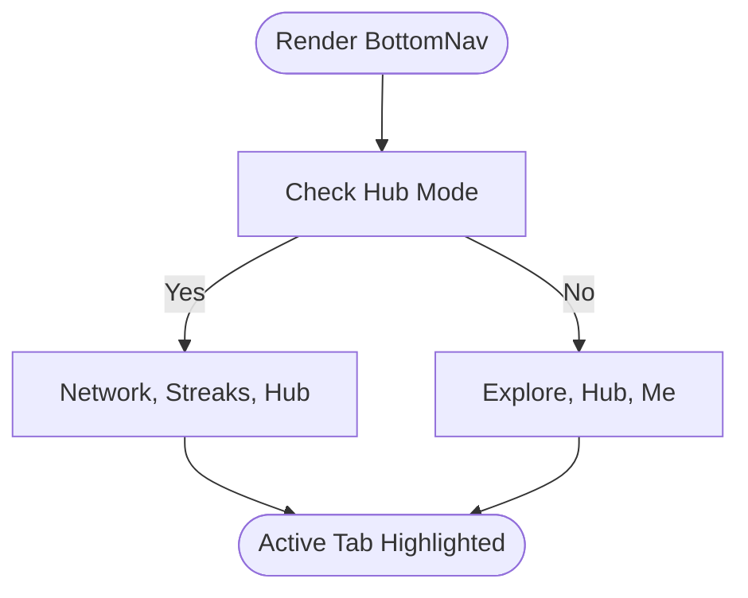
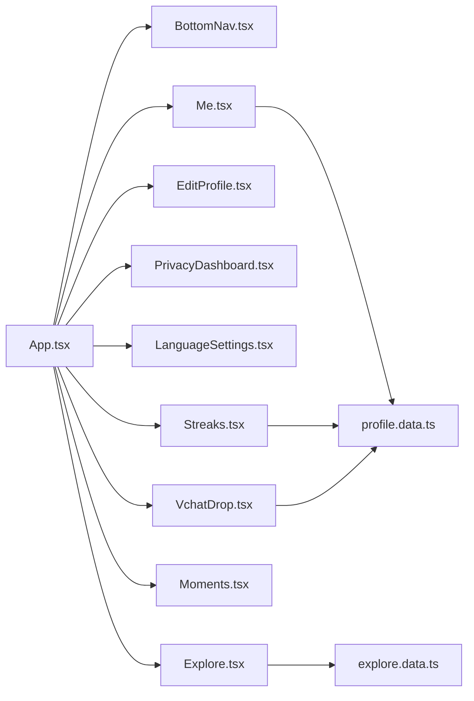

# Social Platform

<cite>
**Referenced Files in This Document**
- [App.tsx](file://src/App.tsx)
- [BottomNav.tsx](file://src/components/BottomNav.tsx)
- [Me.tsx](file://src/pages/Me.tsx)
- [EditProfile.tsx](file://src/pages/profile/EditProfile.tsx)
- [LanguageSettings.tsx](file://src/pages/profile/LanguageSettings.tsx)
- [PrivacyDashboard.tsx](file://src/pages/profile/PrivacyDashboard.tsx)
- [VchatDrop.tsx](file://src/pages/profile/VchatDrop.tsx)
- [Streaks.tsx](file://src/pages/profile/Streaks.tsx)
- [Moments.tsx](file://src/pages/profile/Moments.tsx)
- [Explore.tsx](file://src/pages/Explore.tsx)
- [profile.data.ts](file://src/data/profile.data.ts)
- [explore.data.ts](file://src/data/explore.data.ts)
</cite>

## Table of Contents
1. [Introduction](#introduction)
2. [Project Structure](#project-structure)
3. [Core Components](#core-components)
4. [Architecture Overview](#architecture-overview)
5. [Detailed Component Analysis](#detailed-component-analysis)
6. [Dependency Analysis](#dependency-analysis)
7. [Performance Considerations](#performance-considerations)
8. [Troubleshooting Guide](#troubleshooting-guide)
9. [Conclusion](#conclusion)
10. [Appendices](#appendices)

## Introduction
This document describes VChat’s social platform features centered around user profiles, story sharing, moments collection, and social interactions. It documents the user profile interface (including edit profile, privacy settings, and language preferences), the social features (story sharing, moments timeline, streak tracking, and VChat Drop), and the privacy dashboard. It also outlines profile data management, authentication patterns, social graph maintenance, moderation and community guidelines enforcement, user experience considerations, accessibility compliance, cross-platform synchronization, and implementation guidelines for extending social features and integrating with external platforms.

## Project Structure
VChat organizes social features primarily under:
- Profile pages: Edit profile, privacy dashboard, language settings, VChat Drop, streaks, and moments
- Social feed: Explore page with Reels, posts, live streams, communities
- Navigation: Bottom navigation adapts context (Hub vs. Explore) and routes to social features
- Data: Mock datasets for streaks, connections, languages, and social content

**Diagram sources**
- [App.tsx:66-133](file://src/App.tsx#L66-L133)
- [BottomNav.tsx:13-23](file://src/components/BottomNav.tsx#L13-L23)
- [Me.tsx:101-108](file://src/pages/Me.tsx#L101-L108)
- [EditProfile.tsx:6-31](file://src/pages/profile/EditProfile.tsx#L6-L31)
- [PrivacyDashboard.tsx:6-114](file://src/pages/profile/PrivacyDashboard.tsx#L6-L114)
- [LanguageSettings.tsx:7-103](file://src/pages/profile/LanguageSettings.tsx#L7-L103)
- [VchatDrop.tsx:7-162](file://src/pages/profile/VchatDrop.tsx#L7-L162)
- [Streaks.tsx:7-151](file://src/pages/profile/Streaks.tsx#L7-L151)
- [Moments.tsx:6-100](file://src/pages/profile/Moments.tsx#L6-L100)
- [Explore.tsx:7-366](file://src/pages/Explore.tsx#L7-L366)
- [profile.data.ts:1-77](file://src/data/profile.data.ts#L1-L77)
- [explore.data.ts:1-193](file://src/data/explore.data.ts#L1-L193)

**Section sources**
- [App.tsx:66-133](file://src/App.tsx#L66-L133)
- [BottomNav.tsx:13-23](file://src/components/BottomNav.tsx#L13-L23)
- [Me.tsx:101-108](file://src/pages/Me.tsx#L101-L108)

## Core Components
- Profile Management
  - Edit Profile: Stubbed UI for editing personal details and preferences
  - Language & Translation: Primary language selection, auto-translate toggles, offline translation packs
  - Privacy Dashboard: Privacy score, data categories, stealth mode, read receipts, data download/delete actions
- Story Sharing and Social Interactions
  - Explore feed: Reels, videos, live streams, text posts, communities
  - VChat Drop: Nearby share, remote share, NFC tap, ephemeral spaces, QR sharing, recent connections
  - Streaks: Life streaks, Super App Streaks, individual streak cards with progress and theme selection
  - Moments: Private timeline, weekly highlights, AI search, chronological events
- Navigation and Routing
  - Bottom navigation adapts to Hub mode and routes to Explore, Streaks, and Me

**Section sources**
- [EditProfile.tsx:6-31](file://src/pages/profile/EditProfile.tsx#L6-L31)
- [LanguageSettings.tsx:7-103](file://src/pages/profile/LanguageSettings.tsx#L7-L103)
- [PrivacyDashboard.tsx:6-114](file://src/pages/profile/PrivacyDashboard.tsx#L6-L114)
- [Explore.tsx:7-366](file://src/pages/Explore.tsx#L7-L366)
- [VchatDrop.tsx:7-162](file://src/pages/profile/VchatDrop.tsx#L7-L162)
- [Streaks.tsx:7-151](file://src/pages/profile/Streaks.tsx#L7-L151)
- [Moments.tsx:6-100](file://src/pages/profile/Moments.tsx#L6-L100)
- [BottomNav.tsx:13-23](file://src/components/BottomNav.tsx#L13-L23)

## Architecture Overview
VChat uses React Router for navigation and Framer Motion for page transitions. The Explore feed composes reusable UI elements and mock data. Profile-related screens are lazily loaded and rendered within animated wrappers. The BottomNav dynamically switches between Explore and Streaks depending on Hub context.

**Diagram sources**
- [BottomNav.tsx:13-23](file://src/components/BottomNav.tsx#L13-L23)
- [App.tsx:66-133](file://src/App.tsx#L66-L133)

**Section sources**
- [App.tsx:66-133](file://src/App.tsx#L66-L133)
- [BottomNav.tsx:13-23](file://src/components/BottomNav.tsx#L13-L23)

## Detailed Component Analysis

### Profile Management
- Edit Profile
  - Purpose: Central place to update profile details and preferences
  - UI: Back button, save action, stubbed content indicating future implementation
  - UX: Smooth slide-in/out transitions using motion primitives
- Language & Translation
  - Primary language selector
  - Auto-translate toggles for incoming messages, original below translation, voice notes
  - Voice output language selection
  - Offline translation packs with download actions
- Privacy Dashboard
  - Privacy score visualization
  - Data categories with view/download/delete actions
  - Stealth mode toggle
  - Read receipts settings with per-contact exceptions
  - Account actions: download data, delete account

**Diagram sources**
- [PrivacyDashboard.tsx:6-114](file://src/pages/profile/PrivacyDashboard.tsx#L6-L114)

**Section sources**
- [EditProfile.tsx:6-31](file://src/pages/profile/EditProfile.tsx#L6-L31)
- [LanguageSettings.tsx:7-103](file://src/pages/profile/LanguageSettings.tsx#L7-L103)
- [PrivacyDashboard.tsx:6-114](file://src/pages/profile/PrivacyDashboard.tsx#L6-L114)

### Social Features: Explore, Stories, and Communities
- Explore Feed
  - Tabs: For You, Reels, Videos, Live, Posts, Communities
  - Reels: Interactive cards with overlays, likes/comments/share/save/actions
  - Posts: Text posts with hashtags, follow buttons, engagement metrics
  - Live Streams: Live badges, viewer counts, join buttons
  - Communities: Joinable groups with trending posts
- Story Sharing
  - Reels and video content integrated into Explore
  - Duet/Stitch/Shop affordances for collaborative content
- Communities
  - Joinable groups with member counts and recent posts

**Diagram sources**
- [Explore.tsx:8-98](file://src/pages/Explore.tsx#L8-L98)
- [Explore.tsx:104-362](file://src/pages/Explore.tsx#L104-L362)

**Section sources**
- [Explore.tsx:7-366](file://src/pages/Explore.tsx#L7-L366)
- [explore.data.ts:1-193](file://src/data/explore.data.ts#L1-L193)

### VChat Drop: Nearby, Remote, and NFC Sharing
- Ephemeral Spaces: Instant geo-fenced mesh network with room controls
- Nearby Share: Bluetooth/WiFi Direct sharing without internet
- Remote Share: Secure encrypted link generation
- NFC Tap: Instant connection via NFC (device-dependent)
- QR Sharing: Personal QR generation and sharing
- Recent Connections: List of recent connections via Drop

**Diagram sources**
- [VchatDrop.tsx:7-162](file://src/pages/profile/VchatDrop.tsx#L7-L162)

**Section sources**
- [VchatDrop.tsx:7-162](file://src/pages/profile/VchatDrop.tsx#L7-L162)
- [profile.data.ts:40-57](file://src/data/profile.data.ts#L40-L57)

### Streak Tracking and Moments Collection
- Streaks
  - Highlights: Total active streaks and longest streak
  - Super App Streaks: Eco, Brain, Generosity themes
  - Individual streak cards: Status indicators, progress visualization, theme selection
  - Risk warnings and milestone messaging
- Moments
  - Private timeline with weekly/monthly/all-time tabs
  - Weekly highlights card summarizing events, connections, spending
  - AI search box for querying moments
  - Chronological event timeline with icons and metadata

**Diagram sources**
- [Streaks.tsx:67-106](file://src/pages/profile/Streaks.tsx#L67-L106)
- [Moments.tsx:77-95](file://src/pages/profile/Moments.tsx#L77-L95)
- [profile.data.ts:1-38](file://src/data/profile.data.ts#L1-L38)

**Section sources**
- [Streaks.tsx:7-151](file://src/pages/profile/Streaks.tsx#L7-L151)
- [Moments.tsx:6-100](file://src/pages/profile/Moments.tsx#L6-L100)
- [profile.data.ts:1-77](file://src/data/profile.data.ts#L1-L77)

### Navigation and Routing
- BottomNav adapts to Hub mode:
  - In Hub: “Network” replaces “Explore”, “Streaks” replaces “Hub”
  - Otherwise: Standard “Explore” and “Hub” tabs
- Routes for social features are defined in App.tsx with lazy loading and animated wrappers

**Diagram sources**
- [BottomNav.tsx:9-23](file://src/components/BottomNav.tsx#L9-L23)
- [App.tsx:66-133](file://src/App.tsx#L66-L133)

**Section sources**
- [BottomNav.tsx:13-23](file://src/components/BottomNav.tsx#L13-L23)
- [App.tsx:66-133](file://src/App.tsx#L66-L133)

## Dependency Analysis
- Routing and Layout
  - App.tsx defines all routes, including profile and social features
  - BottomNav depends on current location to highlight active tab
- Data Dependencies
  - Profile screens consume mock data from profile.data.ts
  - Explore consumes mock data from explore.data.ts
- UI Composition
  - Explore composes reusable components for posts, live streams, and communities
  - Profile screens reuse toggle components and navigation patterns

**Diagram sources**
- [App.tsx:66-133](file://src/App.tsx#L66-L133)
- [BottomNav.tsx:13-23](file://src/components/BottomNav.tsx#L13-L23)
- [Me.tsx:101-108](file://src/pages/Me.tsx#L101-L108)
- [profile.data.ts:1-77](file://src/data/profile.data.ts#L1-L77)
- [explore.data.ts:1-193](file://src/data/explore.data.ts#L1-L193)

**Section sources**
- [App.tsx:66-133](file://src/App.tsx#L66-L133)
- [profile.data.ts:1-77](file://src/data/profile.data.ts#L1-L77)
- [explore.data.ts:1-193](file://src/data/explore.data.ts#L1-L193)

## Performance Considerations
- Lazy loading: All major pages are lazy-loaded to reduce initial bundle size
- Animations: Framer Motion transitions are lightweight and optimized for mobile
- Virtualization: Consider list virtualization for long feeds (Explore, Moments)
- Data fetching: Current implementation uses mock data; integrate real APIs with caching and pagination
- Asset delivery: Optimize images and videos in Explore feed; consider CDN and compression

## Troubleshooting Guide
- Navigation Issues
  - Verify routes in App.tsx match BottomNav targets
  - Ensure animated wrappers are applied consistently
- Data Consistency
  - Confirm mock datasets align with UI expectations (e.g., streak themes, connection gradients)
- Interaction States
  - Toggle states (privacy, language, read receipts) should persist across sessions
  - Theme toggle persists via theme hook; ensure hydration on load
- Accessibility
  - Add ARIA labels and keyboard navigation for interactive elements
  - Ensure sufficient color contrast for streak risk indicators and privacy score

**Section sources**
- [App.tsx:66-133](file://src/App.tsx#L66-L133)
- [BottomNav.tsx:13-23](file://src/components/BottomNav.tsx#L13-L23)
- [Me.tsx:101-108](file://src/pages/Me.tsx#L101-L108)

## Conclusion
VChat’s social platform integrates profile management, privacy controls, language preferences, and robust social features. The Explore feed, VChat Drop, Streaks, and Moments provide a cohesive social experience, while the privacy dashboard and language settings support user autonomy and inclusivity. The modular component architecture and lazy routing enable scalable enhancements and cross-platform synchronization.

## Appendices

### Implementation Guidelines for Extending Social Features
- Story Engine
  - Integrate a story engine with persistence for seen/unseen states and expiration
  - Add push notifications for new stories and social reminders
- Moments AI Search
  - Implement natural language queries over stored events and media
  - Add filters for time range, participants, and categories
- VChat Drop Enhancements
  - Add permission prompts for Bluetooth/NFC/WiFi Direct
  - Implement secure file transfer protocols and encryption
- Social Graph Maintenance
  - Track follows, blocks, and mutes
  - Implement friend suggestion algorithms and mutual connections
- Moderation and Community Guidelines
  - Add reporting mechanisms with flagging and review workflows
  - Enforce community guidelines with automated content filtering and manual moderation queues
- Cross-Platform Synchronization
  - Sync profile data, privacy settings, and social interactions across devices
  - Use secure cloud storage with granular access controls
- Accessibility Compliance
  - Ensure screen reader compatibility, keyboard navigation, and high contrast modes
  - Provide captions/subtitles for audio/video content
- Integrations
  - OAuth for social logins and third-party sign-up
  - Embed social sharing buttons and Open Graph meta tags
  - Integrate with external calendars and payment providers