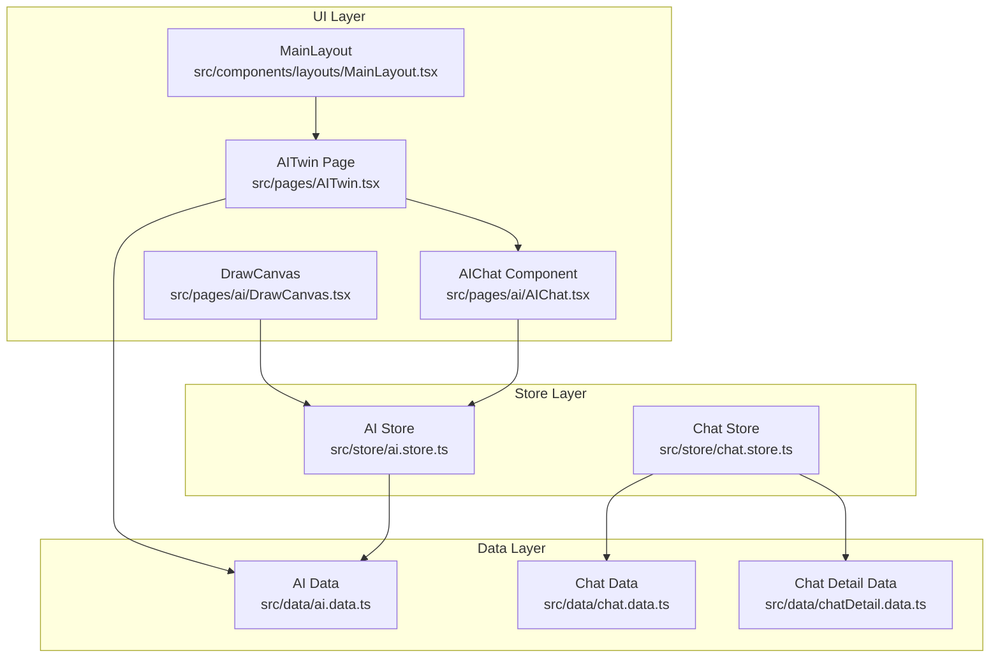
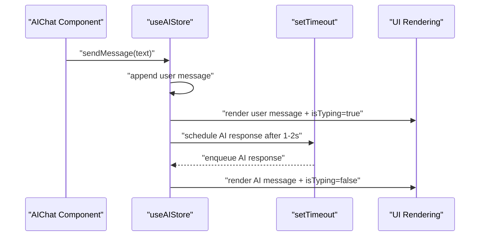
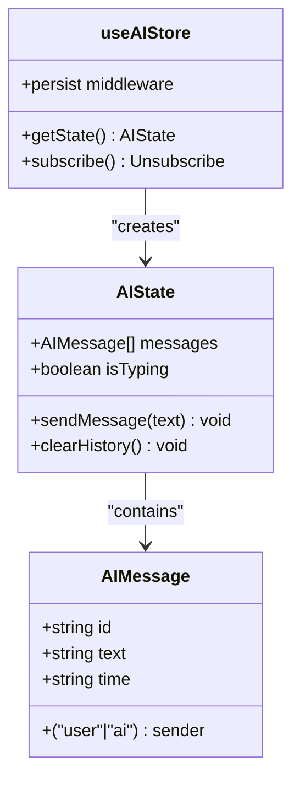
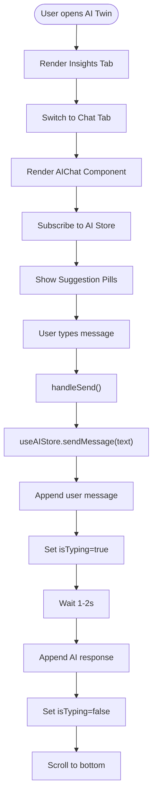
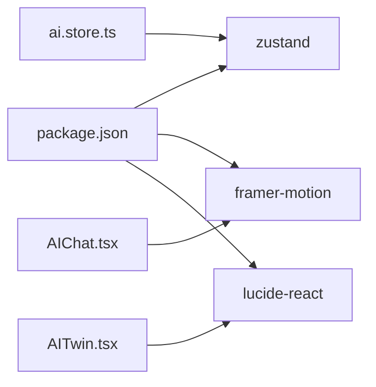

# AI State Management

<cite>
**Referenced Files in This Document**
- [ai.store.ts](file://src/store/ai.store.ts)
- [ai.data.ts](file://src/data/ai.data.ts)
- [AIChat.tsx](file://src/pages/ai/AIChat.tsx)
- [AITwin.tsx](file://src/pages/AITwin.tsx)
- [MainLayout.tsx](file://src/components/layouts/MainLayout.tsx)
- [chat.data.ts](file://src/data/chat.data.ts)
- [chatDetail.data.ts](file://src/data/chatDetail.data.ts)
- [chat.store.ts](file://src/store/chat.store.ts)
- [DrawCanvas.tsx](file://src/pages/ai/DrawCanvas.tsx)
- [package.json](file://package.json)
</cite>

## Table of Contents
1. [Introduction](#introduction)
2. [Project Structure](#project-structure)
3. [Core Components](#core-components)
4. [Architecture Overview](#architecture-overview)
5. [Detailed Component Analysis](#detailed-component-analysis)
6. [Dependency Analysis](#dependency-analysis)
7. [Performance Considerations](#performance-considerations)
8. [Troubleshooting Guide](#troubleshooting-guide)
9. [Conclusion](#conclusion)
10. [Appendices](#appendices)

## Introduction
This document explains VChat’s AI state management system built with Zustand. It covers the AI store architecture, conversation history management, message processing logic, AI response simulation, suggestion system, and integration with AI data modules. It also documents message threading, context preservation, async response handling, state persistence, memory management, error handling, and guidance for extending AI functionality and optimizing performance.

## Project Structure
The AI state management spans several modules:
- Store: AI state and actions (Zustand)
- Data: AI insights and mock chat sequences
- Pages: AI chat UI and AI Twin container
- Layouts: Application shell and navigation
- Related stores: Chat store for comparison and integration points

**Diagram sources**
- [ai.store.ts:1-162](file://src/store/ai.store.ts#L1-L162)
- [ai.data.ts:1-102](file://src/data/ai.data.ts#L1-L102)
- [AIChat.tsx:1-127](file://src/pages/ai/AIChat.tsx#L1-L127)
- [AITwin.tsx:1-135](file://src/pages/AITwin.tsx#L1-L135)
- [MainLayout.tsx:1-30](file://src/components/layouts/MainLayout.tsx#L1-L30)
- [chat.store.ts:1-325](file://src/store/chat.store.ts#L1-L325)
- [chat.data.ts:1-134](file://src/data/chat.data.ts#L1-L134)
- [chatDetail.data.ts:1-71](file://src/data/chatDetail.data.ts#L1-L71)
- [DrawCanvas.tsx:1-120](file://src/pages/ai/DrawCanvas.tsx#L1-L120)

**Section sources**
- [ai.store.ts:1-162](file://src/store/ai.store.ts#L1-L162)
- [ai.data.ts:1-102](file://src/data/ai.data.ts#L1-L102)
- [AIChat.tsx:1-127](file://src/pages/ai/AIChat.tsx#L1-L127)
- [AITwin.tsx:1-135](file://src/pages/AITwin.tsx#L1-L135)
- [MainLayout.tsx:1-30](file://src/components/layouts/MainLayout.tsx#L1-L30)
- [chat.store.ts:1-325](file://src/store/chat.store.ts#L1-L325)
- [chat.data.ts:1-134](file://src/data/chat.data.ts#L1-L134)
- [chatDetail.data.ts:1-71](file://src/data/chatDetail.data.ts#L1-L71)
- [DrawCanvas.tsx:1-120](file://src/pages/ai/DrawCanvas.tsx#L1-L120)

## Core Components
- AI Store: Centralized state for AI messages, typing indicator, and actions to send messages and clear history. Uses Zustand with persistence to localStorage.
- AI Chat UI: Renders messages, typing indicators, suggestion pills, and handles user input submission.
- AI Twin Container: Hosts Insights and Chat tabs, integrates AI data and routes to AI chat.
- AI Data: Provides mock insights and initial chat sequences for seeding the AI store.
- Chat Store: Reference implementation for message threading and async replies; useful for understanding patterns applicable to AI message handling.

Key responsibilities:
- Conversation history management: append user and AI messages, preserve timestamps.
- Message processing logic: validate input, enqueue user message, simulate AI response with randomized delay.
- AI response simulation: keyword-based routing to contextual responses; fallback to default responses.
- Suggestion system: pre-defined suggestion pills shown before first user message.
- Context preservation: initial messages seeded from mock data to establish context.
- Persistence: localStorage-backed store to retain conversation history across sessions.
- Memory management: current implementation appends messages without trimming; consider pagination or trimming for long sessions.
- Async handling: setTimeout simulates AI processing; UI reacts to isTyping flag.
- Integration points: AI Twin page consumes AI data; DrawCanvas demonstrates AI parsing feedback.

**Section sources**
- [ai.store.ts:4-161](file://src/store/ai.store.ts#L4-L161)
- [AIChat.tsx:7-127](file://src/pages/ai/AIChat.tsx#L7-L127)
- [AITwin.tsx:8-135](file://src/pages/AITwin.tsx#L8-L135)
- [ai.data.ts:1-102](file://src/data/ai.data.ts#L1-L102)
- [chat.store.ts:171-325](file://src/store/chat.store.ts#L171-L325)

## Architecture Overview
The AI state management follows a unidirectional data flow:
- UI triggers actions via the AI store.
- Store updates state immutably and schedules async AI responses.
- UI subscribes to state changes and renders messages and typing indicators.
- Persistence middleware ensures state survives reloads.

**Diagram sources**
- [AIChat.tsx:22-26](file://src/pages/ai/AIChat.tsx#L22-L26)
- [ai.store.ts:119-148](file://src/store/ai.store.ts#L119-L148)

**Section sources**
- [ai.store.ts:113-161](file://src/store/ai.store.ts#L113-L161)
- [AIChat.tsx:18-26](file://src/pages/ai/AIChat.tsx#L18-L26)

## Detailed Component Analysis

### AI Store: State, Messages, and Actions
The AI store defines the conversation state and actions:
- State shape:
  - messages: array of AIMessage with id, text, sender, time.
  - isTyping: boolean to indicate AI thinking.
- Actions:
  - sendMessage(text): validates input, appends user message, sets isTyping, schedules AI response.
  - clearHistory(): resets to initial messages and clears typing.

**Diagram sources**
- [ai.store.ts:4-17](file://src/store/ai.store.ts#L4-L17)
- [ai.store.ts:113-161](file://src/store/ai.store.ts#L113-L161)

Implementation highlights:
- Initial messages seeded from mock data to establish context.
- simulateAIResponse performs keyword matching to produce contextual responses.
- sendMessage appends user message immediately, sets isTyping, then enqueues AI response after a randomized delay.
- clearHistory restores initial messages and typing state.

**Section sources**
- [ai.store.ts:19-51](file://src/store/ai.store.ts#L19-L51)
- [ai.store.ts:61-111](file://src/store/ai.store.ts#L61-L111)
- [ai.store.ts:119-155](file://src/store/ai.store.ts#L119-L155)

### AI Chat UI: Rendering, Suggestions, and Input Handling
The AI chat component consumes the AI store and renders:
- Messages with distinct styling for user and AI.
- Typing indicator animation when isTyping is true.
- Suggestion pills shown before first user message.
- Voice input and text input handling with recording state.
- Auto-scroll to latest message.

**Diagram sources**
- [AITwin.tsx:122-129](file://src/pages/AITwin.tsx#L122-L129)
- [AIChat.tsx:18-26](file://src/pages/ai/AIChat.tsx#L18-L26)
- [AIChat.tsx:73-81](file://src/pages/ai/AIChat.tsx#L73-L81)
- [AIChat.tsx:114-122](file://src/pages/ai/AIChat.tsx#L114-L122)
- [ai.store.ts:119-148](file://src/store/ai.store.ts#L119-L148)

**Section sources**
- [AIChat.tsx:28-68](file://src/pages/ai/AIChat.tsx#L28-L68)
- [AIChat.tsx:73-81](file://src/pages/ai/AIChat.tsx#L73-L81)
- [AIChat.tsx:114-122](file://src/pages/ai/AIChat.tsx#L114-L122)

### AI Data Module: Insights and Initial Sequences
The AI data module provides:
- mockInsights: structured data for urgent items, today’s schedule, suggestions, and summaries.
- mockAIChatSequence: initial conversation messages to seed the AI store.

These datasets inform the UI and can be used to pre-populate or contextualize AI responses.

**Section sources**
- [ai.data.ts:1-73](file://src/data/ai.data.ts#L1-L73)
- [ai.data.ts:75-101](file://src/data/ai.data.ts#L75-L101)

### AI Twin Container: Tabs and Navigation
The AITwin page hosts two tabs:
- Insights: displays urgent, today, suggestions, and summaries using mockInsights.
- Chat: embeds the AI chat UI.

It also provides navigation to AI Twin settings and manages tab switching with animations.

**Section sources**
- [AITwin.tsx:44-131](file://src/pages/AITwin.tsx#L44-L131)

### Integration with AI Data Modules and Message Formatting
- AI data is consumed by the AITwin page to render insights and summaries.
- AI messages are formatted with sender, text, and ISO timestamp.
- The AI response simulation uses keyword matching against user input to produce contextual replies.

Practical integration points:
- Use mockInsights to populate the Insights tab.
- Seed initial messages from mockAIChatSequence to establish context.
- Extend simulateAIResponse to incorporate external AI APIs by replacing the keyword-based logic with API calls.

**Section sources**
- [AITwin.tsx:46-121](file://src/pages/AITwin.tsx#L46-L121)
- [ai.data.ts:75-101](file://src/data/ai.data.ts#L75-L101)
- [ai.store.ts:61-111](file://src/store/ai.store.ts#L61-L111)

### Response Parsing Logic and AI Interaction Patterns
Current parsing logic:
- simulateAIResponse converts user text to lowercase and checks for keywords to select a contextual response.
- Default responses are randomly selected when no keyword matches.

Extending response parsing:
- Replace keyword matching with an external AI API call.
- Parse structured responses (e.g., JSON) and map to UI-friendly formats.
- Handle streaming responses by updating state progressively.

**Section sources**
- [ai.store.ts:61-111](file://src/store/ai.store.ts#L61-L111)

### Practical Examples: Consuming AI State in Components
- Subscribing to AI store:
  - Destructure messages, isTyping, and sendMessage from useAIStore.
  - Render messages and typing indicator conditionally.
- Handling async AI responses:
  - On submit, call sendMessage and rely on isTyping to show typing animation.
  - Append AI message when received.
- Managing conversation flow:
  - Clear history via clearHistory to reset context.
  - Use suggestion pills to guide user input.

Example references:
- [AIChat.tsx:9-26](file://src/pages/ai/AIChat.tsx#L9-L26)
- [AIChat.tsx:51-65](file://src/pages/ai/AIChat.tsx#L51-L65)
- [AIChat.tsx:73-81](file://src/pages/ai/AIChat.tsx#L73-L81)

**Section sources**
- [AIChat.tsx:9-26](file://src/pages/ai/AIChat.tsx#L9-L26)
- [AIChat.tsx:51-65](file://src/pages/ai/AIChat.tsx#L51-L65)
- [AIChat.tsx:73-81](file://src/pages/ai/AIChat.tsx#L73-L81)

### State Persistence and Memory Management
- Persistence:
  - The AI store uses Zustand’s persist middleware with a storage key to retain messages across reloads.
- Memory management:
  - Current implementation appends messages without trimming; consider implementing:
    - Max message count limits.
    - Periodic pruning of older messages.
    - Pagination for long histories.

Storage configuration:
- Storage key: ai-chat-storage
- Middleware: persist

**Section sources**
- [ai.store.ts:157-160](file://src/store/ai.store.ts#L157-L160)

### Error Handling for AI Service Failures
- Current simulation does not surface errors; however, when integrating with real AI APIs:
  - Wrap API calls in try/catch blocks.
  - Surface user-facing errors via toasts or inline notifications.
  - Optionally retry failed requests with exponential backoff.
  - Fallback to default responses or cached insights.

[No sources needed since this section provides general guidance]

### Extending AI Functionality and Integrating New AI Models
- Replace simulateAIResponse with an API client:
  - Introduce an async action that calls the AI endpoint.
  - Update state with partial responses during streaming.
  - Handle completion and finalize the AI message.
- Add model selection and configuration:
  - Allow users to switch models or adjust parameters.
  - Persist model preferences in the store.
- Enhance context:
  - Include recent conversation context in API requests.
  - Manage token limits and trim context when necessary.

[No sources needed since this section provides general guidance]

### Optimizing Performance for AI Interactions
- Debounce rapid inputs to reduce unnecessary API calls.
- Batch UI updates to minimize re-renders.
- Use virtualized lists for long conversation histories.
- Cache frequently used responses or metadata.
- Lazy-load heavy assets or models.

[No sources needed since this section provides general guidance]

## Dependency Analysis
External dependencies relevant to AI state management:
- Zustand: state management library enabling simple, scalable stores.
- Framer Motion: animation library used for smooth transitions and typing indicators.
- Lucide React: icons for UI elements.

**Diagram sources**
- [package.json:12-18](file://package.json#L12-L18)
- [ai.store.ts:1-2](file://src/store/ai.store.ts#L1-L2)
- [AIChat.tsx:3-5](file://src/pages/ai/AIChat.tsx#L3-L5)
- [AITwin.tsx:4-6](file://src/pages/AITwin.tsx#L4-L6)

**Section sources**
- [package.json:12-18](file://package.json#L12-L18)
- [ai.store.ts:1-2](file://src/store/ai.store.ts#L1-L2)
- [AIChat.tsx:3-5](file://src/pages/ai/AIChat.tsx#L3-L5)
- [AITwin.tsx:4-6](file://src/pages/AITwin.tsx#L4-L6)

## Performance Considerations
- Rendering:
  - Use memoization for message rendering to avoid re-rendering unchanged messages.
  - Virtualize long lists to improve scroll performance.
- State updates:
  - Keep message arrays immutable and avoid unnecessary deep copies.
  - Debounce user input to prevent excessive state updates.
- Async handling:
  - Cancel pending timers or promises on component unmount to prevent memory leaks.
- Persistence:
  - Consider partitioning large histories into smaller chunks for faster load times.

[No sources needed since this section provides general guidance]

## Troubleshooting Guide
Common issues and resolutions:
- Messages not appearing:
  - Verify sendMessage is invoked and messages array is updated.
  - Ensure isTyping toggles correctly to trigger UI updates.
- Typing indicator stuck:
  - Confirm setTimeout completes and isTyping is reset to false.
- Suggestions not showing:
  - Check that messages length is less than or equal to threshold and input is empty.
- Persistence not working:
  - Confirm the storage key matches and browser allows localStorage.

**Section sources**
- [AIChat.tsx:18-20](file://src/pages/ai/AIChat.tsx#L18-L20)
- [AIChat.tsx:73-81](file://src/pages/ai/AIChat.tsx#L73-L81)
- [ai.store.ts:119-148](file://src/store/ai.store.ts#L119-L148)
- [ai.store.ts:157-160](file://src/store/ai.store.ts#L157-L160)

## Conclusion
VChat’s AI state management leverages Zustand to provide a clean, persistent, and reactive conversation system. The AI store encapsulates message threading, typing indicators, and simulated AI responses, while the UI integrates insights and suggestions. With the provided patterns and guidance, teams can extend the system to integrate real AI models, optimize performance, and manage long conversations effectively.

## Appendices

### AI Conversation State Structure
- AIMessage: id, text, sender, time.
- AIState: messages[], isTyping, sendMessage(text), clearHistory().
- Initial messages: seeded from mockAIChatSequence.

**Section sources**
- [ai.store.ts:4-17](file://src/store/ai.store.ts#L4-L17)
- [ai.store.ts:19-51](file://src/store/ai.store.ts#L19-L51)
- [ai.data.ts:75-101](file://src/data/ai.data.ts#L75-L101)

### Message Threading and Context Preservation
- Append user messages immediately upon send.
- Preserve timestamps for chronological ordering.
- Seed initial messages to establish context for AI responses.

**Section sources**
- [ai.store.ts:119-130](file://src/store/ai.store.ts#L119-L130)
- [ai.store.ts:19-51](file://src/store/ai.store.ts#L19-L51)

### Suggestion System Implementation
- Predefined suggestion pills appear before first user message.
- Clicking a pill populates the input field for quick interaction.

**Section sources**
- [AIChat.tsx:73-81](file://src/pages/ai/AIChat.tsx#L73-L81)

### Integration with AI Data Modules
- Insights and summaries rendered from mockInsights.
- Initial chat sequences used to seed the AI store.

**Section sources**
- [AITwin.tsx:46-121](file://src/pages/AITwin.tsx#L46-L121)
- [ai.data.ts:1-73](file://src/data/ai.data.ts#L1-L73)

### Message Formatting for AI Processing
- Messages include sender, text, and ISO timestamp.
- Responses are appended as AIMessage with sender='ai'.

**Section sources**
- [ai.store.ts:120-141](file://src/store/ai.store.ts#L120-L141)

### Response Parsing Logic
- Keyword-based routing to contextual responses.
- Default responses for unmatched queries.

**Section sources**
- [ai.store.ts:61-111](file://src/store/ai.store.ts#L61-L111)

### Practical Examples: Consuming AI State in Components
- Subscribe to messages and isTyping.
- Handle input submission and async AI responses.
- Manage conversation flow with clearHistory.

**Section sources**
- [AIChat.tsx:9-26](file://src/pages/ai/AIChat.tsx#L9-L26)
- [AIChat.tsx:51-65](file://src/pages/ai/AIChat.tsx#L51-L65)
- [AIChat.tsx:114-122](file://src/pages/ai/AIChat.tsx#L114-L122)

### State Persistence and Memory Management
- Persisted under ai-chat-storage.
- Consider trimming or pagination for long histories.

**Section sources**
- [ai.store.ts:157-160](file://src/store/ai.store.ts#L157-L160)

### Error Handling for AI Service Failures
- Wrap API calls in try/catch.
- Provide user feedback and fallback responses.

[No sources needed since this section provides general guidance]

### Extending AI Functionality and Integrating New AI Models
- Replace simulateAIResponse with API integration.
- Manage streaming responses and model configuration.

[No sources needed since this section provides general guidance]

### Optimizing Performance for AI Interactions
- Debounce inputs, virtualize lists, and cache responses.

[No sources needed since this section provides general guidance]