# Chat State Management

<cite>
**Referenced Files in This Document**
- [chat.store.ts](file://src/store/chat.store.ts)
- [chat.data.ts](file://src/data/chat.data.ts)
- [chatDetail.data.ts](file://src/data/chatDetail.data.ts)
- [Chat.tsx](file://src/pages/Chat.tsx)
- [ChatDetail.tsx](file://src/pages/ChatDetail.tsx)
</cite>

## Table of Contents
1. [Introduction](#introduction)
2. [Project Structure](#project-structure)
3. [Core Components](#core-components)
4. [Architecture Overview](#architecture-overview)
5. [Detailed Component Analysis](#detailed-component-analysis)
6. [Dependency Analysis](#dependency-analysis)
7. [Performance Considerations](#performance-considerations)
8. [Troubleshooting Guide](#troubleshooting-guide)
9. [Conclusion](#conclusion)
10. [Appendices](#appendices)

## Introduction
This document explains VChat’s chat state management system built with Zustand. It covers the chat store architecture, message and conversation state handling, persistence via localStorage, message CRUD operations, typing indicator and read receipt visualization, conversation filtering and search, real-time-like simulation, and practical usage patterns in components. It also provides guidance on extending the system and maintaining consistency across multiple chat sessions.

## Project Structure
The chat state lives in a dedicated Zustand store and is consumed by page components. Supporting data files provide initial seeds for chats and messages.

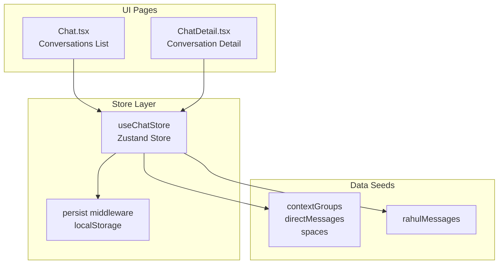

**Diagram sources**
- [chat.store.ts:171-330](file://src/store/chat.store.ts#L171-L330)
- [chat.data.ts:35-134](file://src/data/chat.data.ts#L35-L134)
- [chatDetail.data.ts:18-71](file://src/data/chatDetail.data.ts#L18-L71)
- [Chat.tsx:65-92](file://src/pages/Chat.tsx#L65-L92)
- [ChatDetail.tsx:24-46](file://src/pages/ChatDetail.tsx#L24-L46)

**Section sources**
- [chat.store.ts:1-349](file://src/store/chat.store.ts#L1-L349)
- [chat.data.ts:1-134](file://src/data/chat.data.ts#L1-L134)
- [chatDetail.data.ts:1-71](file://src/data/chatDetail.data.ts#L1-L71)
- [Chat.tsx:1-245](file://src/pages/Chat.tsx#L1-L245)
- [ChatDetail.tsx:1-332](file://src/pages/ChatDetail.tsx#L1-L332)

## Core Components
- Zustand store with persistence: Manages chats, messages, filters, and search query. Provides actions for sending messages, marking as read, filtering, searching, creating chats, and simulating replies.
- Data seeds: Static arrays for context groups, direct messages, and spaces; and a seeded conversation for a DM with Rahul.
- UI pages:
  - Conversations list: Renders filtered chats, handles search and filters, and navigates to a selected chat.
  - Conversation detail: Displays messages, handles input, marks as read on mount, auto-scrolls to latest, and simulates replies.

Key responsibilities:
- Message state: Array of messages keyed by chatId.
- Conversation state: Array of chats with metadata (name, avatar, lastMessage, time, unread count, type).
- Persistence: Uses Zustand’s persist middleware to save chats, messages, activeFilter, and searchQuery to localStorage.

**Section sources**
- [chat.store.ts:45-59](file://src/store/chat.store.ts#L45-L59)
- [chat.store.ts:171-330](file://src/store/chat.store.ts#L171-L330)
- [chat.data.ts:35-134](file://src/data/chat.data.ts#L35-L134)
- [chatDetail.data.ts:18-71](file://src/data/chatDetail.data.ts#L18-L71)
- [Chat.tsx:69-92](file://src/pages/Chat.tsx#L69-L92)
- [ChatDetail.tsx:24-46](file://src/pages/ChatDetail.tsx#L24-L46)

## Architecture Overview
The system follows a unidirectional data flow:
- UI triggers actions via the store.
- Store updates state immutably and persists it.
- UI re-renders based on subscribed selectors.

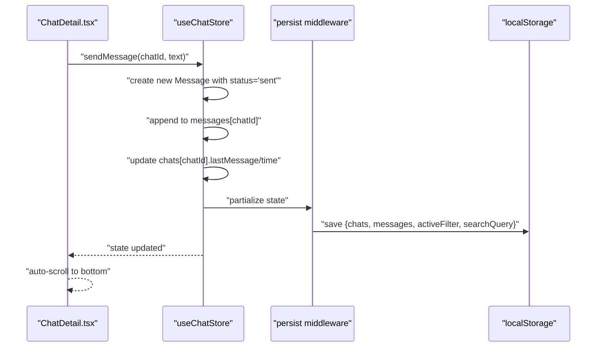

**Diagram sources**
- [chat.store.ts:179-200](file://src/store/chat.store.ts#L179-L200)
- [chat.store.ts:320-329](file://src/store/chat.store.ts#L320-L329)
- [ChatDetail.tsx:302-308](file://src/pages/ChatDetail.tsx#L302-L308)

## Detailed Component Analysis

### Zustand Chat Store
The store defines:
- Types: Message and Chat interfaces, plus helper types for message type and sender.
- State: chats[], messages (Record<string, Message[]>), activeFilter, searchQuery.
- Actions:
  - sendMessage(chatId, text): Creates a new message, appends to messages[chatId], updates lastMessage/time for the chat.
  - markAsRead(chatId): Resets unread count for the chat.
  - setFilter(filter): Updates activeFilter.
  - setSearchQuery(query): Updates searchQuery.
  - getFilteredChats(): Applies filter and search, sorts by time, returns filtered chats.
  - createChat(contactName, emoji?): Creates a new DM chat and initializes an empty messages array for it.
  - simulateReply(chatId): Simulates incoming reply after a random delay.

Persistence:
- Uses Zustand persist with a custom partialize to save only relevant parts of state to localStorage.

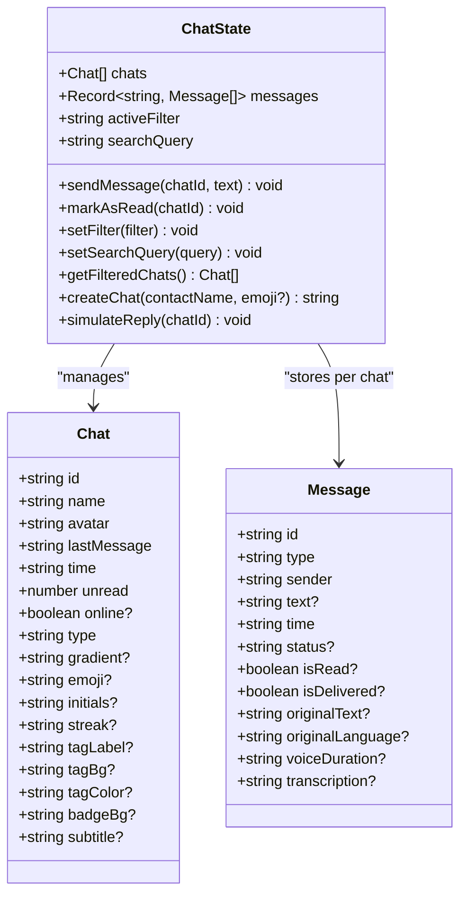

**Diagram sources**
- [chat.store.ts:9-43](file://src/store/chat.store.ts#L9-L43)
- [chat.store.ts:45-59](file://src/store/chat.store.ts#L45-L59)

**Section sources**
- [chat.store.ts:6-22](file://src/store/chat.store.ts#L6-L22)
- [chat.store.ts:24-43](file://src/store/chat.store.ts#L24-L43)
- [chat.store.ts:45-59](file://src/store/chat.store.ts#L45-L59)
- [chat.store.ts:171-330](file://src/store/chat.store.ts#L171-L330)
- [chat.store.ts:320-329](file://src/store/chat.store.ts#L320-L329)

### Message Data Structure
- Message fields include identifiers, type, sender, content (text or voice), timestamps, delivery/read status, and optional translation/transcription fields.
- Status is derived from isRead/isDelivered flags and mapped to 'sent'/'delivered'/'read'.

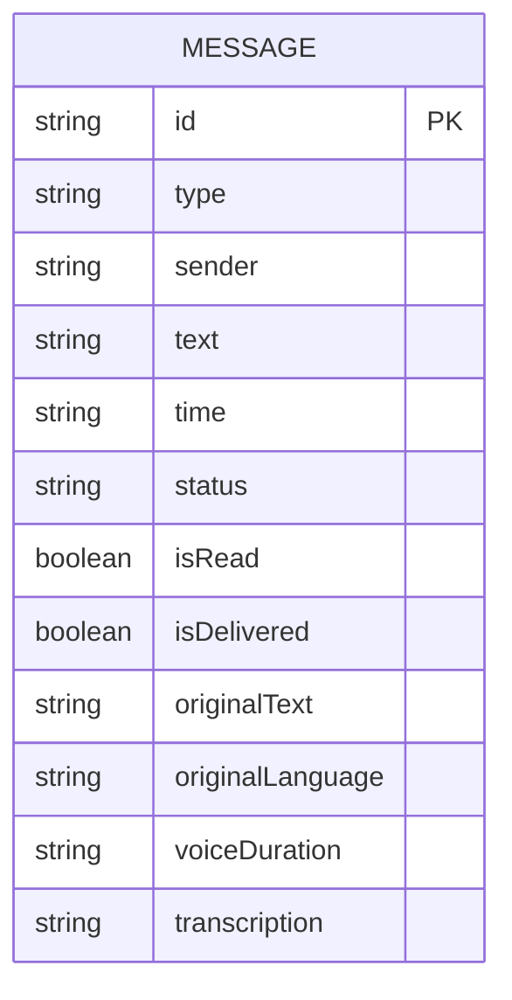

**Diagram sources**
- [chat.store.ts:9-22](file://src/store/chat.store.ts#L9-L22)
- [chatDetail.data.ts:4-16](file://src/data/chatDetail.data.ts#L4-L16)

**Section sources**
- [chat.store.ts:9-22](file://src/store/chat.store.ts#L9-L22)
- [chatDetail.data.ts:4-16](file://src/data/chatDetail.data.ts#L4-L16)

### Conversation State Initialization
- Chats are seeded from contextGroups, directMessages, and spaces.
- Messages are seeded from rahulMessages, converted to the internal Message format.

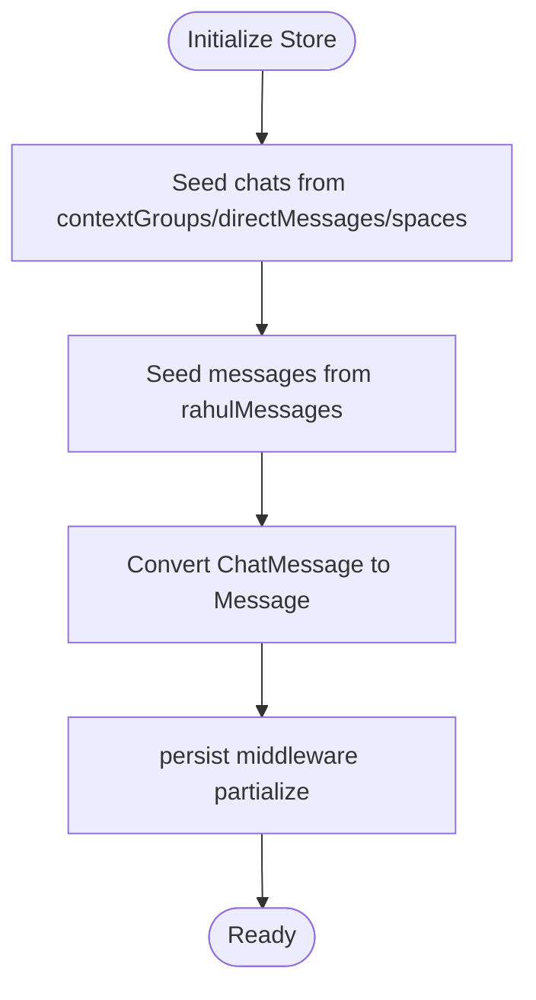

**Diagram sources**
- [chat.store.ts:103-159](file://src/store/chat.store.ts#L103-L159)
- [chat.store.ts:162-169](file://src/store/chat.store.ts#L162-L169)
- [chat.store.ts:62-75](file://src/store/chat.store.ts#L62-L75)

**Section sources**
- [chat.store.ts:103-159](file://src/store/chat.store.ts#L103-L159)
- [chat.store.ts:162-169](file://src/store/chat.store.ts#L162-L169)
- [chat.store.ts:62-75](file://src/store/chat.store.ts#L62-L75)
- [chat.data.ts:35-134](file://src/data/chat.data.ts#L35-L134)
- [chatDetail.data.ts:18-71](file://src/data/chatDetail.data.ts#L18-L71)

### Local Storage Integration (Persistence)
- The store uses Zustand’s persist middleware with a custom partialize to save chats, messages, activeFilter, and searchQuery.
- This enables state hydration on app reload.

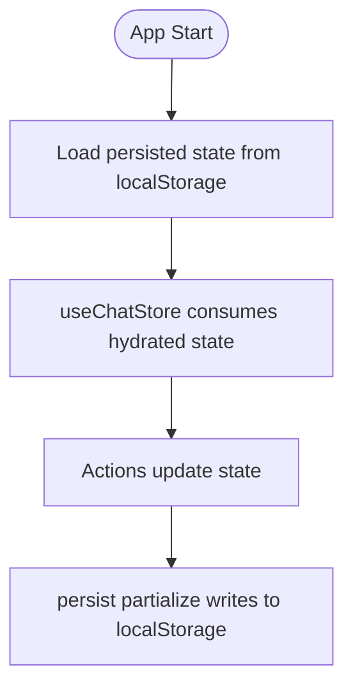

**Diagram sources**
- [chat.store.ts:320-329](file://src/store/chat.store.ts#L320-L329)

**Section sources**
- [chat.store.ts:320-329](file://src/store/chat.store.ts#L320-L329)

### Message CRUD Operations
- Create: sendMessage creates a new message with status 'sent', appends to messages[chatId], and updates the chat’s lastMessage/time.
- Read receipts: The UI displays status indicators based on message.status. The store does not expose explicit read/delivery actions; status is inferred from flags and mapped accordingly.
- Delete/Update: Not implemented in the current store.

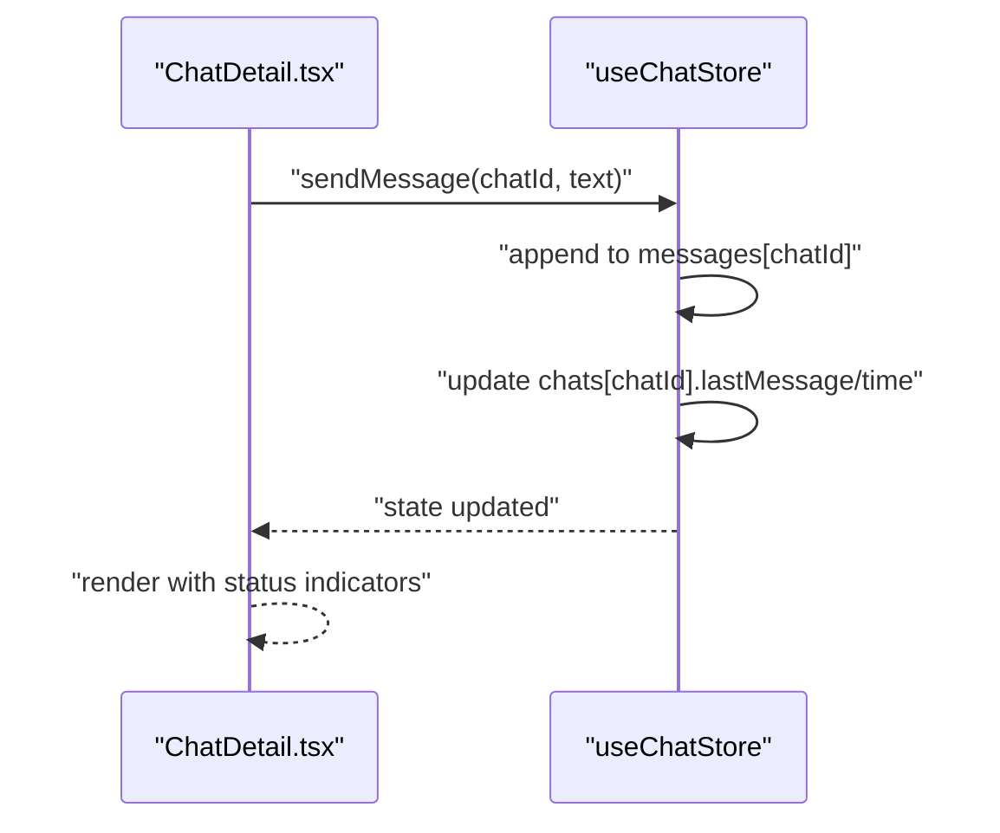

**Diagram sources**
- [chat.store.ts:179-200](file://src/store/chat.store.ts#L179-L200)
- [ChatDetail.tsx:302-308](file://src/pages/ChatDetail.tsx#L302-L308)

**Section sources**
- [chat.store.ts:179-200](file://src/store/chat.store.ts#L179-L200)
- [ChatDetail.tsx:302-308](file://src/pages/ChatDetail.tsx#L302-L308)

### Typing Indicator State Management
- The current store does not manage a typing indicator state. The UI renders read receipt icons based on message.status. If needed, add a typing flag in the store and actions to toggle it.

[No sources needed since this section provides general guidance]

### Read Receipt Tracking
- The store maps isRead/isDelivered flags to a status field ('sent'/'delivered'/'read').
- The UI conditionally renders read/delivered/sent icons based on message.status.

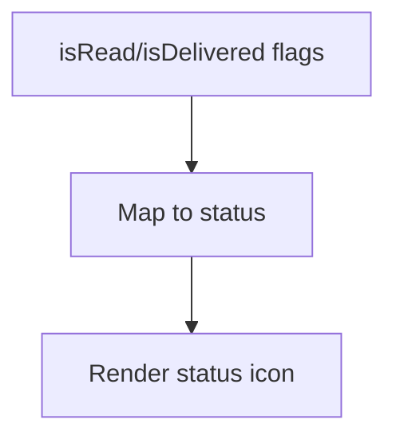

**Diagram sources**
- [chat.store.ts:62-75](file://src/store/chat.store.ts#L62-L75)
- [ChatDetail.tsx:188-195](file://src/pages/ChatDetail.tsx#L188-L195)

**Section sources**
- [chat.store.ts:62-75](file://src/store/chat.store.ts#L62-L75)
- [ChatDetail.tsx:188-195](file://src/pages/ChatDetail.tsx#L188-L195)

### Conversation Switching Mechanism
- The conversations list page subscribes to searchQuery, activeFilter, and getFilteredChats.
- On selection, it calls markAsRead(chatId) and navigates to the detail route with chat metadata.

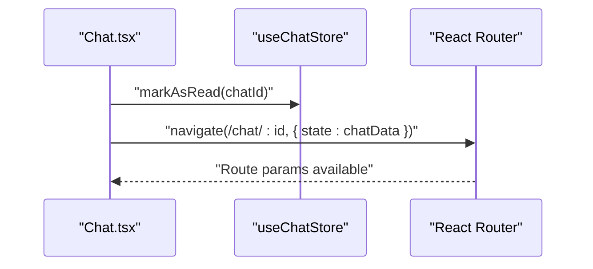

**Diagram sources**
- [Chat.tsx:81-84](file://src/pages/Chat.tsx#L81-L84)
- [Chat.tsx:79](file://src/pages/Chat.tsx#L79)

**Section sources**
- [Chat.tsx:69-92](file://src/pages/Chat.tsx#L69-L92)
- [Chat.tsx:81-84](file://src/pages/Chat.tsx#L81-L84)

### Message Filtering and Search
- Filters: All, Unread, Groups, Spaces, Archived.
- Search: Case-insensitive match on chat name or lastMessage.
- Sorting: By time string, with special handling for non-time strings.

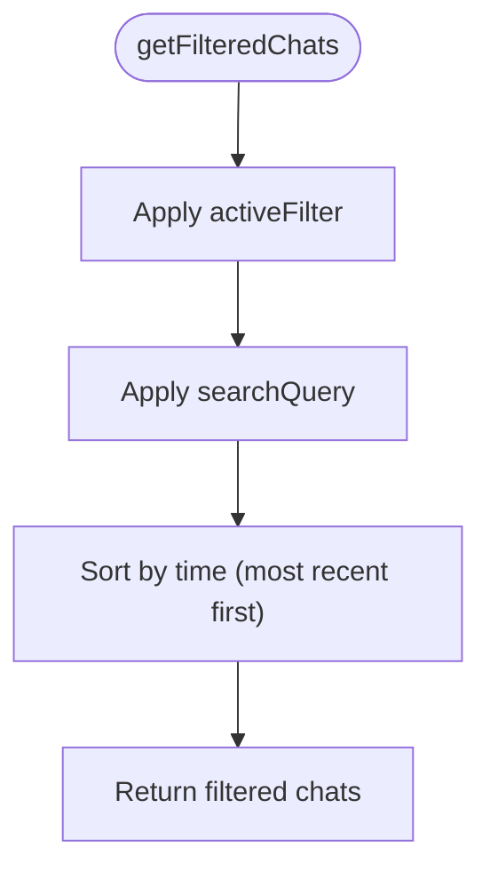

**Diagram sources**
- [chat.store.ts:218-266](file://src/store/chat.store.ts#L218-L266)

**Section sources**
- [chat.store.ts:218-266](file://src/store/chat.store.ts#L218-L266)

### Real-Time Message Updates
- sendMessage is synchronous and immediately updates state.
- simulateReply simulates asynchronous replies after a random delay using setTimeout, appending messages and incrementing unread counts.

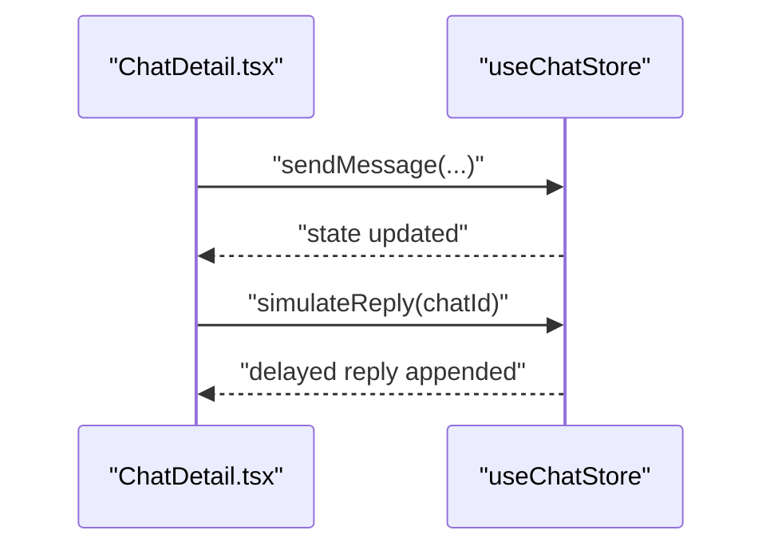

**Diagram sources**
- [chat.store.ts:288-318](file://src/store/chat.store.ts#L288-L318)
- [ChatDetail.tsx:302-308](file://src/pages/ChatDetail.tsx#L302-L308)

**Section sources**
- [chat.store.ts:288-318](file://src/store/chat.store.ts#L288-L318)
- [ChatDetail.tsx:302-308](file://src/pages/ChatDetail.tsx#L302-L308)

### Practical Examples of Consuming Chat State in Components
- Conversations list:
  - Subscribe to searchQuery, setSearchQuery, activeFilter, setFilter, getFilteredChats.
  - Call markAsRead on selection and navigate to the detail route.
- Conversation detail:
  - Read messages from store.messages[chatId].
  - Mark as read on mount.
  - Auto-scroll to bottom on message changes.
  - Send messages and simulate replies.

**Section sources**
- [Chat.tsx:69-92](file://src/pages/Chat.tsx#L69-L92)
- [ChatDetail.tsx:24-46](file://src/pages/ChatDetail.tsx#L24-L46)
- [ChatDetail.tsx:302-308](file://src/pages/ChatDetail.tsx#L302-L308)

### Async Message Operations and Optimistic Updates
- Current behavior:
  - sendMessage is optimistic (updates UI immediately).
  - simulateReply is asynchronous (setTimeout) and updates state after delay.
- Recommendations:
  - Introduce a typing indicator state in the store.
  - For network-backed messaging, wrap sendMessage with a promise and rollback on failure.

[No sources needed since this section provides general guidance]

### Managing Conversation History
- The store maintains messages per chatId in a record keyed by chat id.
- Creating a new chat initializes an empty messages array for that chatId.
- The UI reads messages[chatId] and falls back to route state if needed.

**Section sources**
- [chat.store.ts:47](file://src/store/chat.store.ts#L47)
- [chat.store.ts:268-286](file://src/store/chat.store.ts#L268-L286)
- [ChatDetail.tsx:26](file://src/pages/ChatDetail.tsx#L26)

## Dependency Analysis
- Store depends on:
  - Data seeds for chats and messages.
  - Zustand and Zustand persist middleware.
- Pages depend on the store:
  - Chat.tsx for list rendering and navigation.
  - ChatDetail.tsx for message display and input handling.

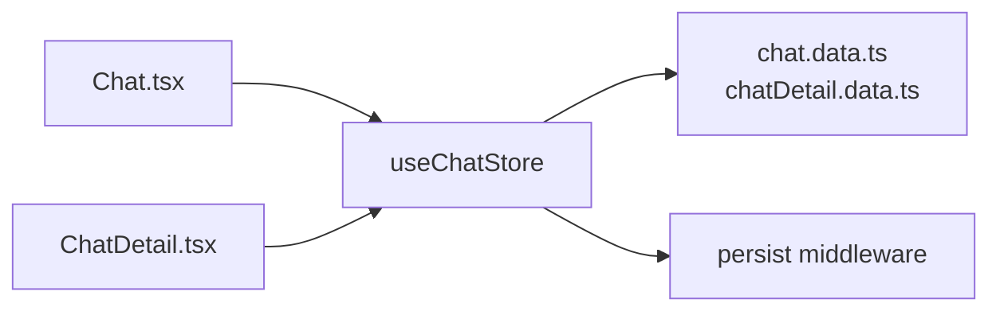

**Diagram sources**
- [chat.store.ts:1-4](file://src/store/chat.store.ts#L1-L4)
- [chat.data.ts:35-134](file://src/data/chat.data.ts#L35-L134)
- [chatDetail.data.ts:18-71](file://src/data/chatDetail.data.ts#L18-L71)
- [Chat.tsx:5](file://src/pages/Chat.tsx#L5)
- [ChatDetail.tsx:6](file://src/pages/ChatDetail.tsx#L6)

**Section sources**
- [chat.store.ts:1-4](file://src/store/chat.store.ts#L1-L4)
- [chat.data.ts:35-134](file://src/data/chat.data.ts#L35-L134)
- [chatDetail.data.ts:18-71](file://src/data/chatDetail.data.ts#L18-L71)
- [Chat.tsx:5](file://src/pages/Chat.tsx#L5)
- [ChatDetail.tsx:6](file://src/pages/ChatDetail.tsx#L6)

## Performance Considerations
- Rendering:
  - Chat list uses animated list items; keep animations minimal to avoid layout thrash.
  - Message list auto-scrolls on every message change; consider debouncing if performance becomes an issue.
- State size:
  - Persist only essential fields (already configured); avoid storing large attachments.
- Sorting:
  - Time parsing is basic; for large datasets, consider normalized time fields.

[No sources needed since this section provides general guidance]

## Troubleshooting Guide
- Messages not appearing:
  - Verify messages[chatId] exists and is initialized when creating a new chat.
- Read receipts not updating:
  - Ensure message.status is set correctly; the UI relies on status for rendering.
- Filter/search not working:
  - Confirm activeFilter and searchQuery are updated and that getFilteredChats is called.
- Persistent state not loading:
  - Check localStorage key and that partialize includes the intended fields.

**Section sources**
- [chat.store.ts:268-286](file://src/store/chat.store.ts#L268-L286)
- [chat.store.ts:218-266](file://src/store/chat.store.ts#L218-L266)
- [chat.store.ts:320-329](file://src/store/chat.store.ts#L320-L329)

## Conclusion
VChat’s chat state management is centered around a Zustand store with persistence, providing a clean separation between UI and state. The system supports message creation, conversation filtering/search, and simulated asynchronous replies. Extending it involves adding typing indicators, explicit read/delivery actions, and robust async handling while preserving state consistency across sessions.

## Appendices

### Message Status Mapping
- isRead=true -> status='read'
- isDelivered=true -> status='delivered'
- otherwise -> status='sent'

**Section sources**
- [chat.store.ts:62-75](file://src/store/chat.store.ts#L62-L75)

### Conversation Types
- dm: Direct message with initials/avatar and online status.
- group: Context group with tag and gradient.
- space: Public space with subtitle.

**Section sources**
- [chat.store.ts:24-43](file://src/store/chat.store.ts#L24-L43)
- [chat.data.ts:1-134](file://src/data/chat.data.ts#L1-L134)