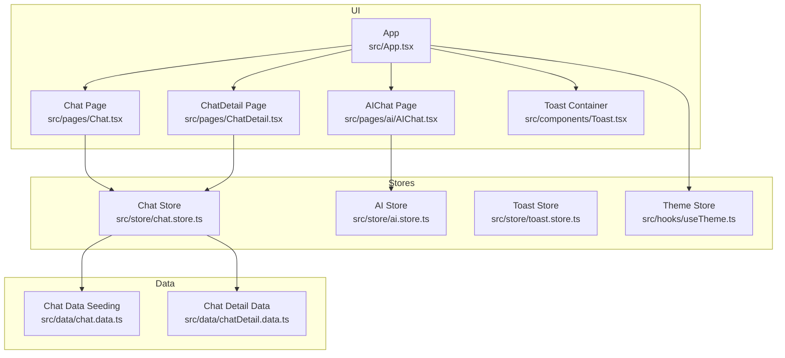
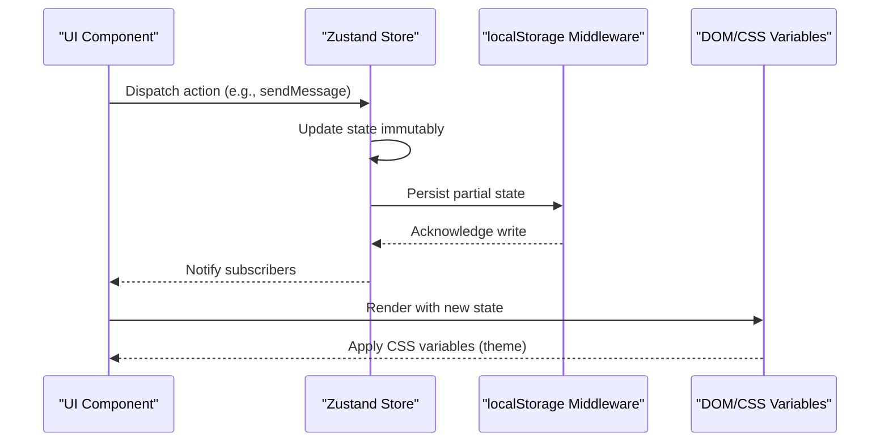
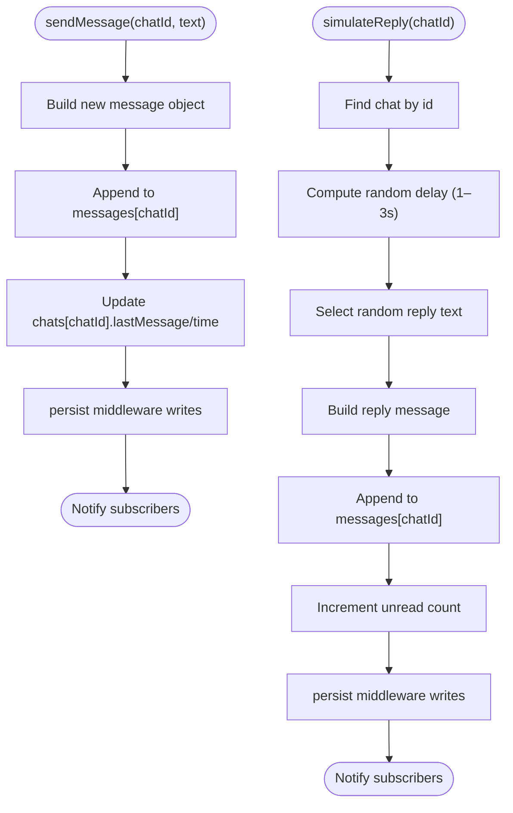
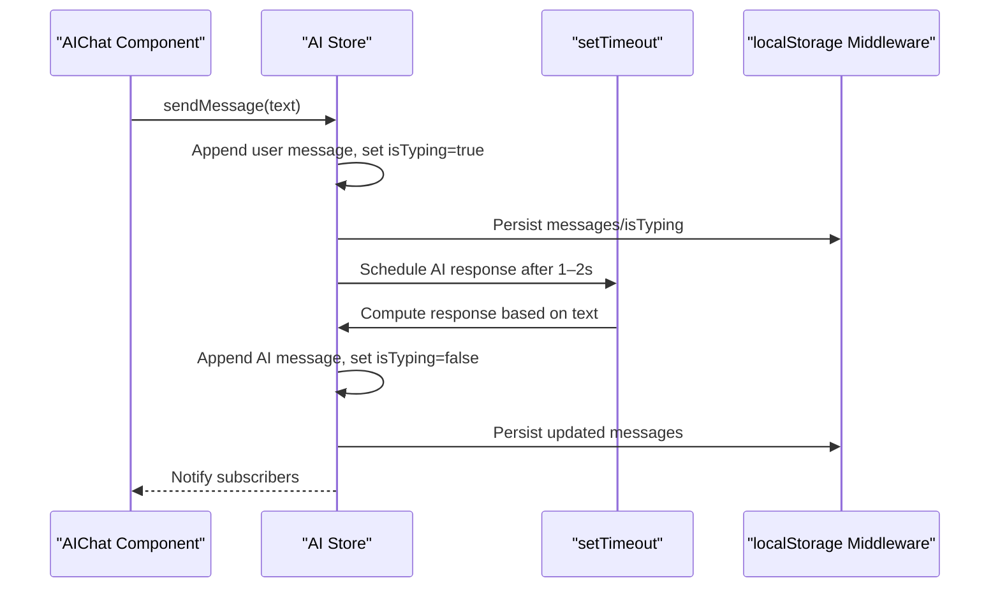
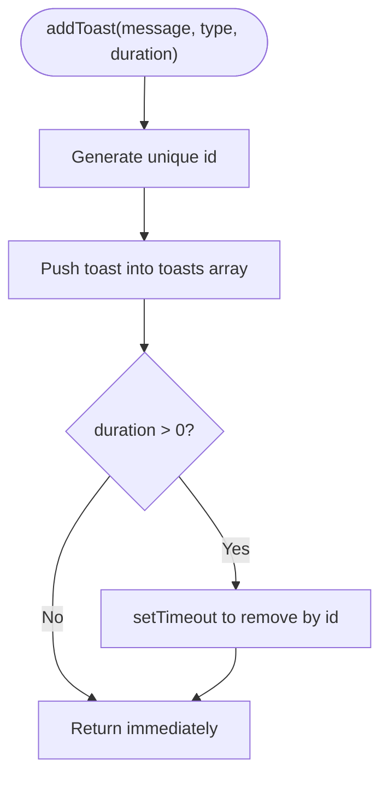
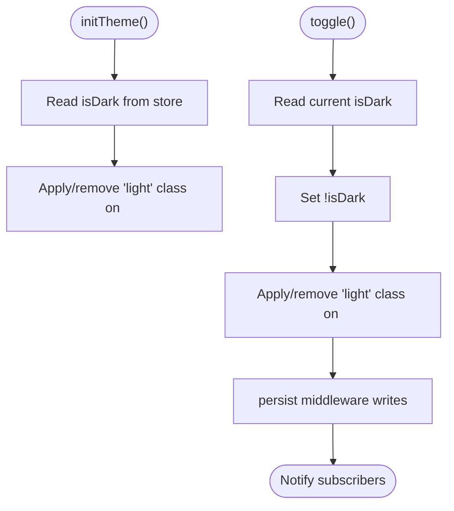
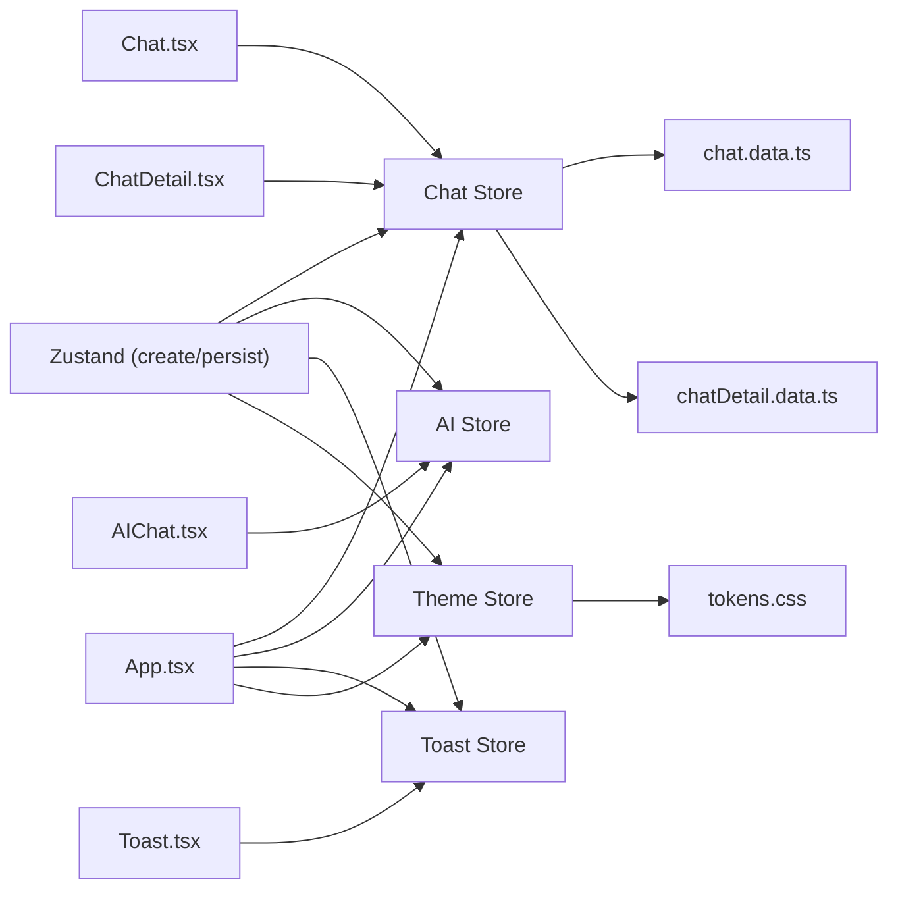

# State Management

<cite>
**Referenced Files in This Document**
- [chat.store.ts](file://src/store/chat.store.ts)
- [ai.store.ts](file://src/store/ai.store.ts)
- [toast.store.ts](file://src/store/toast.store.ts)
- [useTheme.ts](file://src/hooks/useTheme.ts)
- [tokens.css](file://src/styles/tokens.css)
- [App.tsx](file://src/App.tsx)
- [Chat.tsx](file://src/pages/Chat.tsx)
- [ChatDetail.tsx](file://src/pages/ChatDetail.tsx)
- [AIChat.tsx](file://src/pages/ai/AIChat.tsx)
- [Toast.tsx](file://src/components/Toast.tsx)
- [chat.data.ts](file://src/data/chat.data.ts)
- [chatDetail.data.ts](file://src/data/chatDetail.data.ts)
- [package.json](file://package.json)
</cite>

## Table of Contents
1. [Introduction](#introduction)
2. [Project Structure](#project-structure)
3. [Core Components](#core-components)
4. [Architecture Overview](#architecture-overview)
5. [Detailed Component Analysis](#detailed-component-analysis)
6. [Dependency Analysis](#dependency-analysis)
7. [Performance Considerations](#performance-considerations)
8. [Troubleshooting Guide](#troubleshooting-guide)
9. [Conclusion](#conclusion)
10. [Appendices](#appendices)

## Introduction
This document explains VChat’s state management architecture built with Zustand. It covers:
- Chat store: message state handling, conversation management, filtering/search, and persistence
- AI store: conversation history, message processing logic, and simulated AI responses
- Toast store: notifications/alerts lifecycle and auto-dismissal
- Theme management: CSS variable integration, light/dark mode toggle, and initialization
- Patterns: state update strategies, subscriptions, and localStorage persistence
- Practical usage: consuming state in components, async operations, and cross-store communication
- Best practices: performance, hydration, debugging, and extending the system

## Project Structure
The state management is organized around four stores:
- Chat store: manages conversations and messages
- AI store: manages AI twin chat history and typing indicators
- Toast store: manages transient notifications
- Theme store: manages theme mode and DOM class toggling

UI pages and components subscribe to stores to render and mutate state.

**Diagram sources**
- [chat.store.ts:171-330](file://src/store/chat.store.ts#L171-L330)
- [ai.store.ts:113-161](file://src/store/ai.store.ts#L113-L161)
- [toast.store.ts:17-38](file://src/store/toast.store.ts#L17-L38)
- [useTheme.ts:10-36](file://src/hooks/useTheme.ts#L10-L36)
- [App.tsx:135-148](file://src/App.tsx#L135-L148)
- [Chat.tsx:65-79](file://src/pages/Chat.tsx#L65-L79)
- [ChatDetail.tsx:9-27](file://src/pages/ChatDetail.tsx#L9-L27)
- [AIChat.tsx:7-12](file://src/pages/ai/AIChat.tsx#L7-L12)
- [chat.data.ts:35-133](file://src/data/chat.data.ts#L35-L133)
- [chatDetail.data.ts:19-70](file://src/data/chatDetail.data.ts#L19-L70)

**Section sources**
- [chat.store.ts:171-330](file://src/store/chat.store.ts#L171-L330)
- [ai.store.ts:113-161](file://src/store/ai.store.ts#L113-L161)
- [toast.store.ts:17-38](file://src/store/toast.store.ts#L17-L38)
- [useTheme.ts:10-36](file://src/hooks/useTheme.ts#L10-L36)
- [App.tsx:135-148](file://src/App.tsx#L135-L148)

## Core Components
- Chat Store
  - Manages chats and messages, filters, search, read/unread, and simulated replies
  - Persists chats, messages, active filter, and search query to localStorage
- AI Store
  - Manages AI twin messages and typing indicator
  - Simulates AI responses with delays and keyword-based replies
  - Persists messages and typing state to localStorage
- Toast Store
  - Adds/removes toasts with optional auto-dismissal
- Theme Store
  - Toggles between dark/light modes and initializes DOM classes
  - Persists theme preference to localStorage

**Section sources**
- [chat.store.ts:45-59](file://src/store/chat.store.ts#L45-L59)
- [ai.store.ts:11-17](file://src/store/ai.store.ts#L11-L17)
- [toast.store.ts:11-15](file://src/store/toast.store.ts#L11-L15)
- [useTheme.ts:4-8](file://src/hooks/useTheme.ts#L4-L8)

## Architecture Overview
Zustand stores are created with the functional store pattern and middleware for persistence. Components subscribe to stores using hooks and react to state changes. CSS variables in tokens.css integrate with theme toggling.

**Diagram sources**
- [chat.store.ts:171-330](file://src/store/chat.store.ts#L171-L330)
- [ai.store.ts:113-161](file://src/store/ai.store.ts#L113-L161)
- [toast.store.ts:17-38](file://src/store/toast.store.ts#L17-L38)
- [useTheme.ts:10-36](file://src/hooks/useTheme.ts#L10-L36)
- [tokens.css:1-39](file://src/styles/tokens.css#L1-L39)

## Detailed Component Analysis

### Chat Store
Responsibilities:
- Seed chats and messages from data files
- Manage message sending, read status, filtering, search, and simulated replies
- Persist chats, messages, active filter, and search query

Key patterns:
- Immer-like updates via functional setters
- Partial persistence to limit storage footprint
- Sorting logic for chat list with time parsing
- Simulated replies using timeouts

**Diagram sources**
- [chat.store.ts:179-200](file://src/store/chat.store.ts#L179-L200)
- [chat.store.ts:288-318](file://src/store/chat.store.ts#L288-L318)

Practical usage in components:
- Chat page consumes filters, search, and filtered chats
- Chat detail page reads messages and chat metadata, sends messages, and simulates replies

**Section sources**
- [chat.store.ts:103-169](file://src/store/chat.store.ts#L103-L169)
- [chat.store.ts:179-200](file://src/store/chat.store.ts#L179-L200)
- [chat.store.ts:218-266](file://src/store/chat.store.ts#L218-L266)
- [chat.store.ts:288-318](file://src/store/chat.store.ts#L288-L318)
- [Chat.tsx:69-79](file://src/pages/Chat.tsx#L69-L79)
- [ChatDetail.tsx:24-41](file://src/pages/ChatDetail.tsx#L24-L41)

### AI Store
Responsibilities:
- Maintain conversation history and typing indicator
- Simulate AI responses with keyword-based logic and randomized delays
- Clear history back to initial seeded messages

**Diagram sources**
- [ai.store.ts:119-148](file://src/store/ai.store.ts#L119-L148)

Practical usage:
- AIChat page subscribes to messages and isTyping, scrolls to bottom, and renders typing indicators

**Section sources**
- [ai.store.ts:113-161](file://src/store/ai.store.ts#L113-L161)
- [AIChat.tsx:7-26](file://src/pages/ai/AIChat.tsx#L7-L26)

### Toast Store
Responsibilities:
- Manage a list of toasts with id, message, and type
- Add toasts with optional duration; auto-remove after timeout
- Remove toasts manually

**Diagram sources**
- [toast.store.ts:19-31](file://src/store/toast.store.ts#L19-L31)

Practical usage:
- Toast container renders toasts with icons and styles, supports manual dismissal

**Section sources**
- [toast.store.ts:17-38](file://src/store/toast.store.ts#L17-L38)
- [Toast.tsx:6-52](file://src/components/Toast.tsx#L6-L52)

### Theme Management
Responsibilities:
- Toggle between dark and light themes
- Initialize theme on app load
- Apply/remove CSS class on document root for CSS variable switching

**Diagram sources**
- [useTheme.ts:23-30](file://src/hooks/useTheme.ts#L23-L30)
- [useTheme.ts:14-22](file://src/hooks/useTheme.ts#L14-L22)
- [tokens.css:1-39](file://src/styles/tokens.css#L1-L39)

Integration with CSS:
- CSS variables switch between dark and light palettes based on the presence of the “light” class on the root element

**Section sources**
- [useTheme.ts:10-36](file://src/hooks/useTheme.ts#L10-L36)
- [tokens.css:1-39](file://src/styles/tokens.css#L1-L39)
- [App.tsx:135-140](file://src/App.tsx#L135-L140)

## Dependency Analysis
- Stores depend on Zustand create and persist middleware
- UI pages depend on store hooks
- Theme store depends on DOM class manipulation
- CSS variables define theme tokens consumed by components

**Diagram sources**
- [chat.store.ts:1-2](file://src/store/chat.store.ts#L1-L2)
- [ai.store.ts:1-2](file://src/store/ai.store.ts#L1-L2)
- [toast.store.ts](file://src/store/toast.store.ts#L1)
- [useTheme.ts:1-2](file://src/hooks/useTheme.ts#L1-L2)
- [chat.data.ts:1-134](file://src/data/chat.data.ts#L1-L134)
- [chatDetail.data.ts:1-71](file://src/data/chatDetail.data.ts#L1-L71)
- [tokens.css:1-39](file://src/styles/tokens.css#L1-L39)
- [App.tsx:135-148](file://src/App.tsx#L135-L148)
- [Chat.tsx](file://src/pages/Chat.tsx#L5)
- [ChatDetail.tsx](file://src/pages/ChatDetail.tsx#L6)
- [AIChat.tsx](file://src/pages/ai/AIChat.tsx#L5)
- [Toast.tsx](file://src/components/Toast.tsx#L3)

**Section sources**
- [package.json:12-18](file://package.json#L12-L18)
- [chat.store.ts:1-2](file://src/store/chat.store.ts#L1-L2)
- [ai.store.ts:1-2](file://src/store/ai.store.ts#L1-L2)
- [toast.store.ts](file://src/store/toast.store.ts#L1)
- [useTheme.ts:1-2](file://src/hooks/useTheme.ts#L1-L2)

## Performance Considerations
- Prefer functional updates to minimize re-renders
- Use partial persistence to reduce serialized payload sizes
- Debounce or throttle expensive UI updates (e.g., search input)
- Avoid unnecessary deep copies; spread arrays/objects where safe
- Use memoization for derived computations (e.g., filtered chats)
- Limit DOM manipulations during animations; rely on CSS variables for theme switching
- Keep timeouts short and cancelable if needed to prevent memory leaks

[No sources needed since this section provides general guidance]

## Troubleshooting Guide
Common issues and remedies:
- State not persisting
  - Verify persist middleware is configured and keys match expectations
  - Confirm localStorage availability and permissions
- Theme not applying
  - Ensure “light” class toggling occurs on document root
  - Check CSS variable definitions and specificity
- Toasts not disappearing
  - Confirm duration > 0 and id filtering logic
- Chat list not updating
  - Ensure actions update both messages and chats consistently
  - Validate time parsing and sorting logic for edge cases

**Section sources**
- [chat.store.ts:320-329](file://src/store/chat.store.ts#L320-L329)
- [ai.store.ts:157-159](file://src/store/ai.store.ts#L157-L159)
- [toast.store.ts:19-31](file://src/store/toast.store.ts#L19-L31)
- [useTheme.ts:14-22](file://src/hooks/useTheme.ts#L14-L22)
- [tokens.css:26-38](file://src/styles/tokens.css#L26-L38)

## Conclusion
VChat’s state management leverages Zustand for simplicity and flexibility, with persistent stores for seamless hydration across sessions. The architecture cleanly separates concerns:
- Chat store handles conversations and messaging
- AI store simulates intelligent responses
- Toast store centralizes notifications
- Theme store integrates with CSS variables for consistent theming

Adhering to immutable updates, selective persistence, and clear separation of concerns ensures scalability and maintainability.

[No sources needed since this section summarizes without analyzing specific files]

## Appendices

### State Update Patterns
- Functional setters for immutable updates
- Partial persistence to optimize storage
- Subscription via hooks in components
- Cross-store communication through coordinated actions

**Section sources**
- [chat.store.ts:179-200](file://src/store/chat.store.ts#L179-L200)
- [ai.store.ts:119-148](file://src/store/ai.store.ts#L119-L148)
- [toast.store.ts:19-31](file://src/store/toast.store.ts#L19-L31)
- [useTheme.ts:14-22](file://src/hooks/useTheme.ts#L14-L22)

### Async State Operations
- Simulated AI responses using timeouts
- Auto-scrolling in chat UI after state updates
- Toast auto-dismissal timers

**Section sources**
- [ai.store.ts:132-147](file://src/store/ai.store.ts#L132-L147)
- [AIChat.tsx:14-20](file://src/pages/ai/AIChat.tsx#L14-L20)
- [toast.store.ts:25-31](file://src/store/toast.store.ts#L25-L31)

### Extending the System
- Add new stores with minimal boilerplate
- Use partial persistence to include only necessary fields
- Introduce selectors for derived data to reduce re-renders
- Centralize side effects (e.g., analytics) in store actions
- Maintain consistent naming and typing across stores

[No sources needed since this section provides general guidance]