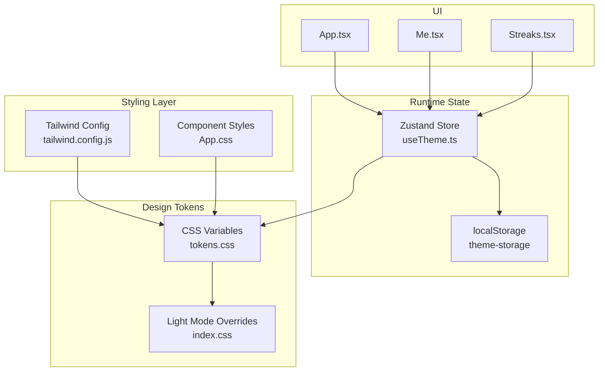
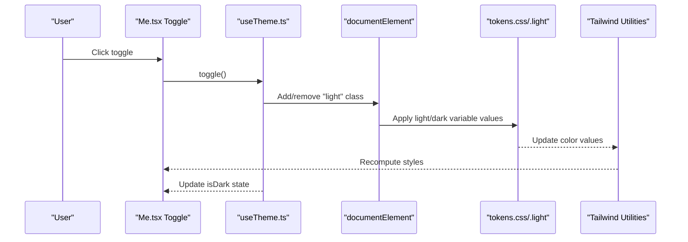
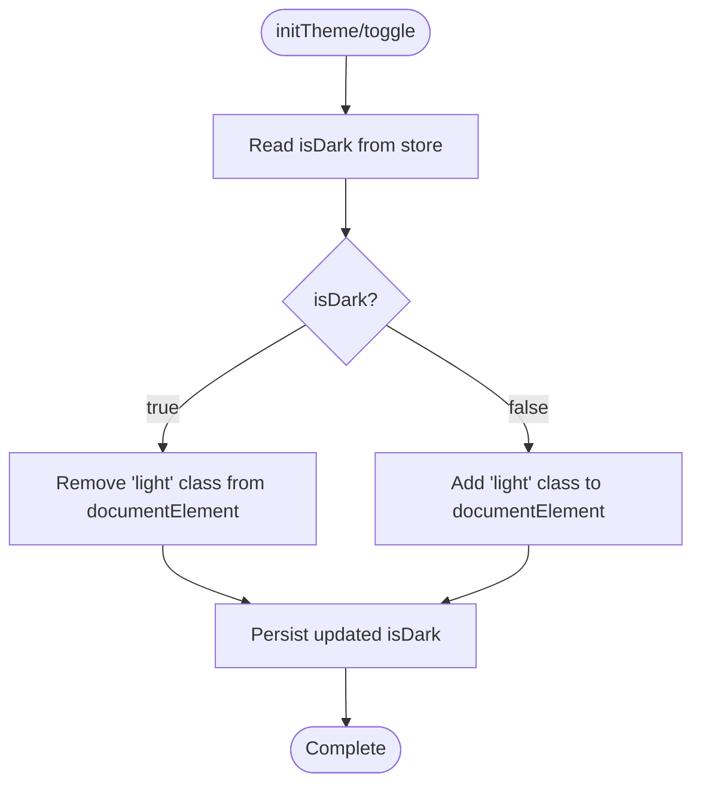
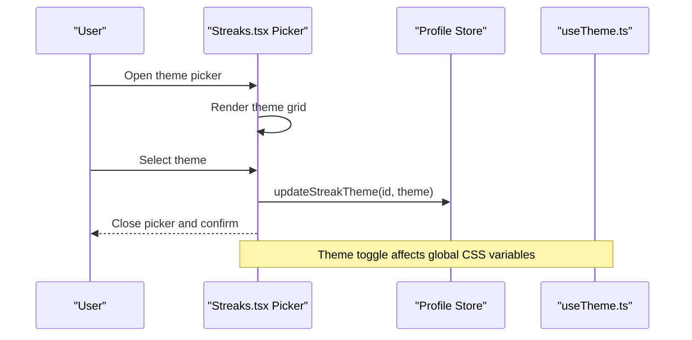
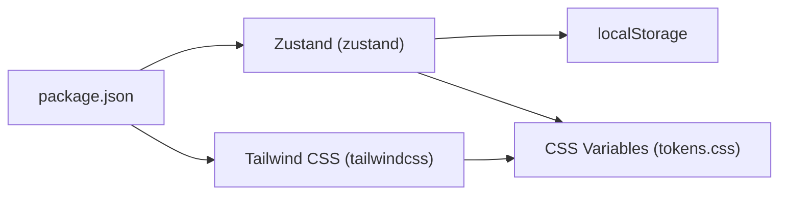

# Theme Management System

<cite>
**Referenced Files in This Document**
- [useTheme.ts](file://src/hooks/useTheme.ts)
- [tokens.css](file://src/styles/tokens.css)
- [index.css](file://src/index.css)
- [App.css](file://src/App.css)
- [tailwind.config.js](file://tailwind.config.js)
- [App.tsx](file://src/App.tsx)
- [Me.tsx](file://src/pages/Me.tsx)
- [Streaks.tsx](file://src/pages/profile/Streaks.tsx)
- [main.tsx](file://src/main.tsx)
- [package.json](file://package.json)
</cite>

## Table of Contents
1. [Introduction](#introduction)
2. [Project Structure](#project-structure)
3. [Core Components](#core-components)
4. [Architecture Overview](#architecture-overview)
5. [Detailed Component Analysis](#detailed-component-analysis)
6. [Dependency Analysis](#dependency-analysis)
7. [Performance Considerations](#performance-considerations)
8. [Troubleshooting Guide](#troubleshooting-guide)
9. [Conclusion](#conclusion)
10. [Appendices](#appendices)

## Introduction
This document explains VChat's theme management system, focusing on CSS variable integration, light/dark mode toggle, and persistent theme state. It covers the theme hook implementation, design token architecture, Tailwind CSS integration, and practical usage patterns across components. It also addresses performance, accessibility, and extensibility considerations for extending the theme system.

## Project Structure
The theme system spans three layers:
- Design tokens: centralized CSS variables in tokens.css
- Runtime state: Zustand store with localStorage persistence
- Styling integration: Tailwind CSS using CSS variables and light-mode overrides



**Diagram sources**
- [useTheme.ts:1-37](file://src/hooks/useTheme.ts#L1-L37)
- [tokens.css:1-39](file://src/styles/tokens.css#L1-L39)
- [index.css:73-82](file://src/index.css#L73-L82)
- [tailwind.config.js:1-50](file://tailwind.config.js#L1-L50)
- [App.tsx:135-148](file://src/App.tsx#L135-L148)
- [Me.tsx:188-204](file://src/pages/Me.tsx#L188-L204)
- [Streaks.tsx:126-170](file://src/pages/profile/Streaks.tsx#L126-L170)

**Section sources**
- [useTheme.ts:1-37](file://src/hooks/useTheme.ts#L1-L37)
- [tokens.css:1-39](file://src/styles/tokens.css#L1-L39)
- [index.css:1-83](file://src/index.css#L1-L83)
- [tailwind.config.js:1-50](file://tailwind.config.js#L1-L50)
- [App.tsx:135-148](file://src/App.tsx#L135-L148)
- [Me.tsx:188-204](file://src/pages/Me.tsx#L188-L204)
- [Streaks.tsx:126-170](file://src/pages/profile/Streaks.tsx#L126-L170)

## Core Components
- Theme hook (Zustand): Manages isDark state, toggles DOM class, and initializes theme on app load.
- Design tokens: CSS variables for colors and backgrounds, with light-mode overrides via .light class.
- Tailwind integration: Tailwind config maps CSS variables to Tailwind color utilities.
- Component usage: UI components consume theme state and render accordingly.

Key implementation references:
- Theme state and persistence: [useTheme.ts:10-36](file://src/hooks/useTheme.ts#L10-L36)
- Token definitions and light overrides: [tokens.css:1-39](file://src/styles/tokens.css#L1-L39)
- Tailwind CSS variable mapping: [tailwind.config.js:8-46](file://tailwind.config.js#L8-L46)
- App initialization and theme binding: [App.tsx:135-140](file://src/App.tsx#L135-L140)
- Theme toggle UI: [Me.tsx:188-204](file://src/pages/Me.tsx#L188-L204)

**Section sources**
- [useTheme.ts:10-36](file://src/hooks/useTheme.ts#L10-L36)
- [tokens.css:1-39](file://src/styles/tokens.css#L1-L39)
- [tailwind.config.js:8-46](file://tailwind.config.js#L8-L46)
- [App.tsx:135-140](file://src/App.tsx#L135-L140)
- [Me.tsx:188-204](file://src/pages/Me.tsx#L188-L204)

## Architecture Overview
The theme system follows a unidirectional data flow:
- App initialization reads persisted theme from localStorage and applies the appropriate DOM class.
- Users toggle the theme, which updates the Zustand store and toggles the .light class on documentElement.
- CSS variables change based on the current mode, and Tailwind utilities reflect the new values.
- Components render using Tailwind classes bound to CSS variables.



**Diagram sources**
- [Me.tsx:188-204](file://src/pages/Me.tsx#L188-L204)
- [useTheme.ts:14-21](file://src/hooks/useTheme.ts#L14-L21)
- [tokens.css:26-38](file://src/styles/tokens.css#L26-L38)

## Detailed Component Analysis

### Theme Hook Implementation
The theme hook encapsulates:
- State: isDark boolean
- Actions: toggle(), initTheme()
- Persistence: localStorage-backed via Zustand middleware

Behavior highlights:
- toggle(): flips isDark, manipulates documentElement.classList, persists state
- initTheme(): ensures DOM class reflects stored isDark value on app load



**Diagram sources**
- [useTheme.ts:23-30](file://src/hooks/useTheme.ts#L23-L30)
- [useTheme.ts:14-21](file://src/hooks/useTheme.ts#L14-L21)

**Section sources**
- [useTheme.ts:10-36](file://src/hooks/useTheme.ts#L10-L36)

### Design Token System and Color Scheme Architecture
Tokens define semantic color roles via CSS variables. Light mode overrides are applied by adding/removing the .light class on documentElement, switching between dark defaults and light overrides.

Key aspects:
- Root tokens: primary, accent, semantic colors, backgrounds, cards, text, borders
- Light overrides: redefined values for backgrounds, cards, text, and borders
- Tailwind integration: Tailwind theme extends color palette using CSS variables

```mermaid
classDiagram
class Tokens {
"+--primary"
"+--primary-light"
"+--primary-dark"
"+--accent"
"+--accent-light"
"+--green"
"+--red"
"+--amber"
"+--pink"
"+--bg / --bg2 / --bg3"
"+--card / --card2 / --card3"
"+--text / --text2 / --text3"
"+--border / --border2"
}
class LightOverride {
"+.light"
"+overrides for bg/card/text/border"
}
Tokens <.. LightOverride : "applied via .light class"
```

**Diagram sources**
- [tokens.css:1-39](file://src/styles/tokens.css#L1-L39)

**Section sources**
- [tokens.css:1-39](file://src/styles/tokens.css#L1-L39)
- [tailwind.config.js:9-42](file://tailwind.config.js#L9-L42)

### Tailwind CSS Integration and Component Styling Patterns
Tailwind is configured to resolve color utilities from CSS variables, enabling dynamic theming without rebuilding styles. Components use Tailwind classes that map to tokens, ensuring consistent theming across the app.

Highlights:
- Tailwind colors mapped to CSS variables for primary/accent/semantic scales
- Body and component styles use var(--*) for backgrounds, text, and borders
- Light-mode-specific shadow utilities override default shadows in light mode

Practical usage patterns:
- Use Tailwind color classes (e.g., bg-bg, text-text, border-border) to remain theme-aware
- Prefer semantic tokens for consistent rendering across modes

**Section sources**
- [tailwind.config.js:8-46](file://tailwind.config.js#L8-L46)
- [index.css:14-21](file://src/index.css#L14-L21)
- [App.css:75-82](file://src/App.css#L75-L82)

### Theme-Aware UI Elements and Dynamic Behavior
Components consume theme state to render mode-appropriate visuals and interactions.

Examples:
- Theme toggle switch in Me.tsx: renders a switch whose background and knob position depend on isDark
- Streaks theme picker: displays theme options and confirms selection, updating store state



**Diagram sources**
- [Streaks.tsx:126-170](file://src/pages/profile/Streaks.tsx#L126-L170)
- [Me.tsx:188-204](file://src/pages/Me.tsx#L188-L204)
- [useTheme.ts:14-21](file://src/hooks/useTheme.ts#L14-L21)

**Section sources**
- [Me.tsx:188-204](file://src/pages/Me.tsx#L188-L204)
- [Streaks.tsx:126-170](file://src/pages/profile/Streaks.tsx#L126-L170)

### System Preference Detection and Manual Override
Current implementation:
- The theme hook initializes based on persisted state in localStorage
- There is no explicit system preference detection in the provided code

Manual override capability:
- Users can toggle between light and dark modes via the UI
- The toggle updates the store and DOM class, persisting the choice

Recommendations for enhancement:
- Detect prefers-color-scheme at startup and set initial theme accordingly
- Provide a system preference option in settings to automatically follow OS preferences
- Respect user override when system preference changes

Note: These enhancements would require extending the theme hook to detect and apply system preferences during init.

**Section sources**
- [useTheme.ts:23-30](file://src/hooks/useTheme.ts#L23-L30)
- [App.tsx:135-140](file://src/App.tsx#L135-L140)

### Theme Transition Animations
The UI employs subtle transitions for interactive elements:
- Smooth transitions for hover and focus states in various components
- Light-mode-specific shadow overrides for high-fidelity depth cues
- Motion library usage for modal and layout transitions

References:
- Hover/focus transitions in component styles
- Light-mode shadow utilities for enhanced depth perception

**Section sources**
- [App.css:11-17](file://src/App.css#L11-L17)
- [index.css:73-82](file://src/index.css#L73-L82)
- [Me.tsx:188-204](file://src/pages/Me.tsx#L188-L204)

## Dependency Analysis
The theme system has minimal external dependencies and clear internal boundaries:
- Zustand manages state and persistence
- Tailwind resolves color utilities from CSS variables
- CSS variables drive runtime theme switching



**Diagram sources**
- [package.json:12-37](file://package.json#L12-L37)
- [useTheme.ts:1-2](file://src/hooks/useTheme.ts#L1-L2)
- [tailwind.config.js:1-2](file://tailwind.config.js#L1-L2)

**Section sources**
- [package.json:12-37](file://package.json#L12-L37)
- [useTheme.ts:1-2](file://src/hooks/useTheme.ts#L1-L2)
- [tailwind.config.js:1-2](file://tailwind.config.js#L1-L2)

## Performance Considerations
- CSS variable switching is efficient and avoids full stylesheet rebuilds
- Zustand with localStorage persistence minimizes re-renders by storing only essential state
- Tailwind utilities resolve to CSS variables at build time, keeping runtime costs low
- Consider debouncing rapid theme toggles if users spam the toggle button

## Troubleshooting Guide
Common issues and resolutions:
- Theme does not persist after refresh
  - Verify localStorage key exists and is readable
  - Ensure the theme hook is initialized on app load
  - References: [useTheme.ts:32-35](file://src/hooks/useTheme.ts#L32-L35), [App.tsx:135-140](file://src/App.tsx#L135-L140)
- Light mode shadows appear too heavy or light
  - Adjust light-mode shadow utilities in index.css
  - Reference: [index.css:73-82](file://src/index.css#L73-L82)
- Tailwind colors not reflecting theme changes
  - Confirm Tailwind config maps colors to CSS variables
  - Reference: [tailwind.config.js:9-42](file://tailwind.config.js#L9-L42)
- Toggle switch not updating visuals
  - Ensure isDark state is consumed and used to compute class names and transforms
  - Reference: [Me.tsx:188-204](file://src/pages/Me.tsx#L188-L204)

**Section sources**
- [useTheme.ts:32-35](file://src/hooks/useTheme.ts#L32-L35)
- [App.tsx:135-140](file://src/App.tsx#L135-L140)
- [index.css:73-82](file://src/index.css#L73-L82)
- [tailwind.config.js:9-42](file://tailwind.config.js#L9-L42)
- [Me.tsx:188-204](file://src/pages/Me.tsx#L188-L204)

## Conclusion
VChat’s theme system leverages CSS variables, a lightweight Zustand store, and Tailwind’s CSS variable integration to deliver a responsive, persistent, and maintainable theming solution. The current implementation supports manual theme toggling and light/dark mode switching with clear extension points for system preference detection and additional themes.

## Appendices

### Practical Examples

- Consuming theme state in a component:
  - Import the theme hook and destructure isDark and toggle
  - Reference: [Me.tsx:9](file://src/pages/Me.tsx#L9)

- Implementing a theme-aware toggle:
  - Bind click handler to toggle()
  - Use isDark to compute class names and knob position
  - Reference: [Me.tsx:188-204](file://src/pages/Me.tsx#L188-L204)

- Handling theme changes dynamically:
  - Call toggle() on user interaction
  - Observe DOM class changes propagate to CSS variables and Tailwind utilities
  - Reference: [useTheme.ts:14-21](file://src/hooks/useTheme.ts#L14-L21)

- Extending the theme system:
  - Add new CSS variables in tokens.css
  - Extend Tailwind config to expose new color utilities
  - Reference: [tokens.css:1-39](file://src/styles/tokens.css#L1-L39), [tailwind.config.js:8-46](file://tailwind.config.js#L8-L46)

### Accessibility and Compatibility Notes
- Color contrast: Ensure sufficient contrast between text and backgrounds across both modes
- Compatibility: CSS variables and Tailwind are broadly supported; verify browser support for prefers-color-scheme if adding system preference detection
- Performance: CSS variable switching is efficient; avoid excessive DOM writes during theme transitions