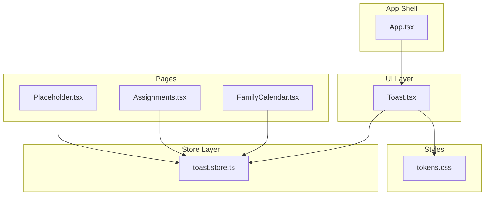
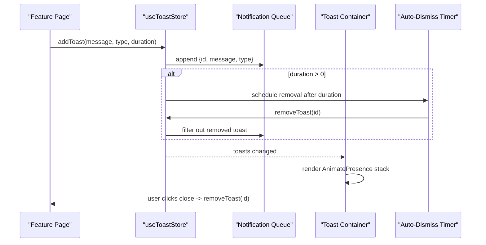
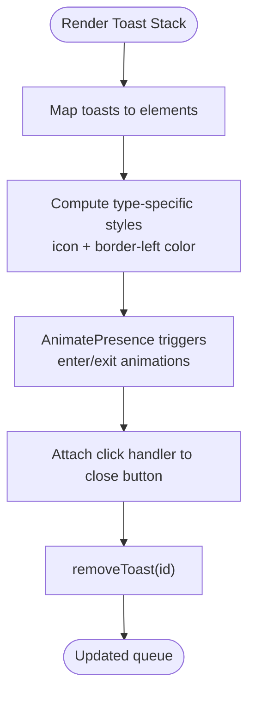
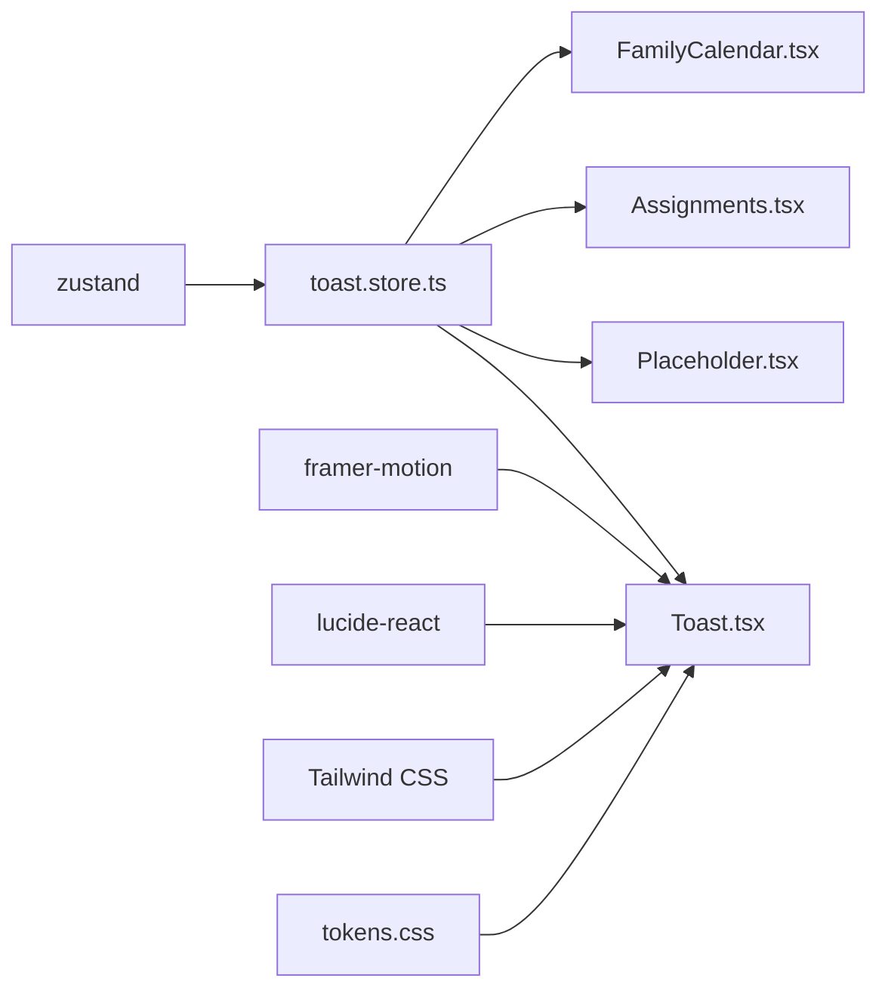

# Toast Notification System

<cite>
**Referenced Files in This Document**
- [toast.store.ts](file://src/store/toast.store.ts)
- [Toast.tsx](file://src/components/Toast.tsx)
- [App.tsx](file://src/App.tsx)
- [Placeholder.tsx](file://src/pages/Placeholder.tsx)
- [Assignments.tsx](file://src/pages/features/Assignments.tsx)
- [FamilyCalendar.tsx](file://src/pages/features/FamilyCalendar.tsx)
- [tokens.css](file://src/styles/tokens.css)
- [package.json](file://package.json)
</cite>

## Table of Contents
1. [Introduction](#introduction)
2. [Project Structure](#project-structure)
3. [Core Components](#core-components)
4. [Architecture Overview](#architecture-overview)
5. [Detailed Component Analysis](#detailed-component-analysis)
6. [Dependency Analysis](#dependency-analysis)
7. [Performance Considerations](#performance-considerations)
8. [Troubleshooting Guide](#troubleshooting-guide)
9. [Conclusion](#conclusion)
10. [Appendices](#appendices)

## Introduction
This document describes VChat’s toast notification system built with Zustand. It covers the store architecture, notification state management, queue handling, auto-dismiss behavior, notification types, positioning, animations, and integration with the Toast component. Practical examples show how components trigger notifications, customize appearance, manage priorities, and handle user interactions. Guidance is included for extending the system, adding custom notification types, and integrating with external services.

## Project Structure
The toast system spans a small set of focused files:
- Store: defines the Zustand store and notification model
- Component: renders the toast container and applies animations
- Pages: demonstrate real-world usage across features
- Styles: provide theme tokens consumed by the toast visuals
- App: mounts the toast container globally



**Diagram sources**
- [toast.store.ts:1-39](file://src/store/toast.store.ts#L1-L39)
- [Toast.tsx:1-53](file://src/components/Toast.tsx#L1-L53)
- [App.tsx:142-147](file://src/App.tsx#L142-L147)
- [Placeholder.tsx:1-43](file://src/pages/Placeholder.tsx#L1-L43)
- [Assignments.tsx:1-195](file://src/pages/features/Assignments.tsx#L1-L195)
- [FamilyCalendar.tsx:1-276](file://src/pages/features/FamilyCalendar.tsx#L1-L276)
- [tokens.css:1-39](file://src/styles/tokens.css#L1-L39)

**Section sources**
- [toast.store.ts:1-39](file://src/store/toast.store.ts#L1-L39)
- [Toast.tsx:1-53](file://src/components/Toast.tsx#L1-L53)
- [App.tsx:142-147](file://src/App.tsx#L142-L147)

## Core Components
- Toast store: manages a queue of notifications and exposes add/remove actions with auto-dismiss.
- Toast component: renders the toast stack, applies animations, and handles user dismissal.
- Pages: consume the store to trigger notifications for user feedback.

Key capabilities:
- Notification types: success, warning, error, info
- Duration control: configurable per notification
- Auto-dismiss: automatic removal after duration elapses
- Manual dismissal: user-triggered close button
- Stacking: multiple notifications shown concurrently
- Positioning: fixed at top center of viewport
- Animations: spring-based entrance/exit transitions

**Section sources**
- [toast.store.ts:3-38](file://src/store/toast.store.ts#L3-L38)
- [Toast.tsx:6-52](file://src/components/Toast.tsx#L6-L52)

## Architecture Overview
The system follows a unidirectional data flow:
- Components call the store to enqueue a notification
- The store updates state and optionally schedules removal
- The Toast component subscribes to store changes and renders the stack
- Users can dismiss individual notifications manually



**Diagram sources**
- [toast.store.ts:17-38](file://src/store/toast.store.ts#L17-L38)
- [Toast.tsx:6-52](file://src/components/Toast.tsx#L6-L52)

## Detailed Component Analysis

### Toast Store (Zustand)
Responsibilities:
- Define the notification data model
- Manage the queue of active notifications
- Provide add/remove actions
- Schedule auto-dismiss timers

Data model:
- ToastMessage: id, message, type
- ToastType: union of success, warning, error, info
- Store state: toasts array
- Actions: addToast, removeToast

Behavior:
- addToast generates a unique id, appends to queue, and optionally schedules removal
- removeToast filters out a specific toast by id
- Duration defaults to 3000ms; zero disables auto-dismiss

```mermaid
classDiagram
class ToastMessage {
+string id
+string message
+ToastType type
}
class ToastStore {
+ToastMessage[] toasts
+addToast(message, type, duration) void
+removeToast(id) void
}
class ToastType {
<<enumeration>>
"success"
"warning"
"error"
"info"
}
ToastStore --> ToastMessage : "manages"
ToastMessage --> ToastType : "has type"
```

**Diagram sources**
- [toast.store.ts:3-15](file://src/store/toast.store.ts#L3-L15)

**Section sources**
- [toast.store.ts:3-38](file://src/store/toast.store.ts#L3-L38)

### Toast Component (Rendering and Animation)
Responsibilities:
- Subscribe to the store and render the toast stack
- Apply type-specific styling and icons
- Trigger animations on mount/unmount
- Handle manual dismissal

Positioning and layout:
- Absolute overlay positioned near the top of the viewport
- Centered horizontally with a max width constraint
- Vertical gap between stacked notifications

Animation:
- Entrance: slide down and fade in with spring easing
- Exit: slide up and fade out with spring easing
- Transition parameters configured for smooth UX

Accessibility:
- Close button is keyboard focusable and clickable
- Uses semantic button element



**Diagram sources**
- [Toast.tsx:6-52](file://src/components/Toast.tsx#L6-L52)

**Section sources**
- [Toast.tsx:6-52](file://src/components/Toast.tsx#L6-L52)

### Integration with App Shell
The Toast container is mounted at the top level so it overlays all routes and pages.

- App mounts ToastContainer alongside route transitions
- Ensures notifications appear above page content regardless of navigation

**Section sources**
- [App.tsx:142-147](file://src/App.tsx#L142-L147)

### Usage Examples Across Pages
Real-world examples demonstrate how to trigger notifications with different types and durations.

- Placeholder page: triggers an informational notification on button press
- Assignments page: triggers success/warning notifications during form submission
- FamilyCalendar page: triggers success and info notifications for event operations

These examples illustrate:
- Importing the store hook
- Calling addToast with message, type, and optional duration
- Using different types to communicate severity

**Section sources**
- [Placeholder.tsx:9-38](file://src/pages/Placeholder.tsx#L9-L38)
- [Assignments.tsx:35-45](file://src/pages/features/Assignments.tsx#L35-L45)
- [FamilyCalendar.tsx:52-74](file://src/pages/features/FamilyCalendar.tsx#L52-L74)
- [FamilyCalendar.tsx:157-165](file://src/pages/features/FamilyCalendar.tsx#L157-L165)

## Dependency Analysis
External libraries:
- Zustand: state management for the toast queue
- Framer Motion: declarative animations for entrance/exit
- Lucide React: icons for each notification type
- Tailwind CSS: responsive layout and theme tokens

Internal dependencies:
- Toast component depends on the store for state and actions
- Pages depend on the store to trigger notifications
- Styles rely on CSS variables for theme-aware colors



**Diagram sources**
- [package.json:12-18](file://package.json#L12-L18)
- [toast.store.ts:1](file://src/store/toast.store.ts#L1)
- [Toast.tsx:1-4](file://src/components/Toast.tsx#L1-L4)
- [tokens.css:1-39](file://src/styles/tokens.css#L1-L39)

**Section sources**
- [package.json:12-18](file://package.json#L12-L18)

## Performance Considerations
- Minimal re-renders: Zustand’s selector-based subscriptions reduce unnecessary renders
- Efficient queue updates: immutable updates with spread operator
- Auto-dismiss timers: short-lived timeouts per toast; consider batching if many notifications are generated rapidly
- Animation cost: spring animations are GPU-friendly; keep max-width and shadow reasonable
- Memory: remove toasts promptly on user action or timeout; avoid indefinite queues

## Troubleshooting Guide
Common issues and resolutions:
- Notifications not appearing
  - Ensure ToastContainer is rendered at the top level
  - Verify store is initialized and addToast is called from a mounted component
- Auto-dismiss not working
  - Confirm duration > 0; zero disables auto-dismiss
  - Check that the timer callback executes removeToast(id)
- Icons or colors not matching type
  - Validate type string matches expected values
  - Confirm CSS variables are defined in tokens.css
- Accessibility concerns
  - Ensure close button is focusable and has clear affordances
  - Avoid relying solely on color to convey meaning

**Section sources**
- [Toast.tsx:6-52](file://src/components/Toast.tsx#L6-L52)
- [toast.store.ts:19-31](file://src/store/toast.store.ts#L19-L31)
- [tokens.css:1-39](file://src/styles/tokens.css#L1-L39)

## Conclusion
VChat’s toast system provides a lightweight, extensible solution for user feedback. It leverages Zustand for efficient state management, Framer Motion for smooth animations, and a simple type-driven design for consistent UX. The examples across pages demonstrate practical usage patterns, and the architecture supports easy extension for custom types and integrations.

## Appendices

### Notification Types and Defaults
- Types: success, warning, error, info
- Default duration: 3000ms
- Default type: info

**Section sources**
- [toast.store.ts:3-15](file://src/store/toast.store.ts#L3-L15)

### Triggering Notifications from Components
- Import the store hook
- Call addToast with message, type, and optional duration
- Use success for confirmations, warning for validation errors, error for failures, info for neutral updates

**Section sources**
- [Placeholder.tsx:9-38](file://src/pages/Placeholder.tsx#L9-L38)
- [Assignments.tsx:35-45](file://src/pages/features/Assignments.tsx#L35-L45)
- [FamilyCalendar.tsx:52-74](file://src/pages/features/FamilyCalendar.tsx#L52-L74)

### Customizing Appearance
- Modify type-specific colors and icons in the Toast component
- Adjust animation parameters (spring damping/stiffness) for different feel
- Change layout constraints (width, spacing) to fit product design

**Section sources**
- [Toast.tsx:9-21](file://src/components/Toast.tsx#L9-L21)
- [Toast.tsx:30-35](file://src/components/Toast.tsx#L30-L35)

### Managing Notification Priorities
- Use type to signal importance (error > warning > success > info)
- Control visibility by adjusting duration for urgent vs. background updates
- Consider grouping related notifications to avoid overwhelming the user

### State Persistence for Pending Notifications
- Current implementation does not persist toasts across sessions
- To persist, serialize the queue and restore on app initialization
- Consider session storage or local storage keyed by a session identifier

### Extending the System
- Add new types by extending ToastType and updating the style/icon mapping
- Introduce severity levels or categories for richer semantics
- Add optional metadata (e.g., action buttons) to ToastMessage and render accordingly

### Integrating with External Services
- Push notifications: integrate service worker and push APIs to enqueue toasts
- Analytics: track toast events (trigger, dismiss, duration) for UX insights
- Accessibility: add ARIA live regions for screen readers