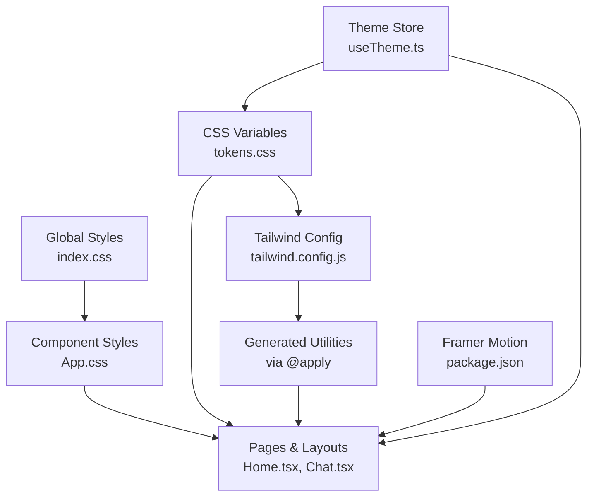
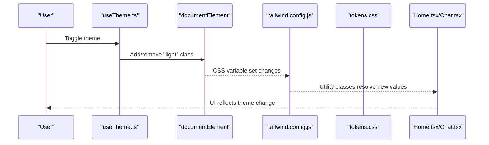
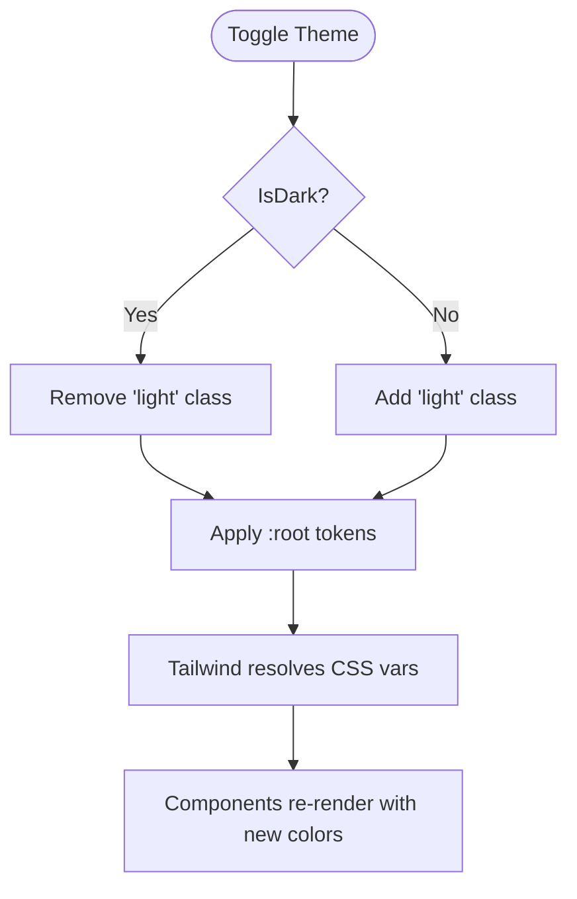
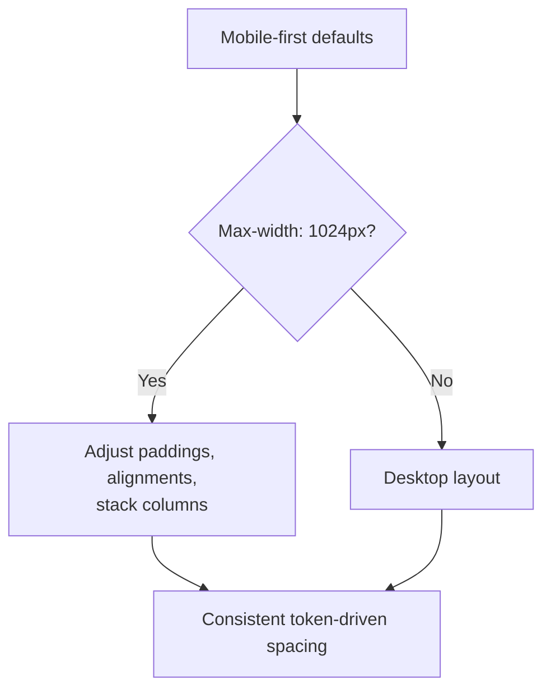
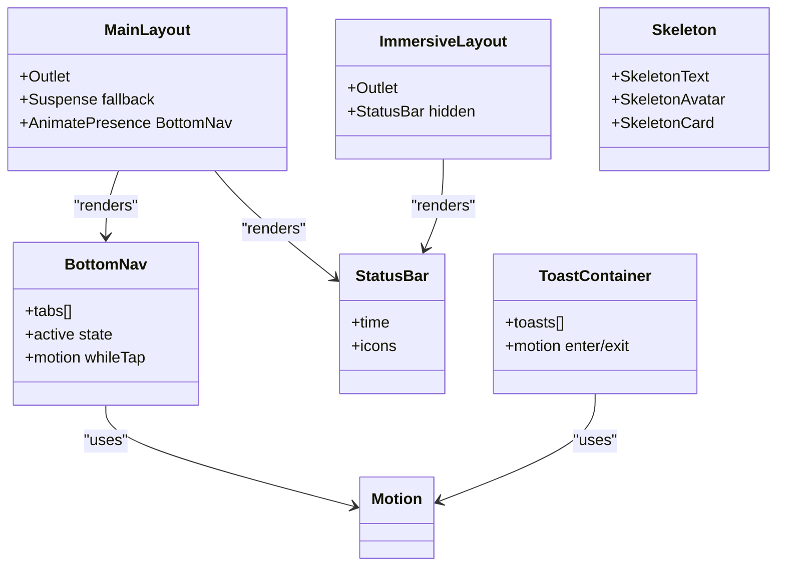
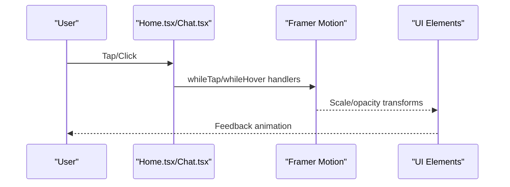
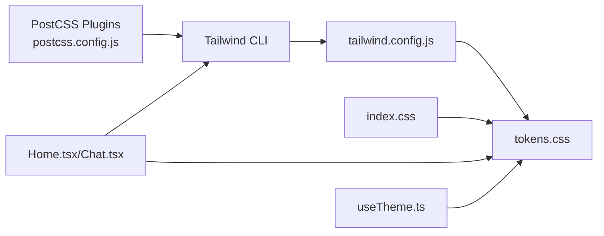

# Styling and Design System

<cite>
**Referenced Files in This Document**
- [tokens.css](file://src/styles/tokens.css)
- [tailwind.config.js](file://tailwind.config.js)
- [postcss.config.js](file://postcss.config.js)
- [index.css](file://src/index.css)
- [App.css](file://src/App.css)
- [useTheme.ts](file://src/hooks/useTheme.ts)
- [MainLayout.tsx](file://src/components/layouts/MainLayout.tsx)
- [ImmersiveLayout.tsx](file://src/components/layouts/ImmersiveLayout.tsx)
- [BottomNav.tsx](file://src/components/BottomNav.tsx)
- [StatusBar.tsx](file://src/components/StatusBar.tsx)
- [Skeleton.tsx](file://src/components/Skeleton.tsx)
- [Toast.tsx](file://src/components/Toast.tsx)
- [Home.tsx](file://src/pages/Home.tsx)
- [Chat.tsx](file://src/pages/Chat.tsx)
- [package.json](file://package.json)
</cite>

## Table of Contents
1. [Introduction](#introduction)
2. [Project Structure](#project-structure)
3. [Core Components](#core-components)
4. [Architecture Overview](#architecture-overview)
5. [Detailed Component Analysis](#detailed-component-analysis)
6. [Dependency Analysis](#dependency-analysis)
7. [Performance Considerations](#performance-considerations)
8. [Accessibility and Inclusive Design](#accessibility-and-inclusive-design)
9. [Extensibility and Best Practices](#extensibility-and-best-practices)
10. [Troubleshooting Guide](#troubleshooting-guide)
11. [Conclusion](#conclusion)

## Introduction
This document explains VChat’s styling architecture and design system. It covers Tailwind CSS integration, the custom property token system, component styling patterns, responsive design, animations with Framer Motion, and accessibility considerations. It also provides guidelines for extending the design system consistently across the application.

## Project Structure
The styling system is organized around:
- A central token layer that defines CSS custom properties for theme-aware colors, backgrounds, borders, and text.
- Tailwind CSS configured to resolve design tokens via CSS variables for consistent design tokens across utility classes.
- Global base styles and animations.
- Component-level styling that leverages both Tailwind utilities and CSS variables for dynamic themes.
- Animation orchestration using Framer Motion integrated into layout and page components.

**Diagram sources**
- [tokens.css:1-39](file://src/styles/tokens.css#L1-L39)
- [tailwind.config.js:1-50](file://tailwind.config.js#L1-L50)
- [index.css:1-83](file://src/index.css#L1-L83)
- [App.css:1-185](file://src/App.css#L1-L185)
- [Home.tsx:1-272](file://src/pages/Home.tsx#L1-L272)
- [Chat.tsx:1-245](file://src/pages/Chat.tsx#L1-L245)
- [useTheme.ts:1-37](file://src/hooks/useTheme.ts#L1-L37)
- [package.json:12-19](file://package.json#L12-L19)

**Section sources**
- [tokens.css:1-39](file://src/styles/tokens.css#L1-L39)
- [tailwind.config.js:1-50](file://tailwind.config.js#L1-L50)
- [postcss.config.js:1-7](file://postcss.config.js#L1-L7)
- [index.css:1-83](file://src/index.css#L1-L83)
- [App.css:1-185](file://src/App.css#L1-L185)
- [useTheme.ts:1-37](file://src/hooks/useTheme.ts#L1-L37)
- [package.json:12-19](file://package.json#L12-L19)

## Core Components
- Design tokens: CSS custom properties define semantic color roles and theme variants for dark and light modes.
- Tailwind integration: Tailwind theme extends color palettes to map to CSS variables, enabling utility classes to reflect theme changes.
- Theme management: A Zustand store toggles the light class on the root element to switch tokens.
- Component styling: Pages and components combine Tailwind utilities with CSS variables and inline styles for gradients, blur, and shadows.
- Animations: Framer Motion powers transitions and presence animations for routes, modals, and interactive elements.

**Section sources**
- [tokens.css:1-39](file://src/styles/tokens.css#L1-L39)
- [tailwind.config.js:9-42](file://tailwind.config.js#L9-L42)
- [useTheme.ts:10-36](file://src/hooks/useTheme.ts#L10-L36)
- [Home.tsx:10-53](file://src/pages/Home.tsx#L10-L53)
- [Chat.tsx:65-93](file://src/pages/Chat.tsx#L65-L93)
- [package.json:13-13](file://package.json#L13-L13)

## Architecture Overview
The design system architecture ties together tokens, Tailwind utilities, global styles, and component rendering. Theme switching updates CSS variables, which Tailwind resolves via custom color definitions. Components consume both utilities and variables for consistent, theme-aware visuals.

**Diagram sources**
- [useTheme.ts:14-30](file://src/hooks/useTheme.ts#L14-L30)
- [tailwind.config.js:9-42](file://tailwind.config.js#L9-L42)
- [tokens.css:1-39](file://src/styles/tokens.css#L1-L39)
- [Home.tsx:257-271](file://src/pages/Home.tsx#L257-L271)
- [Chat.tsx:94-244](file://src/pages/Chat.tsx#L94-L244)

## Detailed Component Analysis

### Token System and Theme Management
- Tokens define semantic roles for primary/accent colors, status colors, and surface/text/border tokens in both dark and light contexts.
- Tailwind theme maps these tokens to color families so utilities like bg-bg, text-text, border-border, and primary classes resolve to current theme values.
- The theme hook toggles a class on the root element to switch between dark and light tokens.

**Diagram sources**
- [useTheme.ts:14-30](file://src/hooks/useTheme.ts#L14-L30)
- [tokens.css:1-39](file://src/styles/tokens.css#L1-L39)
- [tailwind.config.js:9-42](file://tailwind.config.js#L9-L42)

**Section sources**
- [tokens.css:1-39](file://src/styles/tokens.css#L1-L39)
- [tailwind.config.js:9-42](file://tailwind.config.js#L9-L42)
- [useTheme.ts:10-36](file://src/hooks/useTheme.ts#L10-L36)

### Responsive Design and Cross-Device Patterns
- Mobile-first approach: Components use minimal breakpoints to adapt layout on smaller screens.
- Flexible containers: Sticky headers, scroll regions, and horizontal snap lists accommodate varied device sizes.
- Global media queries adjust paddings and alignments for tablet-sized screens.

**Diagram sources**
- [App.css:67-71](file://src/App.css#L67-L71)
- [App.css:92-96](file://src/App.css#L92-L96)
- [App.css:139-154](file://src/App.css#L139-L154)
- [index.css:36-57](file://src/index.css#L36-L57)

**Section sources**
- [App.css:67-71](file://src/App.css#L67-L71)
- [App.css:92-96](file://src/App.css#L92-L96)
- [App.css:139-154](file://src/App.css#L139-L154)
- [index.css:36-57](file://src/index.css#L36-L57)

### Component Styling Patterns
- Layouts: MainLayout and ImmersiveLayout use Tailwind utilities and CSS variables for backgrounds, borders, and backdrop blur. They integrate Framer Motion for animated bottom navigation.
- Navigation: BottomNav applies token-driven colors and hover/active states with motion scaling.
- Status bar: StatusBar uses text tokens for typography and icons.
- Skeleton loaders: Skeleton components apply token-based borders and background with a shared pulse animation.
- Toasts: ToastContainer uses motion for entrance/exit and token-based backgrounds and borders.

**Diagram sources**
- [MainLayout.tsx:7-29](file://src/components/layouts/MainLayout.tsx#L7-L29)
- [ImmersiveLayout.tsx:5-18](file://src/components/layouts/ImmersiveLayout.tsx#L5-L18)
- [BottomNav.tsx:26-59](file://src/components/BottomNav.tsx#L26-L59)
- [StatusBar.tsx:3-13](file://src/components/StatusBar.tsx#L3-L13)
- [Skeleton.tsx:3-28](file://src/components/Skeleton.tsx#L3-L28)
- [Toast.tsx:24-51](file://src/components/Toast.tsx#L24-L51)

**Section sources**
- [MainLayout.tsx:7-29](file://src/components/layouts/MainLayout.tsx#L7-L29)
- [ImmersiveLayout.tsx:5-18](file://src/components/layouts/ImmersiveLayout.tsx#L5-L18)
- [BottomNav.tsx:26-59](file://src/components/BottomNav.tsx#L26-L59)
- [StatusBar.tsx:3-13](file://src/components/StatusBar.tsx#L3-L13)
- [Skeleton.tsx:3-28](file://src/components/Skeleton.tsx#L3-L28)
- [Toast.tsx:24-51](file://src/components/Toast.tsx#L24-L51)

### Animation System Integration (Framer Motion)
- Route-level transitions: MainLayout wraps outlet in Suspense and renders a bottom navigation with AnimatePresence and motion props.
- Page-level micro-interactions: Buttons, cards, and avatars use whileTap and whileHover to provide tactile feedback.
- Modal presentation: Chat page animates a bottom sheet modal with spring physics and overlay fade.
- Toast notifications: ToastContainer animates entries and exits with spring damping and stiffness.

**Diagram sources**
- [MainLayout.tsx:20-27](file://src/components/layouts/MainLayout.tsx#L20-L27)
- [Home.tsx:30-50](file://src/pages/Home.tsx#L30-L50)
- [Chat.tsx:110-126](file://src/pages/Chat.tsx#L110-L126)
- [Chat.tsx:21-62](file://src/pages/Chat.tsx#L21-L62)
- [Toast.tsx:30-36](file://src/components/Toast.tsx#L30-L36)

**Section sources**
- [MainLayout.tsx:20-27](file://src/components/layouts/MainLayout.tsx#L20-L27)
- [Home.tsx:30-50](file://src/pages/Home.tsx#L30-L50)
- [Chat.tsx:110-126](file://src/pages/Chat.tsx#L110-L126)
- [Chat.tsx:21-62](file://src/pages/Chat.tsx#L21-L62)
- [Toast.tsx:30-36](file://src/components/Toast.tsx#L30-L36)
- [package.json:13-13](file://package.json#L13-L13)

### Typography and Spacing Systems
- Typography scale: Tailwind theme sets a sans font family; components use semantic text tokens for hierarchy and readability.
- Spacing: Components rely on Tailwind spacing utilities and token-based borders and backgrounds for consistent rhythm.

**Section sources**
- [tailwind.config.js:43-45](file://tailwind.config.js#L43-L45)
- [index.css:14-21](file://src/index.css#L14-L21)
- [Home.tsx:12-28](file://src/pages/Home.tsx#L12-L28)
- [Chat.tsx:130-139](file://src/pages/Chat.tsx#L130-L139)

## Dependency Analysis
The styling pipeline depends on Tailwind and PostCSS, with theme tokens bridged into Tailwind via CSS variables. Components depend on both Tailwind utilities and CSS variables for theme-aware rendering.

**Diagram sources**
- [postcss.config.js:1-7](file://postcss.config.js#L1-L7)
- [tailwind.config.js:1-50](file://tailwind.config.js#L1-L50)
- [tokens.css:1-39](file://src/styles/tokens.css#L1-L39)
- [index.css:1-83](file://src/index.css#L1-L83)
- [Home.tsx:1-272](file://src/pages/Home.tsx#L1-L272)
- [Chat.tsx:1-245](file://src/pages/Chat.tsx#L1-L245)
- [useTheme.ts:1-37](file://src/hooks/useTheme.ts#L1-L37)

**Section sources**
- [postcss.config.js:1-7](file://postcss.config.js#L1-L7)
- [tailwind.config.js:1-50](file://tailwind.config.js#L1-L50)
- [tokens.css:1-39](file://src/styles/tokens.css#L1-L39)
- [index.css:1-83](file://src/index.css#L1-L83)
- [Home.tsx:1-272](file://src/pages/Home.tsx#L1-L272)
- [Chat.tsx:1-245](file://src/pages/Chat.tsx#L1-L245)
- [useTheme.ts:1-37](file://src/hooks/useTheme.ts#L1-L37)

## Performance Considerations
- CSS variables reduce duplication and enable efficient theme switching without rebuilding styles.
- Tailwind’s JIT and purging minimize bundle size; ensure content globs cover all component paths.
- Prefer CSS variables for theme-dependent values to avoid generating numerous utility variants.
- Use motion primitives sparingly; keep animation durations reasonable to maintain responsiveness.

[No sources needed since this section provides general guidance]

## Accessibility and Inclusive Design
- Color contrast: Ensure sufficient contrast between foreground and background tokens for text and interactive elements. Test against WCAG AA/AAA guidelines.
- Focus management: Components include focus-visible outlines using tokenized colors for keyboard navigation.
- Motion preferences: Respect reduced motion settings; simplify or disable animations where appropriate.
- Semantic markup: Combine Tailwind utilities with semantic HTML to support assistive technologies.

**Section sources**
- [index.css:14-21](file://src/index.css#L14-L21)
- [App.css:14-17](file://src/App.css#L14-L17)
- [BottomNav.tsx:43-45](file://src/components/BottomNav.tsx#L43-L45)

## Extensibility and Best Practices
- Extend tokens: Add new semantic tokens in tokens.css and map them in tailwind.config.js under theme.extend.colors.
- Naming conventions: Use kebab-case for CSS variables and Tailwind utilities. Keep class names concise and descriptive.
- Component styling: Prefer Tailwind utilities for layout and spacing; use CSS variables for theme-dependent colors and gradients.
- Responsive patterns: Define breakpoints early and reuse media queries for consistent adjustments across components.
- Animation guidelines: Use Framer Motion for complex transitions; keep micro-interactions subtle and purposeful.
- Organization: Keep global styles in index.css and component-specific styles in dedicated CSS modules or inline styles where necessary.

**Section sources**
- [tokens.css:1-39](file://src/styles/tokens.css#L1-L39)
- [tailwind.config.js:9-42](file://tailwind.config.js#L9-L42)
- [index.css:1-83](file://src/index.css#L1-L83)
- [Home.tsx:257-271](file://src/pages/Home.tsx#L257-L271)
- [Chat.tsx:94-244](file://src/pages/Chat.tsx#L94-L244)

## Troubleshooting Guide
- Theme not switching: Verify the root element receives the "light" class and tokens.css is imported in index.css.
- Utilities not reflecting theme: Confirm tailwind.config.js maps tokens to CSS variables and rebuild Tailwind.
- Animations not playing: Ensure Framer Motion is installed and components use motion wrappers correctly.
- Scrollbar visibility: Global styles hide scrollbars per browser; confirm platform-specific overrides are applied.

**Section sources**
- [useTheme.ts:14-30](file://src/hooks/useTheme.ts#L14-L30)
- [index.css:1-83](file://src/index.css#L1-L83)
- [tailwind.config.js:9-42](file://tailwind.config.js#L9-L42)
- [package.json:13-13](file://package.json#L13-L13)

## Conclusion
VChat’s design system blends a robust token layer with Tailwind utilities and Framer Motion to deliver a cohesive, theme-aware UI. By centralizing design tokens, leveraging CSS variables, and applying consistent responsive and animation patterns, the system supports scalable development and strong accessibility outcomes.