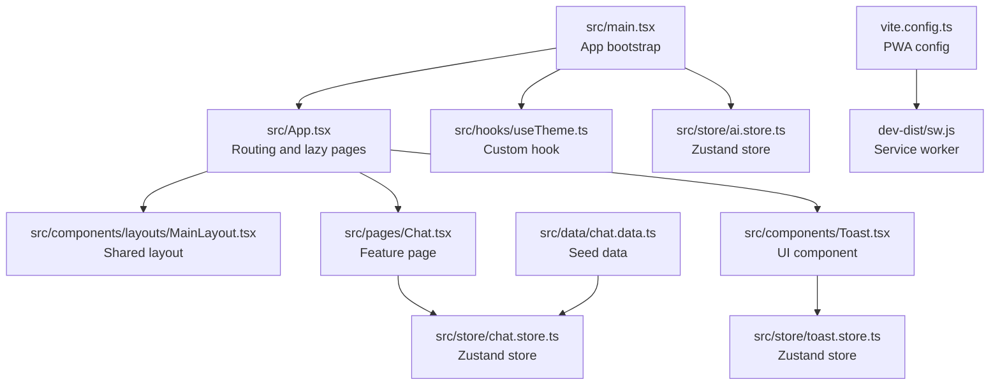
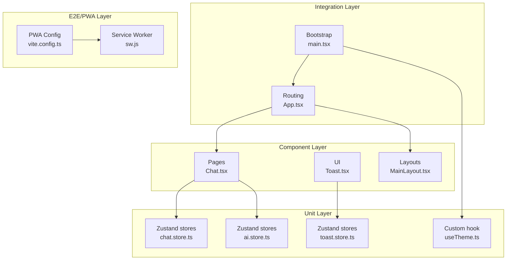
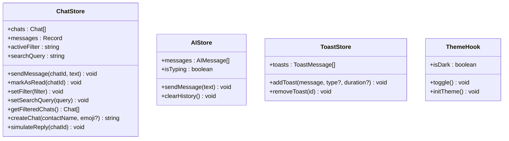
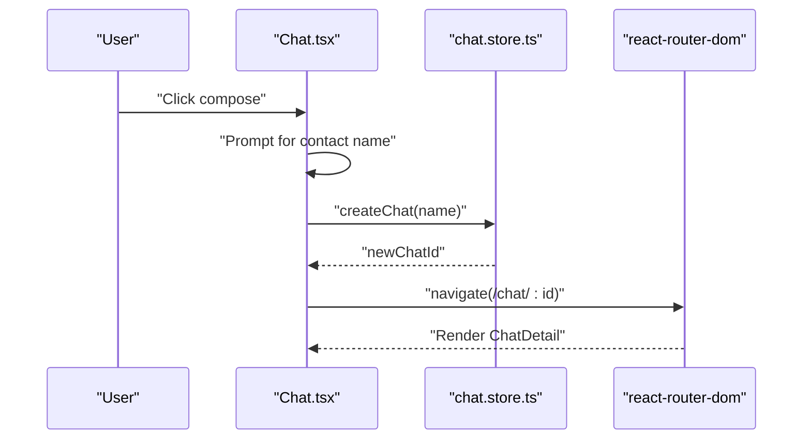
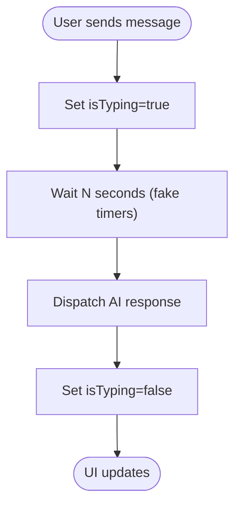
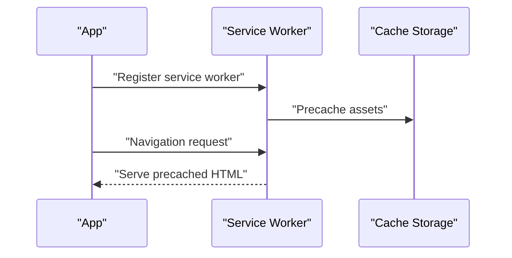
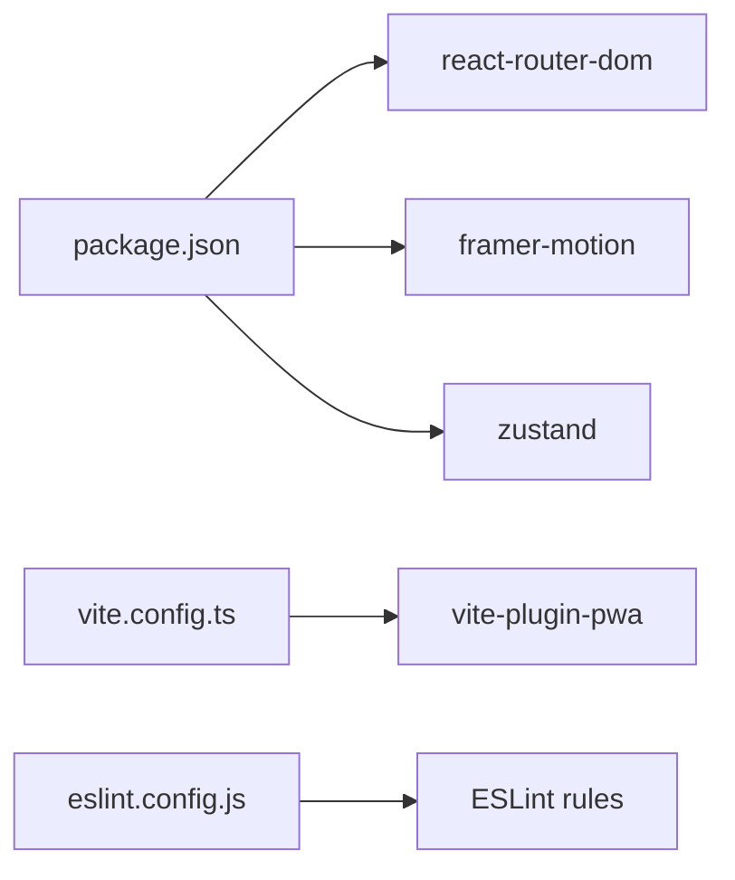

# Testing Strategy

<cite>
**Referenced Files in This Document**
- [package.json](file://package.json)
- [vite.config.ts](file://vite.config.ts)
- [eslint.config.js](file://eslint.config.js)
- [README.md](file://README.md)
- [src/main.tsx](file://src/main.tsx)
- [src/App.tsx](file://src/App.tsx)
- [src/components/layouts/MainLayout.tsx](file://src/components/layouts/MainLayout.tsx)
- [src/pages/Chat.tsx](file://src/pages/Chat.tsx)
- [src/store/chat.store.ts](file://src/store/chat.store.ts)
- [src/store/ai.store.ts](file://src/store/ai.store.ts)
- [src/store/toast.store.ts](file://src/store/toast.store.ts)
- [src/hooks/useTheme.ts](file://src/hooks/useTheme.ts)
- [src/components/Toast.tsx](file://src/components/Toast.tsx)
- [src/data/chat.data.ts](file://src/data/chat.data.ts)
- [dev-dist/sw.js](file://dev-dist/sw.js)
- [dev-dist/registerSW.js](file://dev-dist/registerSW.js)
</cite>

## Table of Contents
1. [Introduction](#introduction)
2. [Project Structure](#project-structure)
3. [Core Components](#core-components)
4. [Architecture Overview](#architecture-overview)
5. [Detailed Component Analysis](#detailed-component-analysis)
6. [Dependency Analysis](#dependency-analysis)
7. [Performance Considerations](#performance-considerations)
8. [Troubleshooting Guide](#troubleshooting-guide)
9. [Conclusion](#conclusion)
10. [Appendices](#appendices)

## Introduction
This document outlines VChat’s testing strategy and quality assurance approach. It covers unit testing, component testing, integration testing, and end-to-end testing patterns tailored to a React + TypeScript + Vite + Zustand + PWA application. It explains how to configure and use testing frameworks, how to test React components, custom hooks, Zustand stores, and asynchronous operations. It also addresses performance, accessibility, cross-browser compatibility, automation, CI testing, and coverage reporting. Guidance is provided for writing effective tests, mocking dependencies, handling async operations, debugging, maintenance, and optimizing testing performance. Special scenarios such as real-time messaging simulation, PWA caching, and state persistence are documented with practical testing strategies.

## Project Structure
VChat is a client-side React application built with Vite and TypeScript. The app uses:
- Routing via React Router
- State management via Zustand (with persistence)
- UI animations via Framer Motion
- PWA capabilities via Vite PWA plugin and Workbox

Key areas for testing:
- Application bootstrap and routing
- Layouts and page components
- Zustand stores (chat, AI, toast, theme)
- UI components and custom hooks
- PWA service worker and caching behavior

**Diagram sources**
- [src/main.tsx:1-11](file://src/main.tsx#L1-L11)
- [src/App.tsx:1-156](file://src/App.tsx#L1-L156)
- [src/components/layouts/MainLayout.tsx:1-30](file://src/components/layouts/MainLayout.tsx#L1-L30)
- [src/pages/Chat.tsx:1-245](file://src/pages/Chat.tsx#L1-L245)
- [src/components/Toast.tsx:1-53](file://src/components/Toast.tsx#L1-L53)
- [src/store/chat.store.ts:1-349](file://src/store/chat.store.ts#L1-L349)
- [src/store/toast.store.ts:1-39](file://src/store/toast.store.ts#L1-L39)
- [src/hooks/useTheme.ts:1-37](file://src/hooks/useTheme.ts#L1-L37)
- [src/store/ai.store.ts:97-161](file://src/store/ai.store.ts#L97-L161)
- [vite.config.ts:1-57](file://vite.config.ts#L1-L57)
- [dev-dist/sw.js:1-93](file://dev-dist/sw.js#L1-L93)
- [src/data/chat.data.ts:1-134](file://src/data/chat.data.ts#L1-L134)

**Section sources**
- [src/main.tsx:1-11](file://src/main.tsx#L1-L11)
- [src/App.tsx:1-156](file://src/App.tsx#L1-L156)
- [vite.config.ts:1-57](file://vite.config.ts#L1-L57)

## Core Components
This section identifies the primary targets for testing and their roles in the testing strategy.

- Application bootstrap and routing
  - Tests should verify route rendering, lazy loading behavior, and layout wrappers.
  - Key files: [src/main.tsx:1-11](file://src/main.tsx#L1-L11), [src/App.tsx:1-156](file://src/App.tsx#L1-L156), [src/components/layouts/MainLayout.tsx:1-30](file://src/components/layouts/MainLayout.tsx#L1-L30)

- Zustand stores
  - Chat store: message sending, filtering, search, creation, simulated replies, persistence.
  - AI store: message lifecycle and typing simulation.
  - Toast store: notifications and dismissal.
  - Theme hook: theme initialization and toggling.
  - Key files: [src/store/chat.store.ts:1-349](file://src/store/chat.store.ts#L1-L349), [src/store/ai.store.ts:97-161](file://src/store/ai.store.ts#L97-L161), [src/store/toast.store.ts:1-39](file://src/store/toast.store.ts#L1-L39), [src/hooks/useTheme.ts:1-37](file://src/hooks/useTheme.ts#L1-L37)

- UI components
  - Chat page and Toast container demonstrate integration of stores and animations.
  - Key files: [src/pages/Chat.tsx:1-245](file://src/pages/Chat.tsx#L1-L245), [src/components/Toast.tsx:1-53](file://src/components/Toast.tsx#L1-L53)

- PWA and caching
  - Service worker and Workbox configuration for offline and caching behavior.
  - Key files: [vite.config.ts:1-57](file://vite.config.ts#L1-L57), [dev-dist/sw.js:1-93](file://dev-dist/sw.js#L1-L93), [dev-dist/registerSW.js:1-1](file://dev-dist/registerSW.js#L1-L1)

**Section sources**
- [src/store/chat.store.ts:1-349](file://src/store/chat.store.ts#L1-L349)
- [src/store/ai.store.ts:97-161](file://src/store/ai.store.ts#L97-L161)
- [src/store/toast.store.ts:1-39](file://src/store/toast.store.ts#L1-L39)
- [src/hooks/useTheme.ts:1-37](file://src/hooks/useTheme.ts#L1-L37)
- [src/pages/Chat.tsx:1-245](file://src/pages/Chat.tsx#L1-L245)
- [src/components/Toast.tsx:1-53](file://src/components/Toast.tsx#L1-L53)
- [vite.config.ts:1-57](file://vite.config.ts#L1-L57)
- [dev-dist/sw.js:1-93](file://dev-dist/sw.js#L1-L93)
- [dev-dist/registerSW.js:1-1](file://dev-dist/registerSW.js#L1-L1)

## Architecture Overview
The testing architecture aligns with the application’s modular structure. It emphasizes:
- Unit tests for pure logic and Zustand slices
- Component tests for UI behavior and integration with stores
- Integration tests for routing and layout composition
- End-to-end tests for critical user journeys (e.g., chat messaging, PWA caching)
- Accessibility and cross-browser checks as part of CI

**Diagram sources**
- [src/main.tsx:1-11](file://src/main.tsx#L1-L11)
- [src/App.tsx:1-156](file://src/App.tsx#L1-L156)
- [src/components/layouts/MainLayout.tsx:1-30](file://src/components/layouts/MainLayout.tsx#L1-L30)
- [src/pages/Chat.tsx:1-245](file://src/pages/Chat.tsx#L1-L245)
- [src/components/Toast.tsx:1-53](file://src/components/Toast.tsx#L1-L53)
- [src/store/chat.store.ts:1-349](file://src/store/chat.store.ts#L1-L349)
- [src/store/ai.store.ts:97-161](file://src/store/ai.store.ts#L97-L161)
- [src/store/toast.store.ts:1-39](file://src/store/toast.store.ts#L1-L39)
- [src/hooks/useTheme.ts:1-37](file://src/hooks/useTheme.ts#L1-L37)
- [vite.config.ts:1-57](file://vite.config.ts#L1-L57)
- [dev-dist/sw.js:1-93](file://dev-dist/sw.js#L1-L93)

## Detailed Component Analysis

### Zustand Stores Testing Patterns
- Chat store
  - Test actions: send message, mark as read, set filter, set search query, create chat, simulate reply.
  - Verify state updates, derived filters, sorting, and persistence boundaries.
  - Mock time and randomness for deterministic tests.
  - Key file: [src/store/chat.store.ts:1-349](file://src/store/chat.store.ts#L1-L349)

- AI store
  - Test message lifecycle and typing simulation with delays.
  - Validate state transitions and timing.
  - Key file: [src/store/ai.store.ts:97-161](file://src/store/ai.store.ts#L97-L161)

- Toast store
  - Test adding and removing toasts with optional auto-dismiss.
  - Key file: [src/store/toast.store.ts:1-39](file://src/store/toast.store.ts#L1-L39)

- Theme hook
  - Test theme initialization and toggling effects on DOM.
  - Key file: [src/hooks/useTheme.ts:1-37](file://src/hooks/useTheme.ts#L1-L37)

**Diagram sources**
- [src/store/chat.store.ts:1-349](file://src/store/chat.store.ts#L1-L349)
- [src/store/ai.store.ts:97-161](file://src/store/ai.store.ts#L97-L161)
- [src/store/toast.store.ts:1-39](file://src/store/toast.store.ts#L1-L39)
- [src/hooks/useTheme.ts:1-37](file://src/hooks/useTheme.ts#L1-L37)

**Section sources**
- [src/store/chat.store.ts:1-349](file://src/store/chat.store.ts#L1-L349)
- [src/store/ai.store.ts:97-161](file://src/store/ai.store.ts#L97-L161)
- [src/store/toast.store.ts:1-39](file://src/store/toast.store.ts#L1-L39)
- [src/hooks/useTheme.ts:1-37](file://src/hooks/useTheme.ts#L1-L37)

### React Components Testing Patterns
- Chat page
  - Test UI interactions: search, filter tabs, compose chat, navigation.
  - Verify store integrations and animations.
  - Key file: [src/pages/Chat.tsx:1-245](file://src/pages/Chat.tsx#L1-L245)

- Toast container
  - Test toast rendering, dismissal, and styling per type.
  - Key file: [src/components/Toast.tsx:1-53](file://src/components/Toast.tsx#L1-L53)

- Main layout
  - Test outlet rendering, suspense fallback, and bottom navigation presence.
  - Key file: [src/components/layouts/MainLayout.tsx:1-30](file://src/components/layouts/MainLayout.tsx#L1-L30)

**Diagram sources**
- [src/pages/Chat.tsx:86-92](file://src/pages/Chat.tsx#L86-L92)
- [src/store/chat.store.ts:268-286](file://src/store/chat.store.ts#L268-L286)
- [src/App.tsx:75-78](file://src/App.tsx#L75-L78)

**Section sources**
- [src/pages/Chat.tsx:1-245](file://src/pages/Chat.tsx#L1-L245)
- [src/components/Toast.tsx:1-53](file://src/components/Toast.tsx#L1-L53)
- [src/components/layouts/MainLayout.tsx:1-30](file://src/components/layouts/MainLayout.tsx#L1-L30)

### Async Operations and Real-Time Simulation
- Simulated replies in chat store
  - Use fake timers to advance time deterministically.
  - Assert message arrival and UI updates.
  - Key file: [src/store/chat.store.ts:288-318](file://src/store/chat.store.ts#L288-L318)

- AI typing simulation
  - Use fake timers to validate isTyping transitions and message ordering.
  - Key file: [src/store/ai.store.ts:119-148](file://src/store/ai.store.ts#L119-L148)

**Diagram sources**
- [src/store/ai.store.ts:119-148](file://src/store/ai.store.ts#L119-L148)

**Section sources**
- [src/store/chat.store.ts:288-318](file://src/store/chat.store.ts#L288-L318)
- [src/store/ai.store.ts:119-148](file://src/store/ai.store.ts#L119-L148)

### PWA and State Persistence Testing
- Service worker and caching
  - Validate precache entries and navigation route handling.
  - Key files: [vite.config.ts:9-54](file://vite.config.ts#L9-L54), [dev-dist/sw.js:80-90](file://dev-dist/sw.js#L80-L90)

- State persistence with Zustand
  - Test partialization and selective persistence of state slices.
  - Key file: [src/store/chat.store.ts:320-329](file://src/store/chat.store.ts#L320-L329)

**Diagram sources**
- [vite.config.ts:9-54](file://vite.config.ts#L9-L54)
- [dev-dist/sw.js:80-90](file://dev-dist/sw.js#L80-L90)

**Section sources**
- [vite.config.ts:9-54](file://vite.config.ts#L9-L54)
- [dev-dist/sw.js:80-90](file://dev-dist/sw.js#L80-L90)
- [src/store/chat.store.ts:320-329](file://src/store/chat.store.ts#L320-L329)

## Dependency Analysis
Testing dependencies and external systems:
- React Router for routing and lazy-loaded routes
- Framer Motion for animations
- Zustand for state management with persistence
- Vite PWA for service worker and caching
- ESLint for code quality and lint rules

**Diagram sources**
- [package.json:1-38](file://package.json#L1-L38)
- [vite.config.ts:1-57](file://vite.config.ts#L1-L57)
- [eslint.config.js:1-23](file://eslint.config.js#L1-L23)

**Section sources**
- [package.json:1-38](file://package.json#L1-L38)
- [vite.config.ts:1-57](file://vite.config.ts#L1-L57)
- [eslint.config.js:1-23](file://eslint.config.js#L1-L23)

## Performance Considerations
- Prefer unit and component tests over heavy integration tests for performance.
- Use fake timers for async operations to avoid real delays.
- Limit snapshot tests; favor focused assertions on behavior.
- Keep test fixtures small; use deterministic seeds for randomness.
- Run tests in parallel where safe; isolate shared mutable state (e.g., localStorage) per test.

## Troubleshooting Guide
Common testing issues and resolutions:
- Zustand persistence interfering with tests
  - Clear or mock storage between tests; reset stores to initial state.
  - Key file: [src/store/chat.store.ts:320-329](file://src/store/chat.store.ts#L320-L329)

- Service worker conflicts during testing
  - Unregister service workers in test environments or disable PWA in test builds.
  - Key files: [vite.config.ts:9-54](file://vite.config.ts#L9-L54), [dev-dist/registerSW.js:1-1](file://dev-dist/registerSW.js#L1-L1)

- Animation flakiness
  - Disable animations or use reduced motion in tests; test layout without motion.
  - Key file: [src/components/Toast.tsx:30-47](file://src/components/Toast.tsx#L30-L47)

**Section sources**
- [src/store/chat.store.ts:320-329](file://src/store/chat.store.ts#L320-L329)
- [vite.config.ts:9-54](file://vite.config.ts#L9-L54)
- [dev-dist/registerSW.js:1-1](file://dev-dist/registerSW.js#L1-L1)
- [src/components/Toast.tsx:30-47](file://src/components/Toast.tsx#L30-L47)

## Conclusion
VChat’s testing strategy leverages unit, component, integration, and E2E testing aligned with its architecture. Zustand stores are prime candidates for unit tests, while components and routing are validated through component and integration tests. PWA behavior and caching are covered via E2E and service worker tests. By combining deterministic async handling, persistence isolation, and CI-friendly practices, VChat ensures reliable, maintainable, and fast test suites.

## Appendices

### Testing Frameworks and Tools Configuration
- Current project setup
  - Dependencies include React, React Router, Zustand, Framer Motion.
  - Dev dependencies include Vite, TypeScript, Tailwind, ESLint, and Vite PWA.
  - No dedicated test runner or library is declared in scripts.
  - Key files: [package.json:1-38](file://package.json#L1-L38), [vite.config.ts:1-57](file://vite.config.ts#L1-L57), [eslint.config.js:1-23](file://eslint.config.js#L1-L23), [README.md:1-74](file://README.md#L1-L74)

- Recommendations
  - Add a test runner (e.g., Vitest) and React Testing Library for component tests.
  - Configure coverage reporting and pre-commit hooks for quality gates.
  - Integrate Playwright or Cypress for E2E testing and cross-browser checks.

**Section sources**
- [package.json:1-38](file://package.json#L1-L38)
- [vite.config.ts:1-57](file://vite.config.ts#L1-L57)
- [eslint.config.js:1-23](file://eslint.config.js#L1-L23)
- [README.md:1-74](file://README.md#L1-L74)

### Testing Best Practices for State Management, Routing, and Composition
- State management
  - Isolate stores; test actions independently; assert state transitions and derived values.
  - Use deterministic helpers for time and randomness.

- Routing
  - Wrap components with memory router for unit tests; test outlet rendering and lazy loading.

- Component composition
  - Render layouts and pages together to validate composition and suspense behavior.

**Section sources**
- [src/App.tsx:66-133](file://src/App.tsx#L66-L133)
- [src/components/layouts/MainLayout.tsx:1-30](file://src/components/layouts/MainLayout.tsx#L1-L30)

### Accessibility and Cross-Browser Compatibility
- Accessibility
  - Use semantic markup and test focus order and ARIA attributes.
  - Validate keyboard navigation and screen reader support.

- Cross-browser
  - Run tests in headless browsers; consider browser-specific drivers for E2E.
  - Validate animations and CSS in target browsers.

[No sources needed since this section provides general guidance]

### Testing Automation and Coverage Reporting
- CI pipeline
  - Install dependencies, run linter, build, and tests.
  - Publish coverage reports to a service of choice.

- Coverage
  - Target 80%+ for stores and components; prioritize critical paths.

[No sources needed since this section provides general guidance]

### Guidelines for Writing Effective Tests
- Keep tests focused and readable; describe intent clearly.
- Mock external dependencies (storage, timers, network).
- Prefer asserting behavior over implementation details.
- Maintain a clean test environment per suite.

[No sources needed since this section provides general guidance]

### Debugging Techniques and Maintenance Strategies
- Debugging
  - Use console logs sparingly; prefer targeted assertions.
  - Snapshot debugging for layout regressions; revert to inline snapshots for clarity.

- Maintenance
  - Refactor tests alongside feature changes.
  - Keep test data small and deterministic.

[No sources needed since this section provides general guidance]

### Testing Complex Scenarios
- Real-time messaging
  - Simulate replies and typing indicators with fake timers; verify UI updates and counters.

- PWA functionality
  - Test offline navigation and cached assets; unregister service workers in tests.

- State persistence
  - Validate partial persistence and selective state serialization.

**Section sources**
- [src/store/chat.store.ts:288-318](file://src/store/chat.store.ts#L288-L318)
- [src/store/ai.store.ts:119-148](file://src/store/ai.store.ts#L119-L148)
- [vite.config.ts:9-54](file://vite.config.ts#L9-L54)
- [dev-dist/sw.js:80-90](file://dev-dist/sw.js#L80-L90)