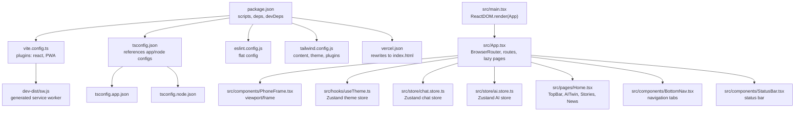
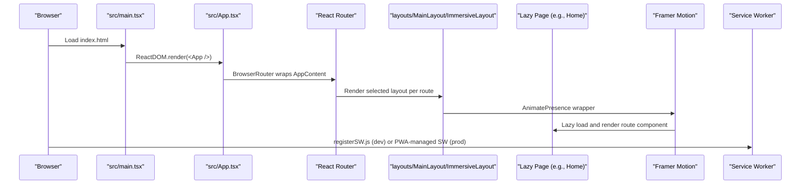
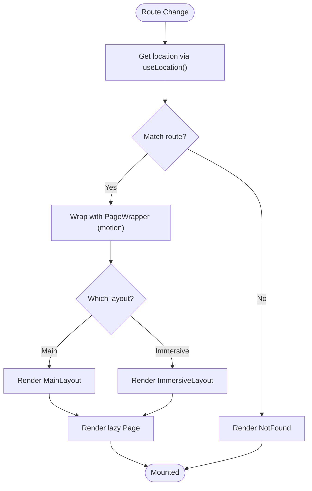
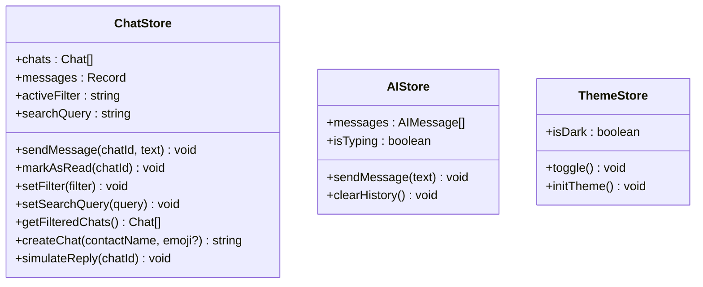
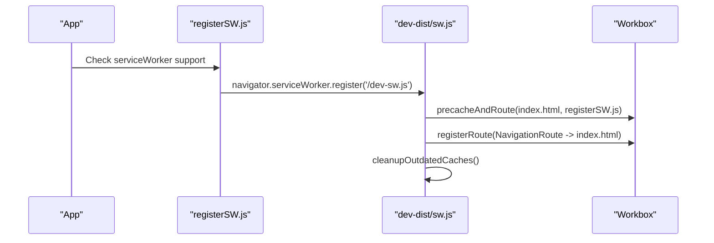
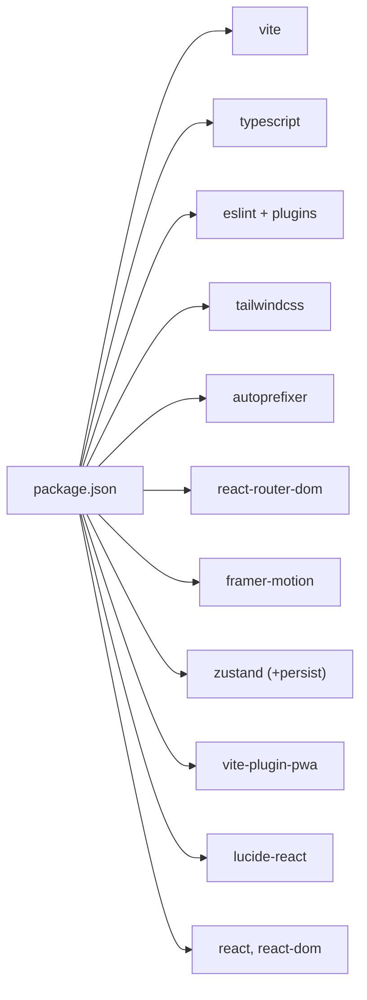

# Troubleshooting and FAQ

<cite>
**Referenced Files in This Document**
- [package.json](file://package.json)
- [vite.config.ts](file://vite.config.ts)
- [tsconfig.json](file://tsconfig.json)
- [tsconfig.app.json](file://tsconfig.app.json)
- [tsconfig.node.json](file://tsconfig.node.json)
- [eslint.config.js](file://eslint.config.js)
- [tailwind.config.js](file://tailwind.config.js)
- [vercel.json](file://vercel.json)
- [src/main.tsx](file://src/main.tsx)
- [src/App.tsx](file://src/App.tsx)
- [src/components/PhoneFrame.tsx](file://src/components/PhoneFrame.tsx)
- [src/hooks/useTheme.ts](file://src/hooks/useTheme.ts)
- [src/store/chat.store.ts](file://src/store/chat.store.ts)
- [src/store/ai.store.ts](file://src/store/ai.store.ts)
- [src/pages/Home.tsx](file://src/pages/Home.tsx)
- [src/components/BottomNav.tsx](file://src/components/BottomNav.tsx)
- [src/components/StatusBar.tsx](file://src/components/StatusBar.tsx)
- [dev-dist/sw.js](file://dev-dist/sw.js)
- [dev-dist/registerSW.js](file://dev-dist/registerSW.js)
</cite>

## Table of Contents
1. [Introduction](#introduction)
2. [Project Structure](#project-structure)
3. [Core Components](#core-components)
4. [Architecture Overview](#architecture-overview)
5. [Detailed Component Analysis](#detailed-component-analysis)
6. [Dependency Analysis](#dependency-analysis)
7. [Performance Considerations](#performance-considerations)
8. [Troubleshooting Guide](#troubleshooting-guide)
9. [Conclusion](#conclusion)
10. [Appendices](#appendices)

## Introduction
This document provides comprehensive troubleshooting guidance and FAQs for VChat development and usage. It covers build issues (dependency conflicts, TypeScript compilation errors, Vite configuration), runtime errors (component mounting, state management, navigation), performance problems (slow loading, memory leaks, animation jank), browser compatibility (polyfills, feature detection, graceful degradation), PWA issues (service worker, caching, offline), deployment pitfalls (build failures, environment configuration, Vercel rewrites), and practical debugging/logging/error tracking strategies. The goal is to help developers diagnose and resolve problems quickly, with actionable steps and diagrams where appropriate.

## Project Structure
VChat is a React + TypeScript application built with Vite, styled with Tailwind CSS, and enhanced with Framer Motion animations. It uses React Router for client-side routing and Zustand for state management. PWA capabilities are configured via Vite PWA plugin with Workbox.

**Diagram sources**
- [package.json:1-39](file://package.json#L1-L39)
- [vite.config.ts:1-57](file://vite.config.ts#L1-L57)
- [tsconfig.json:1-8](file://tsconfig.json#L1-L8)
- [eslint.config.js:1-24](file://eslint.config.js#L1-L24)
- [tailwind.config.js:1-50](file://tailwind.config.js#L1-L50)
- [vercel.json:1-8](file://vercel.json#L1-L8)
- [src/main.tsx:1-11](file://src/main.tsx#L1-L11)
- [src/App.tsx:1-156](file://src/App.tsx#L1-L156)
- [src/components/PhoneFrame.tsx:1-53](file://src/components/PhoneFrame.tsx#L1-L53)
- [src/hooks/useTheme.ts:1-37](file://src/hooks/useTheme.ts#L1-L37)
- [src/store/chat.store.ts:1-349](file://src/store/chat.store.ts#L1-L349)
- [src/store/ai.store.ts:1-162](file://src/store/ai.store.ts#L1-L162)
- [src/pages/Home.tsx:1-295](file://src/pages/Home.tsx#L1-L295)
- [src/components/BottomNav.tsx:1-62](file://src/components/BottomNav.tsx#L1-L62)
- [src/components/StatusBar.tsx:1-14](file://src/components/StatusBar.tsx#L1-L14)
- [dev-dist/sw.js:1-93](file://dev-dist/sw.js#L1-L93)

**Section sources**
- [package.json:1-39](file://package.json#L1-L39)
- [vite.config.ts:1-57](file://vite.config.ts#L1-L57)
- [tsconfig.json:1-8](file://tsconfig.json#L1-L8)
- [eslint.config.js:1-24](file://eslint.config.js#L1-L24)
- [tailwind.config.js:1-50](file://tailwind.config.js#L1-L50)
- [vercel.json:1-8](file://vercel.json#L1-L8)
- [src/main.tsx:1-11](file://src/main.tsx#L1-L11)
- [src/App.tsx:1-156](file://src/App.tsx#L1-L156)

## Core Components
- Application bootstrap and routing: [src/main.tsx:1-11](file://src/main.tsx#L1-L11), [src/App.tsx:1-156](file://src/App.tsx#L1-L156)
- Device frame and responsive layout: [src/components/PhoneFrame.tsx:1-53](file://src/components/PhoneFrame.tsx#L1-L53)
- Theme management (Zustand): [src/hooks/useTheme.ts:1-37](file://src/hooks/useTheme.ts#L1-L37)
- Chat state (Zustand + persistence): [src/store/chat.store.ts:1-349](file://src/store/chat.store.ts#L1-L349)
- AI assistant state (Zustand + persistence): [src/store/ai.store.ts:1-162](file://src/store/ai.store.ts#L1-L162)
- Navigation and bottom bar: [src/components/BottomNav.tsx:1-62](file://src/components/BottomNav.tsx#L1-L62)
- Status bar: [src/components/StatusBar.tsx:1-14](file://src/components/StatusBar.tsx#L1-L14)
- Home page UI composition: [src/pages/Home.tsx:1-295](file://src/pages/Home.tsx#L1-L295)
- PWA configuration and generated SW: [vite.config.ts:1-57](file://vite.config.ts#L1-L57), [dev-dist/sw.js:1-93](file://dev-dist/sw.js#L1-L93), [dev-dist/registerSW.js:1-1](file://dev-dist/registerSW.js#L1-L1)

**Section sources**
- [src/main.tsx:1-11](file://src/main.tsx#L1-L11)
- [src/App.tsx:1-156](file://src/App.tsx#L1-L156)
- [src/components/PhoneFrame.tsx:1-53](file://src/components/PhoneFrame.tsx#L1-L53)
- [src/hooks/useTheme.ts:1-37](file://src/hooks/useTheme.ts#L1-L37)
- [src/store/chat.store.ts:1-349](file://src/store/chat.store.ts#L1-L349)
- [src/store/ai.store.ts:1-162](file://src/store/ai.store.ts#L1-L162)
- [src/components/BottomNav.tsx:1-62](file://src/components/BottomNav.tsx#L1-L62)
- [src/components/StatusBar.tsx:1-14](file://src/components/StatusBar.tsx#L1-L14)
- [src/pages/Home.tsx:1-295](file://src/pages/Home.tsx#L1-L295)
- [vite.config.ts:1-57](file://vite.config.ts#L1-L57)
- [dev-dist/sw.js:1-93](file://dev-dist/sw.js#L1-L93)
- [dev-dist/registerSW.js:1-1](file://dev-dist/registerSW.js#L1-L1)

## Architecture Overview
High-level flow of bootstrapping, routing, lazy-loading, animations, and PWA activation.

**Diagram sources**
- [src/main.tsx:1-11](file://src/main.tsx#L1-L11)
- [src/App.tsx:1-156](file://src/App.tsx#L1-L156)
- [vite.config.ts:1-57](file://vite.config.ts#L1-L57)
- [dev-dist/registerSW.js:1-1](file://dev-dist/registerSW.js#L1-L1)
- [dev-dist/sw.js:1-93](file://dev-dist/sw.js#L1-L93)

## Detailed Component Analysis

### Routing and Lazy Loading
- Routes are defined with lazy-loaded components and animated transitions.
- Animated route transitions use AnimatePresence and motion wrappers.
- Layout variants are applied per route group.

**Diagram sources**
- [src/App.tsx:66-133](file://src/App.tsx#L66-L133)

**Section sources**
- [src/App.tsx:12-50](file://src/App.tsx#L12-L50)
- [src/App.tsx:66-133](file://src/App.tsx#L66-L133)

### State Management (Zustand)
- Chat store manages conversations/messages with persistence.
- AI store simulates AI replies and persists history.
- Theme store toggles and initializes theme classes on documentElement.

**Diagram sources**
- [src/store/chat.store.ts:45-59](file://src/store/chat.store.ts#L45-L59)
- [src/store/ai.store.ts:11-17](file://src/store/ai.store.ts#L11-L17)
- [src/hooks/useTheme.ts:4-8](file://src/hooks/useTheme.ts#L4-L8)

**Section sources**
- [src/store/chat.store.ts:171-330](file://src/store/chat.store.ts#L171-L330)
- [src/store/ai.store.ts:113-161](file://src/store/ai.store.ts#L113-L161)
- [src/hooks/useTheme.ts:10-36](file://src/hooks/useTheme.ts#L10-L36)

### PWA and Service Worker
- Vite PWA plugin generates a service worker with precache and runtime caching.
- Dev mode registers a classic-type service worker scoped to root.
- Generated SW handles navigation fallback and cache cleanup.

**Diagram sources**
- [dev-dist/registerSW.js:1-1](file://dev-dist/registerSW.js#L1-L1)
- [dev-dist/sw.js:80-91](file://dev-dist/sw.js#L80-L91)
- [vite.config.ts:9-54](file://vite.config.ts#L9-L54)

**Section sources**
- [vite.config.ts:9-54](file://vite.config.ts#L9-L54)
- [dev-dist/sw.js:1-93](file://dev-dist/sw.js#L1-L93)
- [dev-dist/registerSW.js:1-1](file://dev-dist/registerSW.js#L1-L1)

## Dependency Analysis
- Build toolchain: Vite, TypeScript, ESLint, PostCSS/Tailwind.
- Runtime libraries: React, React DOM, React Router, Framer Motion, Lucide icons, Zustand.
- PWA plugin: vite-plugin-pwa with Workbox.

**Diagram sources**
- [package.json:6-36](file://package.json#L6-L36)

**Section sources**
- [package.json:6-36](file://package.json#L6-L36)

## Performance Considerations
- Lazy loading pages reduce initial bundle size.
- Animation library usage: ensure only necessary animations are active during route transitions.
- Zustand stores are persisted; avoid storing large transient data to minimize storage overhead.
- Tailwind content scanning targets only necessary paths to keep CSS generation efficient.
- PWA caching strategies: configure cache expiration and runtime caching appropriately to balance freshness and performance.

[No sources needed since this section provides general guidance]

## Troubleshooting Guide

### Build Problems

- Dependency conflicts
  - Symptom: Package manager errors (peer dependency warnings, version mismatches).
  - Steps:
    - Clear lockfile and node_modules, then reinstall dependencies.
    - Align TypeScript and React versions with Vite’s recommended versions.
    - Review devDependencies for incompatible combinations (e.g., conflicting ESLint parsers).
  - References:
    - [package.json:12-36](file://package.json#L12-L36)

- TypeScript compilation errors
  - Symptom: Errors in .ts/.tsx files during dev/build.
  - Steps:
    - Run type-check in build mode to surface issues: [package.json:8](file://package.json#L8).
    - Verify tsconfig references and file paths: [tsconfig.json:3-5](file://tsconfig.json#L3-L5).
    - Ensure React types are present: [package.json:23-24](file://package.json#L23-L24).
  - References:
    - [tsconfig.json:1-8](file://tsconfig.json#L1-L8)
    - [tsconfig.app.json](file://tsconfig.app.json)
    - [tsconfig.node.json](file://tsconfig.node.json)

- Vite configuration issues
  - Symptom: PWA not generating, dev server misbehavior, missing assets.
  - Steps:
    - Confirm plugin order and options in Vite config: [vite.config.ts:7-55](file://vite.config.ts#L7-L55).
    - Validate manifest fields and icons: [vite.config.ts:33-53](file://vite.config.ts#L33-L53).
    - Check devOptions and autoUpdate behavior: [vite.config.ts:30-32](file://vite.config.ts#L30-L32).
  - References:
    - [vite.config.ts:1-57](file://vite.config.ts#L1-L57)

- ESLint configuration problems
  - Symptom: Lint errors or ignored files.
  - Steps:
    - Ensure flat config extends recommended sets: [eslint.config.js:12-17](file://eslint.config.js#L12-L17).
    - Verify globals and plugin usage: [eslint.config.js:18-22](file://eslint.config.js#L18-L22).
  - References:
    - [eslint.config.js:1-24](file://eslint.config.js#L1-L24)

- Tailwind CSS not applying
  - Symptom: Styles missing or not generated.
  - Steps:
    - Confirm content globs include src paths: [tailwind.config.js:3-5](file://tailwind.config.js#L3-L5).
    - Ensure PostCSS and autoprefixer are installed: [package.json:26-32](file://package.json#L26-L32).
  - References:
    - [tailwind.config.js:1-50](file://tailwind.config.js#L1-L50)
    - [package.json:26-32](file://package.json#L26-L32)

### Runtime Errors

- Component mounting issues
  - Symptom: Blank screen, hydration mismatch, or undefined refs.
  - Steps:
    - Verify root element exists in index.html and is referenced by main.tsx: [src/main.tsx:6](file://src/main.tsx#L6).
    - Ensure PhoneFrame renders children inside a valid container: [src/components/PhoneFrame.tsx:14-51](file://src/components/PhoneFrame.tsx#L14-L51).
    - Check StrictMode usage and effects lifecycle: [src/main.tsx:7-9](file://src/main.tsx#L7-L9).
  - References:
    - [src/main.tsx:1-11](file://src/main.tsx#L1-L11)
    - [src/components/PhoneFrame.tsx:1-53](file://src/components/PhoneFrame.tsx#L1-L53)

- State management problems
  - Symptom: Store not persisting, messages not updating, theme not switching.
  - Steps:
    - Verify Zustand middleware is applied and store keys are correct: [src/store/chat.store.ts:172-329](file://src/store/chat.store.ts#L172-L329), [src/store/ai.store.ts:114-160](file://src/store/ai.store.ts#L114-L160).
    - Check theme initialization and class toggling: [src/hooks/useTheme.ts:23-30](file://src/hooks/useTheme.ts#L23-L30).
  - References:
    - [src/store/chat.store.ts:171-330](file://src/store/chat.store.ts#L171-L330)
    - [src/store/ai.store.ts:113-161](file://src/store/ai.store.ts#L113-L161)
    - [src/hooks/useTheme.ts:10-36](file://src/hooks/useTheme.ts#L10-L36)

- Navigation failures
  - Symptom: Clicking tabs does nothing, deep links not working.
  - Steps:
    - Confirm BottomNav routes match App routes: [src/components/BottomNav.tsx:13-23](file://src/components/BottomNav.tsx#L13-L23).
    - Ensure App routes include the paths used by BottomNav: [src/App.tsx:72-129](file://src/App.tsx#L72-L129).
    - Validate useLocation and isActive logic: [src/components/BottomNav.tsx:28-30](file://src/components/BottomNav.tsx#L28-L30).
  - References:
    - [src/components/BottomNav.tsx:1-62](file://src/components/BottomNav.tsx#L1-L62)
    - [src/App.tsx:66-133](file://src/App.tsx#L66-L133)

- Animation performance issues
  - Symptom: Jank during route transitions or hover effects.
  - Steps:
    - Limit heavy animations on low-end devices; prefer transform/opacity where possible.
    - Reduce motion where supported by user preferences.
    - Keep PageWrapper and AnimatePresence usage minimal to route boundaries.
  - References:
    - [src/App.tsx:52-64](file://src/App.tsx#L52-L64)
    - [src/App.tsx:66-70](file://src/App.tsx#L66-L70)

### Browser Compatibility

- Missing modern JS features
  - Steps:
    - Add polyfills for older browsers if needed (e.g., Promise, fetch, URL).
    - Feature-detect before using modern APIs; provide fallbacks.
  - References:
    - [vite.config.ts:7-8](file://vite.config.ts#L7-L8)

- CSS variables and Tailwind tokens
  - Steps:
    - Ensure CSS variables are defined in tokens and Tailwind resolves them: [tailwind.config.js:9-42](file://tailwind.config.js#L9-L42).
  - References:
    - [tailwind.config.js:1-50](file://tailwind.config.js#L1-L50)

- Service worker availability
  - Steps:
    - Check navigator.serviceWorker support and registration errors.
    - Validate SW scope and dev vs prod differences.
  - References:
    - [dev-dist/registerSW.js:1](file://dev-dist/registerSW.js#L1)
    - [dev-dist/sw.js:72-73](file://dev-dist/sw.js#L72-L73)

### PWA and Offline Functionality

- Service worker not installing
  - Steps:
    - Verify devDist register script is included and executed: [dev-dist/registerSW.js:1](file://dev-dist/registerSW.js#L1).
    - Check console for registration errors and origin restrictions.
  - References:
    - [dev-dist/registerSW.js:1](file://dev-dist/registerSW.js#L1)

- Caching issues
  - Steps:
    - Review runtimeCaching patterns and cache names: [vite.config.ts:13-28](file://vite.config.ts#L13-L28).
    - Confirm precache entries and navigation route fallback: [dev-dist/sw.js:80-91](file://dev-dist/sw.js#L80-L91).
  - References:
    - [vite.config.ts:9-54](file://vite.config.ts#L9-L54)
    - [dev-dist/sw.js:1-93](file://dev-dist/sw.js#L1-L93)

- Offline behavior
  - Steps:
    - Test navigation fallback to index.html for SPA routes: [vercel.json:2-7](file://vercel.json#L2-L7).
    - Validate Workbox navigation route allowslist: [dev-dist/sw.js:88-90](file://dev-dist/sw.js#L88-L90).
  - References:
    - [vercel.json:1-8](file://vercel.json#L1-L8)
    - [dev-dist/sw.js:88-90](file://dev-dist/sw.js#L88-L90)

### Deployment Issues

- Build failures
  - Steps:
    - Run build script locally to catch errors early: [package.json:8](file://package.json#L8).
    - Inspect Vite build logs for missing assets or plugin errors.
  - References:
    - [package.json:8](file://package.json#L8)

- Environment configuration problems
  - Steps:
    - Ensure environment variables are defined and optional ones have defaults.
    - Validate Vercel rewrites for SPA routing: [vercel.json:2-7](file://vercel.json#L2-L7).
  - References:
    - [vercel.json:1-8](file://vercel.json#L1-L8)

- Vercel deployment errors
  - Steps:
    - Confirm static export or SPA mode is compatible with rewrites.
    - Validate that index.html is served for all routes: [vercel.json:4-6](file://vercel.json#L4-L6).
  - References:
    - [vercel.json:1-8](file://vercel.json#L1-L8)

### Debugging Tools, Logging, and Error Tracking

- Console and network inspection
  - Use browser devtools to inspect:
    - Network tab for failed assets or 404s.
    - Console for runtime errors and warnings.
    - Application tab for localStorage/sessionStorage keys used by Zustand.
  - References:
    - [src/store/chat.store.ts:320-329](file://src/store/chat.store.ts#L320-L329)
    - [src/store/ai.store.ts:157-160](file://src/store/ai.store.ts#L157-L160)
    - [src/hooks/useTheme.ts:32-35](file://src/hooks/useTheme.ts#L32-L35)

- Logging strategies
  - Add structured logs around:
    - Route transitions and lazy loads.
    - Store actions and state changes.
    - PWA install and update events.
  - References:
    - [src/App.tsx:66-70](file://src/App.tsx#L66-L70)
    - [src/store/chat.store.ts:179-200](file://src/store/chat.store.ts#L179-L200)
    - [src/store/ai.store.ts:119-148](file://src/store/ai.store.ts#L119-L148)

- Error tracking
  - Integrate lightweight error reporting for uncaught exceptions.
  - Capture PWA lifecycle errors and cache cleanup failures.
  - References:
    - [dev-dist/sw.js:72-73](file://dev-dist/sw.js#L72-L73)

### Frequently Asked Questions

- Why does the app not render on mobile?
  - Ensure PhoneFrame detects viewport and applies correct sizing: [src/components/PhoneFrame.tsx:4-10](file://src/components/PhoneFrame.tsx#L4-L10).
  - References:
    - [src/components/PhoneFrame.tsx:1-53](file://src/components/PhoneFrame.tsx#L1-L53)

- Why do my theme changes not persist?
  - Check theme store persistence key and class toggling: [src/hooks/useTheme.ts:32-35](file://src/hooks/useTheme.ts#L32-L35).
  - References:
    - [src/hooks/useTheme.ts:10-36](file://src/hooks/useTheme.ts#L10-L36)

- Why does clicking “Explore” sometimes go to “Network”?
  - BottomNav conditionally swaps Explore for Network in Hub context: [src/components/BottomNav.tsx:16-21](file://src/components/BottomNav.tsx#L16-L21).
  - References:
    - [src/components/BottomNav.tsx:1-62](file://src/components/BottomNav.tsx#L1-L62)

- How do I add a new page route?
  - Steps:
    - Create the page component and lazy-import it in App routes.
    - Add a new Route under the appropriate layout.
    - Update BottomNav if the tab should appear there.
  - References:
    - [src/App.tsx:72-129](file://src/App.tsx#L72-L129)
    - [src/components/BottomNav.tsx:13-23](file://src/components/BottomNav.tsx#L13-L23)

- How do I customize PWA icons and manifest?
  - Modify manifest fields and icons in Vite PWA config: [vite.config.ts:33-53](file://vite.config.ts#L33-L53).
  - References:
    - [vite.config.ts:33-53](file://vite.config.ts#L33-L53)

- How do I adjust caching behavior?
  - Modify runtimeCaching patterns and cache names: [vite.config.ts:13-28](file://vite.config.ts#L13-L28).
  - References:
    - [vite.config.ts:13-28](file://vite.config.ts#L13-L28)

## Conclusion
By following the troubleshooting steps and leveraging the provided references, most build, runtime, performance, compatibility, PWA, and deployment issues can be resolved systematically. Use the diagrams and section sources to pinpoint the exact configuration or code areas requiring adjustment.

## Appendices

### Quick Fix Reference Checklist
- Build: reinstall dependencies, align versions, run type-check, verify Vite config.
- Runtime: confirm root element, lazy-load correctness, store persistence, navigation paths.
- Performance: limit heavy animations, optimize store payloads, tune Tailwind content.
- Compatibility: add polyfills, feature-detect, test CSS variable fallbacks.
- PWA: validate SW registration, runtime caching, navigation fallback.
- Deployment: verify build success, environment variables, Vercel rewrites.

[No sources needed since this section summarizes without analyzing specific files]